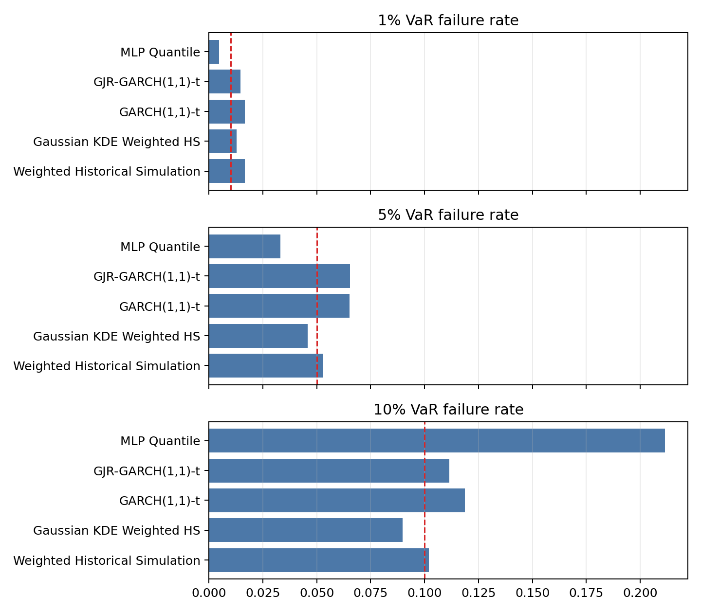

# SPY VaR Forecasting Mini Program

This repository is a compact, reproducible mini program for one-day-ahead Value-at-Risk (VaR) forecasting on SPY. The project compares classical risk-modeling baselines with neural quantile methods under a rolling-window backtesting framework, with emphasis on statistical testing, reproducible code, and transparent discussion of model limitations.

## Full Report

The complete PDF report is available here:

- [Final_Report_Single.pdf](Final_Report_Single.pdf)

The report contains the full data exploration, model descriptions, rolling-window setup, VaR forecast figures, backtesting tables, statistical hypothesis tests, comparative discussion, conclusion, and potential improvements.

## Project Scope

The empirical task is to forecast one-day-ahead downside tail risk for SPY log returns at three tail levels:

- 1% VaR
- 5% VaR
- 10% VaR

The project is designed as a clean mini research program rather than a single script. Each section has its own organized code and report materials, while `code/run_all.py` provides a compact reproducibility entry point for the final aligned comparison.

## Models Compared

The report and code cover the following model families:

| Model family | Role in the project |
|---|---|
| Historical Simulation | Simple non-parametric benchmark based on rolling empirical quantiles |
| KDE-weighted Historical Simulation | Non-parametric benchmark with density-based weighting |
| GARCH-t | Classical conditional-volatility benchmark with Student-t innovations |
| GJR-GARCH-t | Asymmetric volatility benchmark for leverage effects |
| MLP Quantile Regression | Neural quantile model trained with pinball loss |
| GARCH-anchored neural correction | Experimental neural extension using GARCH information as an anchor |

The GARCH-anchored neural correction is treated as an experimental proof of concept. The report explicitly discusses its limitations, including the risk of test-set-informed hyperparameter choice, rather than presenting it as a fully validated benchmark.

## Statistical Evaluation

The backtesting framework includes:

- Rolling-window VaR forecasting
- Failure-rate comparison across 1%, 5%, and 10% tails
- Kupiec unconditional coverage tests
- Christoffersen independence / conditional coverage tests
- Pinball-loss comparison for quantile forecast quality
- Aligned-window comparison to make model performance more directly comparable

## Repository Structure

```text
SPY_VaR_GitHub_Public/
|-- README.md
|-- Final_Report_Single.pdf
`-- code/
    |-- run_all.py
    |-- requirements.txt
    |-- data/
    |   `-- spy_data.csv
    |-- outputs/
    |   |-- figures/
    |   |-- forecasts/
    |   `-- tables/
    |-- scripts/
    |   `-- full project script set copied from the original VaR project
    |-- sections/
    |   |-- section_01_introduction/
    |   |-- section_02_data_backtesting/
    |   |-- section_03_historical_simulation/
    |   |-- section_04_garch_models/
    |   |-- section_05_mlp_quantile/
    |   `-- section_06_comparison_conclusion/
    `-- src/
        `-- shared reference utilities
```

Each section folder keeps its own local materials, usually including:

- `code/`: section-specific Python scripts
- `data/`: section-level input data when needed
- `outputs/`: generated tables and figures
- `report/`: Markdown or source report text
- `pdf/`: standalone PDF output when available
- `README.md`: section-level explanation

## Quick Reproduction

Install dependencies from the `code/` directory:

```bash
pip install -r requirements.txt
```

Then run the compact final reproduction script:

```bash
cd code
python run_all.py
```

This regenerates the aligned model-comparison table and aligned failure-rate figure:

- `code/outputs/tables/aligned_model_comparison.csv`
- `code/outputs/figures/aligned_failure_rates.png`

## Key Outputs

Important generated outputs include:

| Output | Path |
|---|---|
| Aligned model comparison table | `code/outputs/tables/aligned_model_comparison.csv` |
| Backtesting results | `code/outputs/tables/backtesting_results.csv` |
| Model evaluation summary | `code/outputs/tables/model_evaluation_summary.csv` |
| VaR forecast files | `code/outputs/forecasts/` |
| Final figures | `code/outputs/figures/` |
| Section-level materials | `code/sections/` |

Example final comparison figure:



## Notes on Reproducibility

This repository keeps both a compact reproduction path and the section-organized project materials:

- Use `code/run_all.py` for a quick check of the final aligned comparison.
- Use `code/scripts/` for the broader original script set.
- Use `code/sections/` to inspect how each report section is connected to its own code and outputs.

Some computationally heavier model runs may require more time than the compact reproduction script. The included forecasts, tables, and figures are kept so that the report can be audited without rerunning every expensive step.

## Author

Ziyi Zhou  
B.Sc. Statistics, Guangzhou University  
Homepage: <https://cloudcollection.github.io>  
GitHub: <https://github.com/cloudcollection>

