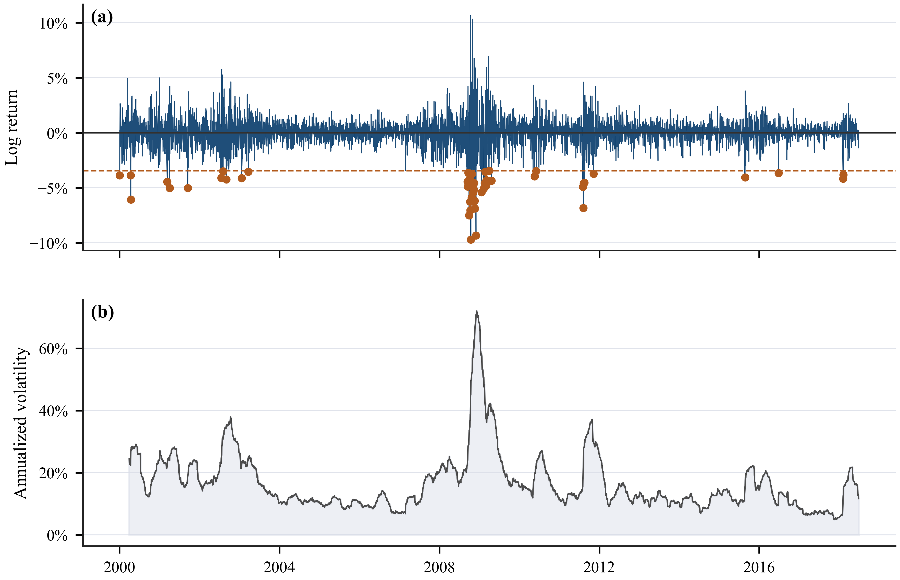
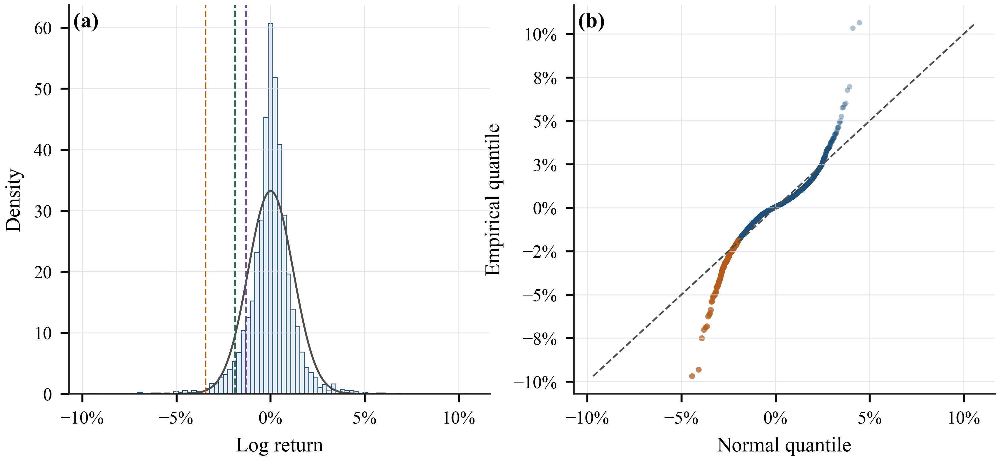
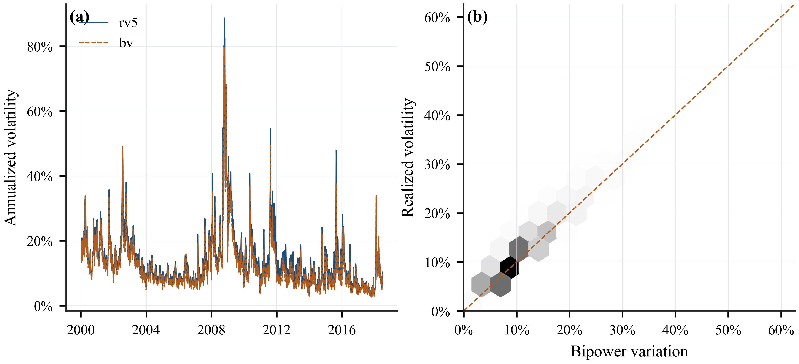
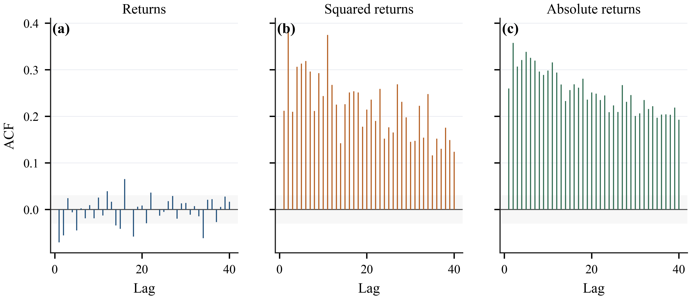
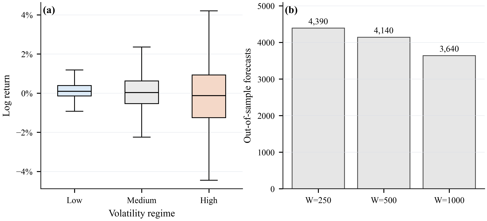

## Section 2. Data Characteristics and the VaR Backtesting Framework

## 2.1 Data and variables

This section documents the empirical data, motivates the model choices used in the following chapters, and defines a common out-of-sample VaR backtesting design. The dataset contains 4,640 daily observations for SPY from 2000-01-04 to 2018-06-27. The target variable is the daily log return, denoted by `log_ret`. The dataset also contains two high-frequency volatility measures, `rv5` and `bv`, which are used to describe market conditions and to provide volatility-related inputs for the neural quantile model in Section 5.

The role of this section is not merely descriptive. The distributional and time-series properties of the data determine whether the later modelling choices are justified. Heavy tails motivate non-Gaussian and nonparametric VaR methods. Volatility clustering motivates conditional-variance models. The availability of realized-volatility proxies motivates the inclusion of nonlinear machine-learning models with volatility features.

## 2.2 Distributional properties of returns

The sample mean of `log_ret` is 0.000133, while the sample standard deviation is 0.012013. The return distribution is not close to Gaussian: the sample skewness is -0.208, and the excess kurtosis is 8.219. The Jarque-Bera normality test has a p-value of 0, rejecting normality at conventional levels. This evidence is directly relevant for VaR because a Gaussian benchmark may understate the probability of extreme losses.

Figure 2.1(a) shows that large negative returns are clustered in stress periods rather than being evenly distributed through time. Figure 2.1(b) reports the corresponding rolling volatility, which rises sharply in the same stress episodes.

Figure 2.2 provides the distributional evidence more directly. The empirical lower-tail quantiles at the 1%, 5%, and 10% levels are -0.034545, -0.018807, and -0.012885, respectively. These empirical quantiles provide the basic nonparametric benchmark for Historical Simulation in Section 3, but they also show why tail estimation is difficult, especially at the 1% level.

## 2.3 Volatility clustering and volatility proxies

The rolling-volatility evidence in Figure 2.1(b) shows that volatility is clearly state-dependent: calm periods alternate with stress periods, and elevated volatility tends to persist. This pattern motivates the GARCH family in Section 4, because a static unconditional quantile cannot fully account for changing conditional risk.

Figure 2.4 examines `rv5` and `bv`. The correlation between the two volatility proxies is 0.964, indicating that they contain closely related information about market volatility. However, the two measures are not identical, especially during extreme trading days. This provides a reason to retain both variables as inputs for the neural quantile model rather than relying only on lagged returns.

## 2.4 Autocorrelation evidence and modelling implications

Figure 2.3 compares the autocorrelation functions of returns, squared returns, and absolute returns. Raw returns show weak serial dependence, suggesting limited predictability in the conditional mean. In contrast, squared and absolute returns display stronger persistence, which is consistent with volatility clustering. This distinction is important: the empirical task is not to forecast the direction of SPY returns, but to forecast the conditional lower tail of the return distribution.

The volatility-regime summary reinforces this point. The 5% return quantile is -0.006206 in the low-volatility regime, compared with -0.029230 in the high-volatility regime. Therefore, the same nominal VaR level corresponds to very different return thresholds across market states.

## 2.5 Out-of-sample VaR forecasting design

The forecast target is the one-day-ahead lower-tail VaR of `log_ret` at the 1%, 5%, and 10% levels. For a tail probability alpha, VaR is interpreted as the conditional quantile satisfying Pr(r_{t+1} < VaR_{alpha,t+1} | F_t) = alpha.

To match Sections 3 and 4, the empirical analysis compares three rolling-window lengths: W = 250, 500, and 1000 trading days. These windows correspond approximately to one, two, and four trading years. For a forecast made at time t, the model uses only the information set F_t(W) = {r_{t-W+1}, ..., r_t} and the corresponding volatility variables observed inside the same window. The window then rolls forward one day at a time.

The resulting out-of-sample forecast counts are 4,390 for W = 250, 4,140 for W = 500, and 3,640 for W = 1000. Sections 3 and 4 retain all three windows in the empirical comparison, while placing emphasis on W = 1000 because it provides more tail observations for crisis-versus-calm analysis.

## 2.6 Backtesting criteria

The backtesting procedure is common across all models. A VaR violation occurs when the realized return is below the forecasted VaR. The failure rate compares the observed violation frequency with the nominal tail probability. The Kupiec unconditional coverage test evaluates whether the violation rate is statistically consistent with the target probability. The Christoffersen independence and conditional coverage tests examine whether violations are serially clustered. The duration test evaluates the spacing between violations, and the Lopez loss provides a loss-based comparison of VaR forecasts.

This common framework makes the following chapters directly comparable. Section 3 evaluates nonparametric Historical Simulation methods, Section 4 evaluates GARCH-type conditional-volatility models, and Section 5 evaluates neural quantile regression.
