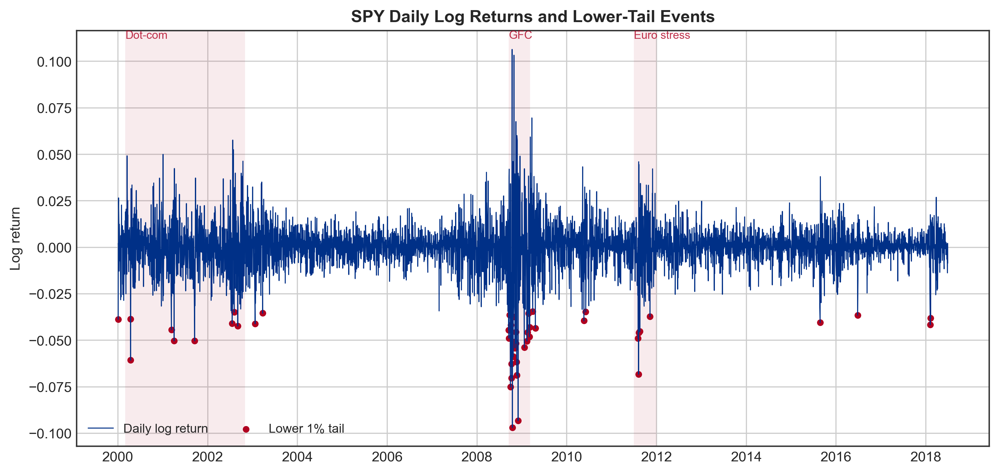
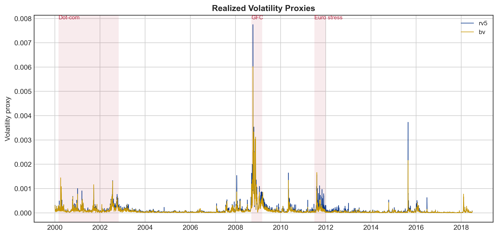
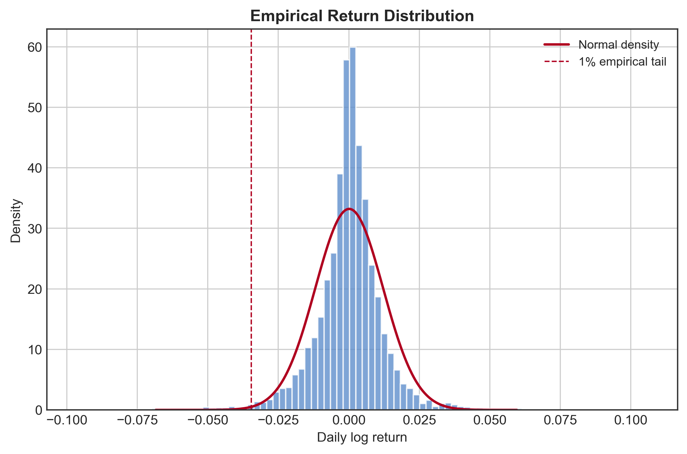
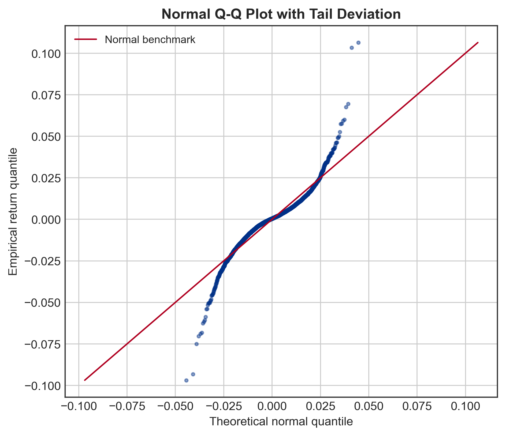
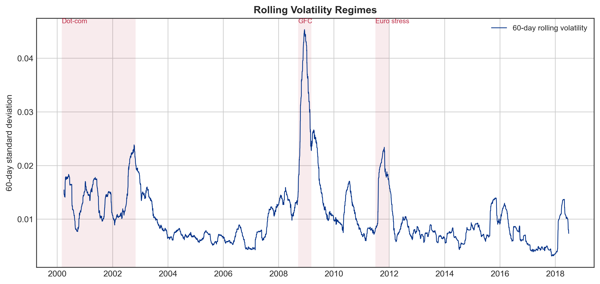
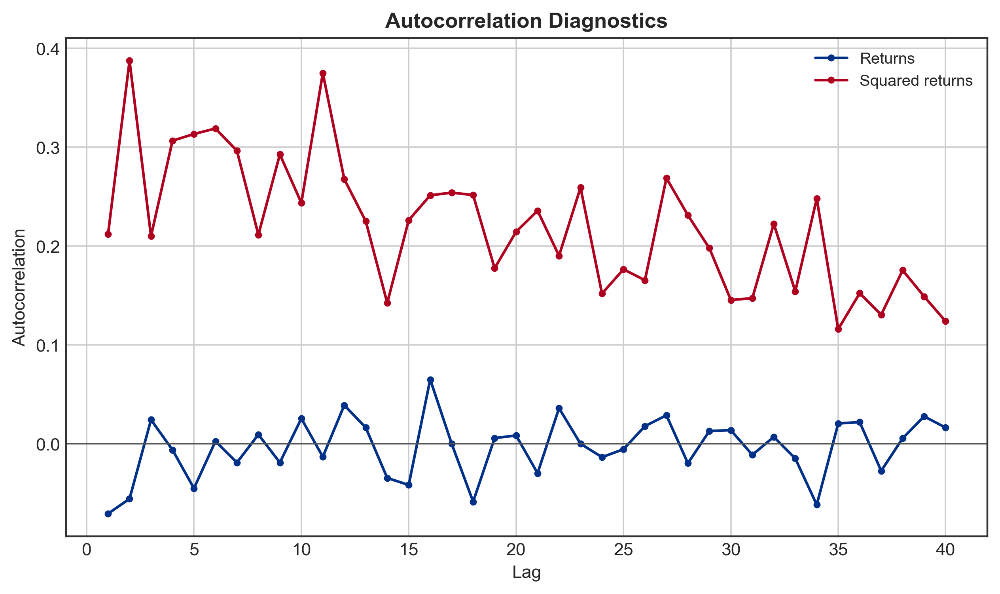
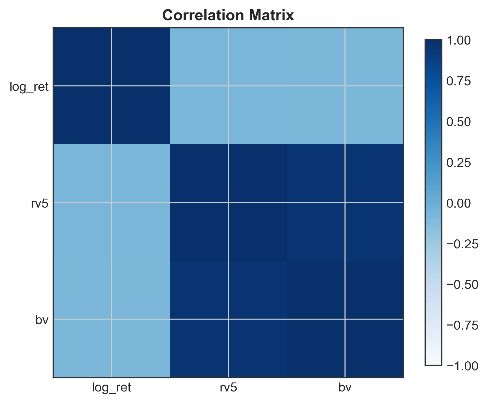
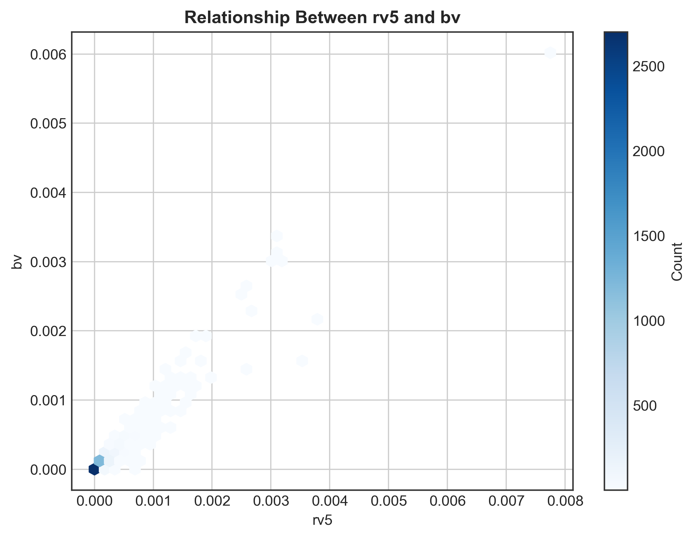
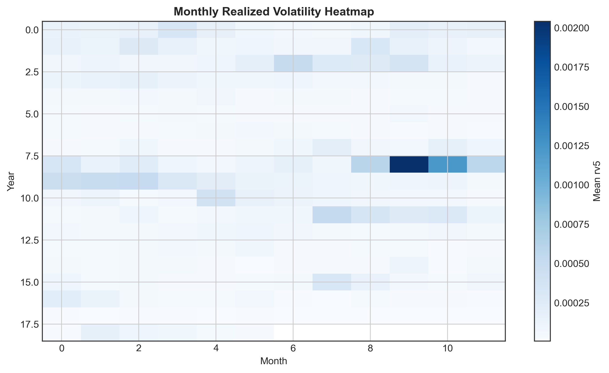

## 第二章 数据特征分析与 VaR 回测框架

## 2.1 数据来源与变量定义

本章首先对实证数据进行描述性统计和探索性分析，并在此基础上给出后续 VaR 预测模型的统一实证框架。本文使用 SPY 的日度收益率和高频波动率指标作为实证样本。样本区间为 2000-01-04 至 2018-06-27，共 4,640 个交易日。核心变量包括日对数收益率 `log_ret`、五分钟 realized volatility 指标 `rv5`，以及 bipower variation 指标 `bv`。其中 `log_ret` 是后续 VaR 预测的目标变量，`rv5` 和 `bv` 则用于刻画市场条件和波动状态，并为第五章的神经网络分位数模型提供可解释的波动率输入。

表 `section2_dataset_overview.csv` 汇总了样本范围、观测数量、缺失情况和后续 VaR 预测设定。样本中三个核心变量均可直接用于滚动窗口实证分析，因此后续模型可以在统一的数据口径下进行比较。需要强调的是，本章的探索性分析并非单纯的数据可视化，而是服务于后续模型选择：收益率分布特征决定是否需要非正态和非参数方法，波动聚集决定是否需要条件异方差模型，而高频波动率变量则决定神经网络模型是否具备额外信息输入。

## 2.2 收益率分布特征

表 `section2_descriptive_statistics.csv` 显示，SPY 日对数收益率的样本均值为 0.000133，标准差为 0.012013。从偏度和峰度看，收益率分布并不服从简单的正态假设：偏度为 -0.208，超额峰度为 8.219。Jarque-Bera 正态性检验的 p 值为 0，在常用显著性水平下拒绝正态分布假设。这说明若直接使用正态分布假设估计 VaR，可能低估极端损失发生的概率。

图 2-1 展示了日收益率时间序列，并标记低于经验 1% 分位数的极端下跌日。可以看到，尾部损失并非均匀分布，而是集中出现在市场压力阶段。图 2-3 和图 2-4 分别从直方图和 Q-Q 图角度进一步说明收益率存在尖峰厚尾和下尾偏离。因此，本文不能只依赖正态线性模型，而需要比较非参数历史模拟、厚尾 GARCH 和神经网络分位数模型。

从 VaR 角度看，经验 1%、5% 和 10% 分位数分别为 -0.034545、-0.018807 和 -0.012885。这些分位数为第三章历史模拟法提供了最直接的非参数基准，也说明了极端尾部样本数量有限，尤其是 1% VaR 的估计更容易受到窗口长度和市场状态变化影响。

## 2.3 波动聚集与市场状态

图 2-2 报告了 annualized `rv5` 与 `bv` 的时间序列，图 2-5 报告了 60 日滚动年化波动率。两个图共同说明，SPY 的波动率存在明显的状态转换和持续性：平稳阶段的波动率较低，而金融危机和其他市场压力阶段会形成显著的高波动区间。这一事实直接支持第四章引入 GARCH 类模型，因为 GARCH 模型的核心就是用条件方差动态刻画波动聚集。若不考虑条件波动率变化，模型在高波动阶段容易给出过于乐观的风险阈值。

表 `section2_volatility_regime_summary.csv` 将样本按 `rv5` 分成低、中、高三个波动状态。低波动状态下 5% 收益率分位数为 -0.006184，高波动状态下 5% 收益率分位数为 -0.028926，说明相同置信水平下的风险阈值会随市场状态显著改变。因此，固定窗口经验分位数虽然透明，但可能在状态切换时反应不足；这也是后续比较加权历史模拟、GARCH-t 和神经网络模型的原因。

## 2.4 自相关、波动代理变量与建模含义

图 2-6 比较了原始收益率和平方收益率的自相关函数。原始收益率自相关整体较弱，说明均值预测空间有限；但平方收益率的自相关更强，反映出波动率具有持续性。这个结果与金融时间序列的典型经验事实一致：收益率方向难以预测，但风险水平和波动状态可以建模。

图 2-7 和图 2-8 进一步考察了 `log_ret`、`rv5` 和 `bv` 之间的关系。`rv5` 与 `bv` 的相关系数为 0.964，说明两个高频波动变量包含高度重叠的市场波动信息，但在跳跃或极端交易日也可能出现差异。第五章神经网络模型可以利用这类变量，在不预设线性条件方差方程的情况下学习尾部分位数。

## 2.5 VaR 预测与回测框架

基于上述数据事实，本文采用统一的滚动窗口 VaR 预测框架。预测目标是 `log_ret` 的一日 ahead 下尾 VaR，尾部概率设为 1%、5% 和 10%。为了避免 look-ahead bias，每个模型在预测日之前的信息集上估计，并只使用预测日前已经可观测的数据。对给定尾部概率 alpha，VaR 可写为条件下尾分位数：

$$
\Pr(r_{t+1} < \mathrm{VaR}_{lpha,t+1}\mid \mathcal{F}_t)=lpha.
$$

为与第三章历史模拟法和第四章 GARCH 类模型保持一致，本文比较 W = 250、500 和 1000 三种滚动窗口，分别近似对应一、两和四个交易年。设第 t 日的日对数收益率为 r_t，在预测 r_{t+1} 的 VaR 时，长度为 W 的信息集定义为：

$$
\mathcal{F}_t(W)=\left\{r_{t-W+1},r_{t-W+2},\ldots,r_t
ight\}.
$$

模型只能使用该窗口内的历史收益率及同一窗口内的 `rv5`、`bv` 等变量。窗口随后逐日向前滚动，形成样本外 VaR 预测序列。三种窗口对应的样本外预测期分别为：W = 250 时从 2001-01-02 至 2018-06-27，共 4,390 个预测日；W = 500 时从 2002-01-09 至 2018-06-27，共 4,140 个预测日；W = 1000 时从 2004-01-08 至 2018-06-27，共 3,640 个预测日。第三章和第四章在报告结果时保留三种窗口的比较，并重点解释 W = 1000 的结果，因为该窗口在极端尾部 VaR 估计中提供更多尾部观测，适合进行危机期与平稳期的子样本比较。

对于神经网络分位数模型，滚动训练集同样遵循上述时间顺序约束；对于 GARCH 类模型，参数估计和条件方差预测也仅基于滚动窗口内信息。由此，第三章、第四章和第五章的模型结果具有可比性。

后续章节比较三类模型：

1. 第三章使用历史模拟法及其改进，包括普通历史模拟、时间加权历史模拟和 KDE 平滑加权历史模拟。
2. 第四章使用 GARCH 类模型，重点考察 GARCH(1,1)-t 和 GJR-GARCH(1,1)-t 对厚尾和非对称波动的刻画能力。
3. 第五章使用神经网络分位数回归，将滞后收益率和高频波动率变量输入 MLP，并通过 pinball loss 直接预测 VaR 分位数。

模型评价使用统一回测框架。首先，定义 VaR 违约指示变量：

$$
I_{t+1}=\mathbf{1}\left(r_{t+1}<\widehat{\mathrm{VaR}}_{lpha,t+1}
ight).
$$

failure rate 用于比较实际 VaR 违约比例是否接近名义尾部概率。Kupiec 无条件覆盖检验用于检验 VaR 违约率是否显著偏离理论水平。Christoffersen 独立性检验和条件覆盖检验用于判断 VaR 违约是否存在聚集现象。duration test 从违约间隔角度检验风险预测是否存在持续性失效，Lopez loss 则提供损失函数意义下的模型比较标准。第二章的可视化和统计检验表明，SPY 收益率同时具有厚尾、波动聚集和市场状态转换特征，因此第三章、第四章和第五章分别引入历史模拟、GARCH 类模型和神经网络模型具有明确的金融统计动机。

## 2.6 学术图表输出

