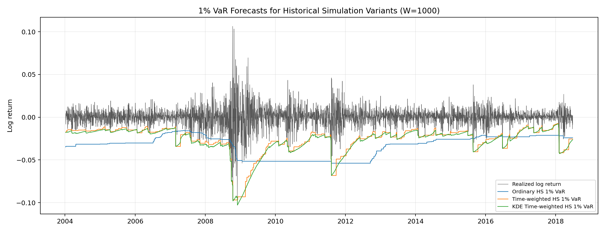
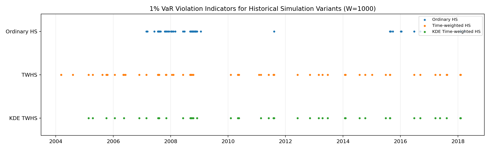

## 第三部分：历史模拟法（非参数 VaR）

### 3.1 方法动机

历史模拟法（Historical Simulation, HS）在本项目中作为 SPY 日对数收益率一日 VaR 预测的非参数基准模型。数据本身提供了使用非参数方法的定量理由。SPY 日对数收益率的全样本超额峰度为 8.22，远高于正态分布的基准值 0；2007-09-01 至 2009-06-30 危机期标准差为 0.0224，而 2012-01-01 至 2016-12-31 后危机平静期标准差为 0.0081，二者比值为 2.78。这两个事实构成了本节方法选择的起点：厚尾使正态 VaR 缺乏说服力，波动率 regime 差异使固定窗口估计容易失效。

本节并不把 HS 当作一个单一的机械基准，而是先建立普通 HS，再引入两个有针对性的改进：时间加权 HS 和 KDE 平滑时间加权 HS。这样的结构与 Boudoukh, Richardson and Whitelaw (1998) 的思想一致，即历史模拟法可以在保持透明性的同时，通过权重设计改善对时变波动率的反应。同时，这也回应了 Pritsker (2006) 对普通 HS 的批评：当极端事件回归周期相对于估计窗口过长时，普通 HS 会系统性低估尾部风险。本数据中最大单日对数收益损失为 -9.69%，这类事件在短窗口中很难被稳定代表。

因此，本节关注两个问题。第一，普通 HS 在 1%、5% 和 10% VaR 水平下是否具有正确的无条件覆盖率。第二，如果模型失败，失败来自违约次数偏离、违约聚集，还是二者同时存在。这个区分具有风险管理含义，因为一个模型即使平均违约率正确，也可能在危机时期连续失效。

### 3.2 滑动窗口设定

对每一个预测日，模型只使用该日之前的信息。若在时间 t 进行预测，长度为 W 的估计窗口为：

$$
\mathcal{F}_t(W)=\{r_{t-W+1},r_{t-W+2},\ldots,r_t\},
\tag{1}
$$

其中 $r_t$ 表示 SPY 日对数收益率，$W$ 表示滑动窗口长度。模型基于该窗口估计下一日 VaR，并用 $r_{t+1}$ 进行样本外评价。该设计避免了前视偏误。

由于题目没有指定唯一窗口长度，本节比较 W = 250、500 和 1000，分别约对应一个、两个和四个交易年。窗口选择本身是一个统计问题。W = 250 反应较快，但 1% 尾部只有约两三个观测；W = 1000 的尾部样本更稳定，但可能混合多个波动率状态。Danielsson, Ergun, de Haan and de Vries (2016) 讨论的滚动窗口状态切换问题正体现了这一偏差-方差权衡。

样本共包含 4,640 个日度观测，区间为 2000-01-04 至 2018-06-27。W = 250 时样本外预测期为 2001-01-02 至 2018-06-27，共 4,390 个预测日；W = 500 时为 2002-01-09 至 2018-06-27，共 4,140 个预测日；W = 1000 时为 2004-01-08 至 2018-06-27，共 3,640 个预测日。后文重点解释 W = 1000，因为该窗口提供更多尾部观测，也更适合进行危机期与平静期的子样本比较。所有检验均以 5% 显著性水平作为主要判断标准。

### 3.3 普通历史模拟法

普通 HS 将 VaR 定义为滑动窗口内历史收益率的经验下分位数：

$$
\widehat{\mathrm{VaR}}^{HS}_{\alpha,t+1}
=Q_{\alpha}(r_{t-W+1},\ldots,r_t).
\tag{2}
$$

其中 $Q_{\alpha}(\cdot)$ 表示经验 $\alpha$ 分位数，$\alpha$ 取 1%、5% 或 10%。普通 HS 对窗口内每个观测赋予相同权重 $1/W$。该方法透明、易审计，但隐含假设是窗口内所有历史收益对未来风险具有相同信息价值。对于具有波动持续性的金融收益，这一假设较强。

实证结果与 Pritsker (2006) 的结论一致：普通 HS 可能在中等尾部看似可接受，但在极端尾部或独立性检验中失败。例如 W = 1000 时，普通 HS 在 5% VaR 下的 Kupiec p 值为 0.7025，但 Christoffersen 独立性 p 值仅为 0.0004。这说明模型可以捕捉平均违约频率，却无法捕捉违约的时间分布。

### 3.4 时间加权历史模拟法

时间加权 HS 通过指数衰减权重提高近期观测的重要性。窗口内观测 i 的未标准化权重为：

$$
\tilde{w}_i=\lambda^{\mathrm{age}_i}, \qquad 0<\lambda<1,
\tag{3}
$$

其中 $\mathrm{age}_i$ 表示该观测距离当前预测日的时间长度，最新观测的 $\mathrm{age}$ 为 0。标准化权重为：

$$
w_i=\frac{\lambda^{\mathrm{age}_i}}{\sum_{j=0}^{W-1}\lambda^j}.
\tag{4}
$$

时间加权 VaR 定义为使累计权重达到 $\alpha$ 的最小分位点：

$$
\widehat{\mathrm{VaR}}^{TWHS}_{\alpha,t+1}
=\inf\left\{q:\sum_i w_i\mathbf{1}(r_i\le q)\ge \alpha\right\}.
\tag{5}
$$

本节采用 $\lambda = 0.98$。较小的 $\lambda$ 会使模型对近期收益更敏感，但也会降低有效样本量，使尾部估计更不稳定。$\lambda = 0.98$ 在响应速度和尾部稳定性之间更平衡。该设定延续了 Boudoukh, Richardson and Whitelaw (1998) 对混合历史模拟法的思路。

W = 1000 的结果显示，时间加权 HS 在 5% 和 10% 水平下同时通过 Kupiec 与 Christoffersen 独立性检验，说明近期权重确实改善了违约动态。这个改进主要发生在中间尾部，这与 Boudoukh, Richardson and Whitelaw (1998) 的直觉一致：5% 和 10% 分位数有足够观测让权重调整发挥作用，而 1% 极端尾部的有效观测数量仍然太少。因此，该方法在 1% 水平仍然失败：期望违约次数为 36.4，实际违约为 61。这不是单纯的统计小误差，而是极端尾部风险低估。

### 3.5 KDE 平滑时间加权历史模拟法

时间加权改变了观测重要性，但分位数仍然来自离散经验分布。对于 1% VaR，即使 W = 1000，尾部有效观测也很少。因此，本节使用高斯核密度估计将加权经验分布连续化：

$$
\hat{f}_t(x)=\frac{1}{h}\sum_i w_iK\left(\frac{x-r_i}{h}\right),
\qquad
K(u)=\frac{1}{\sqrt{2\pi}}\exp\left(-\frac{u^2}{2}\right).
\tag{6}
$$

KDE VaR 通过反解估计分布函数得到：

$$
\widehat{\mathrm{VaR}}^{KDE}_{\alpha,t+1}
=\inf\left\{x:\int_{-\infty}^{x}\hat{f}_t(u)\,du\ge \alpha\right\}.
\tag{7}
$$

实现中使用 `scipy.stats.gaussian_kde` 的权重参数和 Scott 带宽规则。加权 Scott 带宽可理解为与 $\sigma_w n_{\mathrm{eff}}^{-1/5}$ 成比例，其中 $\sigma_w$ 是加权收益波动，$n_{\mathrm{eff}} = 1 / \sum_i w_i^2$。由于指数权重会降低有效样本量，KDE 会相应增加平滑程度。

需要强调的是，KDE 不是无成本改进。核平滑分位数估计受带宽偏差影响，在尾部或边界附近，其非参数收敛速度更接近 n^{-2/5}，而不是参数模型中的 n^{-1/2}。这解释了为什么 1% VaR 即使用 KDE 也仍然不稳定：平滑可以减少离散分位数跳跃，但不能创造样本中不存在的尾部信息。W = 1000 下 KDE 时间加权 HS 将 1% Kupiec p 值提高到 0.0911，但同时使 10% 覆盖率偏保守，并在 5% Duration 检验中出现显著拒绝。这与 Silverman (1986) 以及 Bowman and Azzalini (1997) 对重尾、非正态数据中带宽规则局限性的讨论一致：有利于稳定 1% 极端尾部的全局带宽，可能扭曲 5% 中间尾部。

### 3.6 回测检验方法

对每一个 VaR 预测，定义违约指示变量：

$$
I_{t+1}=\mathbf{1}\left(r_{t+1}<\widehat{\mathrm{VaR}}_{\alpha,t+1}\right).
\tag{8}
$$

样本失败率为：

$$
\widehat{p}=\frac{1}{T}\sum_{t=1}^{T}I_t.
\tag{9}
$$

Kupiec (1995) 检验无条件覆盖率，原假设为 $H_0:p=\alpha$。若样本外共有 $T$ 个预测、违约次数为 $V$，则似然比统计量为：

$$
LR_{uc}
=-2\log\left[
\frac{(1-\alpha)^{T-V}\alpha^V}
{(1-\hat{p})^{T-V}\hat{p}^{V}}
\right]\sim\chi^2(1).
\tag{10}
$$

该检验在 1% 水平下有限样本功效较弱。对于 $T = 3640$、$\alpha = 1\%$，5% 双侧 Kupiec 检验的二项似然比拒绝域为 $V \le 25$ 或 $V \ge 49$，接受域为 26 至 48 次违约。上尾拒绝边界 49 次对应失败率 $49/3640 = 1.35\%$。二项功效计算进一步表明，在上尾方向，真实失败率约需达到 1.50%，检验才有 80% 的功效。因此，一个模型即使明显低估 1% 尾部风险，也可能在有限样本中难以被拒绝。

Christoffersen (1998) 进一步检验违约独立性。设 T_{ij} 表示违约序列中从状态 i 转移到状态 j 的次数，0 表示未违约，1 表示违约。转移概率估计为：

$$
\hat{\pi}_{01}=\frac{T_{01}}{T_{00}+T_{01}},
\qquad
\hat{\pi}_{11}=\frac{T_{11}}{T_{10}+T_{11}}.
\tag{11}
$$

若违约独立，则 $H_0:\pi_{01}=\pi_{11}$。独立性似然比统计量为：

$$
LR_{ind}
=-2\log\left[
\frac{(1-\hat{p})^{T_{00}+T_{10}}\hat{p}^{T_{01}+T_{11}}}
{(1-\hat{\pi}_{01})^{T_{00}}\hat{\pi}_{01}^{T_{01}}
(1-\hat{\pi}_{11})^{T_{10}}\hat{\pi}_{11}^{T_{11}}}
\right]\sim\chi^2(1).
\tag{12}
$$

条件覆盖率检验将覆盖率与独立性合并：

$$
LR_{cc}=LR_{uc}+LR_{ind}\sim\chi^2(2).
\tag{13}
$$

Christoffersen and Pelletier (2004) 的 Duration 检验则考察两次违约之间的等待时间。若 tau_i 表示第 i 次违约发生日期，则：

$$
D_i=\tau_i-\tau_{i-1}.
\tag{14}
$$

若 VaR 模型正确且违约独立，持续时间应服从无记忆分布。离散时间下对应几何分布：

$$
P(D=d)=(1-\alpha)^{d-1}\alpha,\qquad d=1,2,3,\ldots .
\tag{15}
$$

Christoffersen and Pelletier (2004) 使用 Weibull 分布作为备择：

$$
f(d;a,b)=ab(ad)^{b-1}\exp[-(ad)^b].
\tag{16}
$$

当 b = 1 时，Weibull 分布退化为指数分布，对应无记忆性。Duration 似然比统计量为：

$$
LR_{dur}=-2\{\ell(\hat{a},1)-\ell(\hat{a},\hat{b})\}\sim\chi^2(1).
\tag{17}
$$

Duration 检验对 1% VaR 特别重要，因为此时连续违约转移 T_{11} 可能很少，Christoffersen 一阶马尔可夫检验的有限样本表现较弱。

作为补充评分指标，本节还报告 Lopez regulatory loss：

$$
L_t =
\begin{cases}
1 + (r_t-\widehat{\mathrm{VaR}}_t)^2, & r_t < \widehat{\mathrm{VaR}}_t,\\
0, & r_t \ge \widehat{\mathrm{VaR}}_t.
\end{cases}
\tag{18}
$$

Lopez loss 不是假设检验，而是一个损失函数。它同时惩罚 VaR 违约是否发生以及违约幅度。由于本文收益率使用小数形式，平方超越幅度在数值上较小，因此 Lopez loss 会接近 failure rate。不过它仍然有用，因为当多个模型失败率相近时，该指标可以进一步比较违约深度。

### 3.7 实证结果

表 3.1 报告 W = 250 的结果。一年窗口反应较快，但 1% 尾部样本过少。普通 HS 在 5% 和 10% 的无条件覆盖率上并不差，但 Christoffersen p 值显示违约明显聚集。时间加权改善了 5% 和 10% 的独立性诊断，KDE 改善了 1% 覆盖率，但在 10% 水平偏保守。这与 Pritsker (2006) 关于短窗口 HS 尾部不稳定的结论一致。

Table 3.1. W = 250 下 HS-family 模型回测结果。

| Model | Alpha | Viol./Exp. | Fail. rate | Avg VaR | Kupiec p | Christoffersen p | Lopez loss |
|---|---:|---:|---:|---:|---:|---:|---:|
| Ordinary HS | 1% | 72 / 43.9 | 0.0164 | -0.0284 | 0.0001 | 0.0370 | 0.016404 |
| Ordinary HS | 5% | 237 / 219.5 | 0.0540 | -0.0180 | 0.2313 | 0.0000 | 0.053995 |
| Ordinary HS | 10% | 450 / 439.0 | 0.1025 | -0.0129 | 0.5814 | 0.0001 | 0.102522 |
| Time-weighted HS | 1% | 72 / 43.9 | 0.0164 | -0.0275 | 0.0001 | 0.0370 | 0.016402 |
| Time-weighted HS | 5% | 232 / 219.5 | 0.0528 | -0.0177 | 0.3909 | 0.0998 | 0.052853 |
| Time-weighted HS | 10% | 438 / 439.0 | 0.0998 | -0.0129 | 0.9599 | 0.1240 | 0.099783 |
| KDE Time-weighted HS | 1% | 54 / 43.9 | 0.0123 | -0.0289 | 0.1392 | 0.0323 | 0.012302 |
| KDE Time-weighted HS | 5% | 194 / 219.5 | 0.0442 | -0.0188 | 0.0719 | 0.0069 | 0.044196 |
| KDE Time-weighted HS | 10% | 383 / 439.0 | 0.0872 | -0.0139 | 0.0041 | 0.0517 | 0.087253 |

注：Christoffersen 列报告独立性检验 p 值；时间加权模型使用 $\lambda = 0.98$；显著性水平为 5%。

表 3.2 报告 W = 500 的结果。普通 HS 在 5% 和 10% 覆盖率上仍看似可接受，但独立性 p 值接近零，说明违约集中发生。时间加权 HS 在保持失败率接近名义水平的同时改善独立性。KDE 继续改善 1% 失败率，但 10% 水平偏保守。

Table 3.2. W = 500 下 HS-family 模型回测结果。

| Model | Alpha | Viol./Exp. | Fail. rate | Avg VaR | Kupiec p | Christoffersen p | Lopez loss |
|---|---:|---:|---:|---:|---:|---:|---:|
| Ordinary HS | 1% | 67 / 41.4 | 0.0162 | -0.0303 | 0.0002 | 0.0049 | 0.016187 |
| Ordinary HS | 5% | 214 / 207.0 | 0.0517 | -0.0182 | 0.6195 | 0.0000 | 0.051702 |
| Ordinary HS | 10% | 396 / 414.0 | 0.0957 | -0.0129 | 0.3479 | 0.0000 | 0.095671 |
| Time-weighted HS | 1% | 67 / 41.4 | 0.0162 | -0.0270 | 0.0002 | 0.0273 | 0.016185 |
| Time-weighted HS | 5% | 218 / 207.0 | 0.0527 | -0.0174 | 0.4366 | 0.1060 | 0.052662 |
| Time-weighted HS | 10% | 412 / 414.0 | 0.0995 | -0.0126 | 0.9174 | 0.2354 | 0.099528 |
| KDE Time-weighted HS | 1% | 51 / 41.4 | 0.0123 | -0.0283 | 0.1479 | 0.0274 | 0.012320 |
| KDE Time-weighted HS | 5% | 186 / 207.0 | 0.0449 | -0.0185 | 0.1279 | 0.0129 | 0.044932 |
| KDE Time-weighted HS | 10% | 362 / 414.0 | 0.0874 | -0.0136 | 0.0060 | 0.0530 | 0.087449 |

注：Christoffersen 列报告独立性检验 p 值；时间加权模型使用 $\lambda = 0.98$；显著性水平为 5%。

表 3.3 显示 W = 1000 的结果。普通 HS 通过 5% Kupiec 检验，但独立性被拒绝，说明仅有正确平均违约率并不足够。时间加权 HS 在 5% 和 10% 水平下同时通过覆盖率和独立性检验，是整体最稳健的设定。KDE 时间加权 HS 是唯一通过 1% Kupiec 检验的 HS-family 方法，但其 1% Christoffersen p 值仍低于 5%，且 10% 覆盖率偏保守。

Table 3.3. W = 1000 下 HS-family 模型回测结果。

| Model | Alpha | Viol./Exp. | Fail. rate | Avg VaR | Kupiec p | Christoffersen p | Lopez loss |
|---|---:|---:|---:|---:|---:|---:|---:|
| Ordinary HS | 1% | 56 / 36.4 | 0.0154 | -0.0334 | 0.0025 | 0.0002 | 0.015389 |
| Ordinary HS | 5% | 177 / 182.0 | 0.0486 | -0.0187 | 0.7025 | 0.0004 | 0.048641 |
| Ordinary HS | 10% | 303 / 364.0 | 0.0832 | -0.0129 | 0.0005 | 0.0000 | 0.083265 |
| Time-weighted HS | 1% | 61 / 36.4 | 0.0168 | -0.0264 | 0.0002 | 0.0218 | 0.016759 |
| Time-weighted HS | 5% | 193 / 182.0 | 0.0530 | -0.0169 | 0.4072 | 0.2366 | 0.053027 |
| Time-weighted HS | 10% | 371 / 364.0 | 0.1019 | -0.0120 | 0.6998 | 0.3569 | 0.101935 |
| KDE Time-weighted HS | 1% | 47 / 36.4 | 0.0129 | -0.0276 | 0.0911 | 0.0246 | 0.012913 |
| KDE Time-weighted HS | 5% | 167 / 182.0 | 0.0459 | -0.0178 | 0.2476 | 0.0638 | 0.045884 |
| KDE Time-weighted HS | 10% | 327 / 364.0 | 0.0898 | -0.0129 | 0.0379 | 0.1349 | 0.089845 |

注：Christoffersen 列报告独立性检验 p 值；时间加权模型使用 $\lambda = 0.98$；显著性水平为 5%。

Avg VaR 列揭示了模型差异的经济幅度。W = 1000、1% VaR 下，普通 HS 平均 VaR 为 -0.0334，而时间加权 HS 为 -0.0264。后者平均更不保守，因为较早危机观测被赋予较低权重。这解释了为什么时间加权可以改善 5% 和 10% 的违约动态，却在 1% 极端尾部低估风险。KDE 时间加权 HS 的 1% 平均 VaR 为 -0.0276，略比时间加权 HS 保守，因此改善了 1% 覆盖率，但仍未完全解决违约聚集。

W = 250 和 W = 500 中普通 HS 与时间加权 HS 在 1% 下的违约次数相同，并不意味着预测相同。两者平均 VaR 不同，且违约日期也不同。诊断结果显示，W = 250 下有 40 个不同的 1% 违约日期，W = 500 下有 60 个不同的 1% 违约日期。总次数相同只是因为部分日期新增违约、部分日期减少违约后相互抵消。

表 3.4 报告 W = 1000 下 Duration 检验结果。KDE 时间加权 HS 将 1% Duration p 值从 0.0121 提高到 0.1258，说明它改善了极端尾部的持续时间行为。但在 5% 水平下，KDE Duration p 值为 0.0003，说明中间尾部出现显著违约聚集。这不是简单的统计偶然，而可能来自带宽错配：一个有利于稳定 1% 极端尾部的全局高斯带宽，可能对 5% 中间尾部过度平滑，从而在波动状态变化时造成违约集中。

Table 3.4. W = 1000 下 Duration 检验结果。

| Model | 1% Duration p | 5% Duration p | 10% Duration p |
|---|---:|---:|---:|
| Time-weighted HS | 0.0121 | 0.0121 | 0.9885 |
| KDE Time-weighted HS | 0.1258 | 0.0003 | 0.8685 |

注：Duration p 值基于 Christoffersen and Pelletier (2004) 的持续时间独立性检验；显著性水平为 5%。

1% VaR 低估并不是均匀分布在整个样本期。表 3.5 将 W = 1000 预测拆分为 2007-09-01 至 2009-06-30 的危机期，以及 2012-01-01 至 2016-12-31 的后危机平静期。结果非常清楚：普通 HS 在危机期的 1% 失败率为 7.17%，远高于名义 1%；而在平静期只有 0.64%。这说明普通 HS 的整体失败主要来自波动率 regime 切换，而不是全样本中的恒定偏差。危机中市场从低波动状态迅速转入高波动状态，普通 HS 因窗口内仍含有大量平静期观测而反应迟缓。时间加权 HS 将危机期 1% 失败率降至 2.39%，KDE 时间加权 HS 进一步降至 1.74%，但仍高于名义水平。

Table 3.5. W = 1000 子样本失败率。

| Model | Period | Alpha | Obs. | Viol./Exp. | Fail. rate | Avg VaR |
|---|---|---:|---:|---:|---:|---:|
| Ordinary HS | Crisis | 1% | 460 | 33 / 4.6 | 0.0717 | -0.0335 |
| Ordinary HS | Crisis | 5% | 460 | 86 / 23.0 | 0.1870 | -0.0167 |
| Ordinary HS | Crisis | 10% | 460 | 117 / 46.0 | 0.2543 | -0.0112 |
| Time-weighted HS | Crisis | 1% | 460 | 11 / 4.6 | 0.0239 | -0.0502 |
| Time-weighted HS | Crisis | 5% | 460 | 23 / 23.0 | 0.0500 | -0.0355 |
| Time-weighted HS | Crisis | 10% | 460 | 50 / 46.0 | 0.1087 | -0.0266 |
| KDE Time-weighted HS | Crisis | 1% | 460 | 8 / 4.6 | 0.0174 | -0.0527 |
| KDE Time-weighted HS | Crisis | 5% | 460 | 23 / 23.0 | 0.0500 | -0.0373 |
| KDE Time-weighted HS | Crisis | 10% | 460 | 48 / 46.0 | 0.1043 | -0.0282 |
| Ordinary HS | Calm | 1% | 1258 | 8 / 12.6 | 0.0064 | -0.0318 |
| Time-weighted HS | Calm | 1% | 1258 | 16 / 12.6 | 0.0127 | -0.0231 |
| KDE Time-weighted HS | Calm | 1% | 1258 | 15 / 12.6 | 0.0119 | -0.0240 |

注：危机期为 2007-09-01 至 2009-06-30；平静期为 2012-01-01 至 2016-12-31。为保持表格紧凑，表中报告危机期全部 VaR 水平和平静期 1% 对比。

子样本结果比全样本结论更深入。危机期中，时间加权 HS 和 KDE 时间加权 HS 都将 5% 失败率拉回 5.00%，并将 10% 失败率控制在接近 10% 的水平。这说明时间加权对 regime change 下的中间尾部确实有效。平静期中，普通 HS 在 1% 水平偏保守，而两个加权方法接近名义水平。这一模式与 Danielsson et al. (2016) 关于固定滚动窗口混合不同市场状态的讨论一致。

还需要考虑多重检验问题。每个模型有三个 VaR 水平和三个回测维度，共九个同时假设。Bonferroni 校正后的单项显著性阈值为 0.05/9 = 0.0056。在该标准下，一些边际拒绝不再显著，例如时间加权 HS 的 1% Christoffersen p 值 0.0218，以及 KDE 时间加权 HS 的 10% Kupiec p 值 0.0379。不过主要结论不变：普通 HS 多项诊断仍强烈失败；时间加权 HS 仍是 5% 和 10% 的最佳整体选择；KDE 更适合作为 1% 覆盖率的针对性修正，而不是所有分位点的统一替代。

### 3.8 模型选择

证据支持按 VaR 水平分别选择模型。对于 1% VaR，W = 1000 的 KDE 时间加权 HS 是 HS-family 中最合适的设定，因为它是唯一通过 5% 水平 Kupiec 覆盖率检验的方法。但这一结论需要附加说明：其 Christoffersen 独立性 p 值仍低于 5%，且前文有限样本功效计算表明，1% VaR 回测本身对中等程度错误的识别能力有限。

对于 5% 和 10% VaR，$W = 1000$、$\lambda = 0.98$ 的时间加权 HS 是最优选择。它同时保持失败率接近名义水平，并显著改善普通 HS 的违约聚集问题。这一结果支持 Boudoukh, Richardson and Whitelaw (1998) 关于加权历史方法能够改善时变波动环境下 HS 表现的观点。

如果必须在 HS-family 中选择一个统一模型，最稳妥的是 $W = 1000$、$\lambda = 0.98$ 的时间加权 HS。它透明、易实现，并在 5% 与 10% 水平下表现稳定。1% 的不足不应被掩盖，而应作为极端尾部风险仍需专门建模的证据。实际应用中，可以将时间加权 HS 作为主要非参数基准，同时报告 KDE 平滑 1% VaR 作为敏感性分析。

进一步改进方向也很清楚。Barone-Adesi, Giannopoulos and Vosper (1999) 提出的 filtered historical simulation 通过波动率过滤结合经验创新项，是普通 HS 在波动状态切换下失败后的自然改进。Engle and Manganelli (2004) 的 CAViaR 直接建模条件分位数，避免估计完整收益分布。McNeil and Frey (2000) 将 GARCH 波动率动态与极值理论结合，更适合 1% 极端尾部估计。

### 3.9 小结

本节表明，评价历史模拟法不能只看平均失败率。普通 HS 透明但存在违约聚集和极端尾部不稳定；时间加权 HS 通过提高近期观测权重改善违约动态；KDE 平滑时间加权 HS 通过将离散经验分布连续化改善 1% 覆盖率，但在带宽不适配时可能扭曲中间尾部。

最终结论是：对于 1% VaR，$W = 1000$ 的 KDE 时间加权 HS 是 HS-family 中最好的候选方法，但独立性仍不完美；对于 5% 和 10% VaR，$W = 1000$、$\lambda = 0.98$ 的时间加权 HS 是最平衡的模型。这一结论体现了非参数 VaR 建模中的核心权衡：尾部有效样本量、对波动状态变化的响应、无条件覆盖率以及违约独立性必须同时考虑。

### 参考文献

Boudoukh, J., Richardson, M., and Whitelaw, R. (1998). The best of both worlds: A hybrid approach to calculating value at risk. Risk, 11(5), 64-67.

Barone-Adesi, G., Giannopoulos, K., and Vosper, L. (1999). VaR without correlations for nonlinear portfolios. Journal of Futures Markets, 19(5), 583-602.

Bowman, A. W., and Azzalini, A. (1997). Applied Smoothing Techniques for Data Analysis: The Kernel Approach with S-Plus Illustrations. Oxford University Press.

Christoffersen, P. F. (1998). Evaluating interval forecasts. International Economic Review, 39(4), 841-862.

Christoffersen, P. F., and Pelletier, D. (2004). Backtesting value-at-risk: A duration-based approach. Journal of Financial Econometrics, 2(1), 84-108.

Danielsson, J., Ergun, L. M., de Haan, L., and de Vries, C. G. (2016). Tail index estimation: Quantile driven threshold selection. LSE Systemic Risk Centre Discussion Paper.

Engle, R. F., and Manganelli, S. (2004). CAViaR: Conditional autoregressive value at risk by regression quantiles. Journal of Business & Economic Statistics, 22(4), 367-381.

Kupiec, P. H. (1995). Techniques for verifying the accuracy of risk measurement models. The Journal of Derivatives, 3(2), 73-84.

McNeil, A. J., and Frey, R. (2000). Estimation of tail-related risk measures for heteroscedastic financial time series: An extreme value approach. Journal of Empirical Finance, 7(3-4), 271-300.

Pritsker, M. (2006). The hidden dangers of historical simulation. Journal of Banking & Finance, 30(2), 561-582.

Scott, D. W. (1979). On optimal and data-based histograms. Biometrika, 66(3), 605-610.

Silverman, B. W. (1986). Density Estimation for Statistics and Data Analysis. Chapman and Hall.
