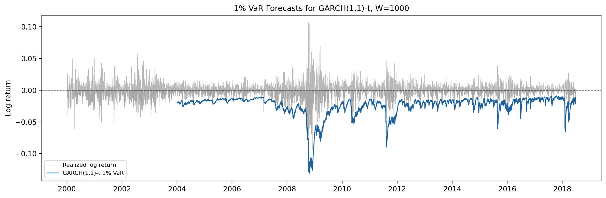
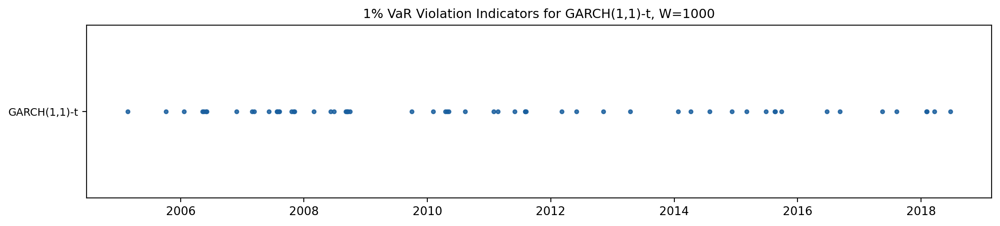
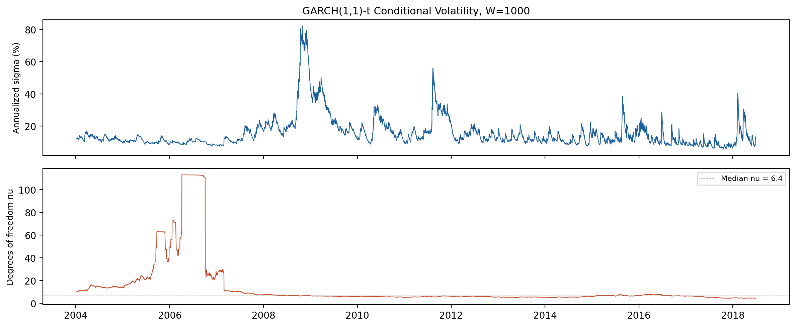
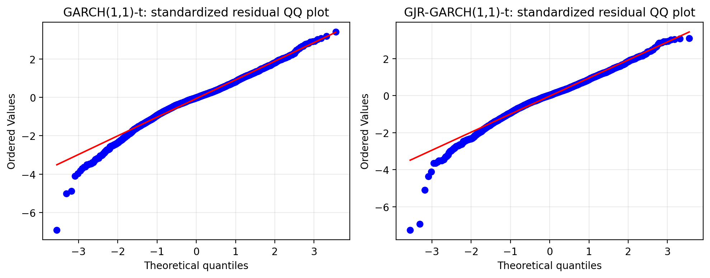

## Section 4: GARCH(1,1) with Student-t Innovations

### 4.1 Motivation

Section 3 shows that Historical Simulation (HS) family methods are transparent but mechanically backward-looking. Ordinary HS gives each return in the rolling window equal weight, while time-weighted HS and KDE-smoothed time-weighted HS improve this design by giving more recent observations greater influence and by smoothing the empirical tail. These changes help, but they do not fully solve the conditional-risk problem. At W = 1000, ordinary HS has a 1% crisis-period failure rate of 7.17%, time-weighted HS reduces it to 2.39%, and KDE time-weighted HS reduces it to 1.74%. The improvement is meaningful, but the 1% Christoffersen p-value for KDE time-weighted HS remains only 0.0246, so violation clustering is still present.

The next step is therefore to model the conditional distribution of returns directly. This section estimates a GARCH(1,1) model with Student-t innovations, hereafter GARCH-t. The GARCH component targets volatility clustering, while the Student-t innovation distribution targets excess kurtosis in standardized shocks. This structure is parametric, unlike the HS methods in Section 3, but it is designed to respond faster when market volatility changes.

The choice is motivated by two empirical features of SPY daily log returns. First, the autocorrelation function of squared returns is positive and persistent, which is the standard signature of ARCH effects. Second, the full-sample excess kurtosis of log returns is 8.22, far above the Gaussian benchmark. A Gaussian GARCH model can adjust conditional volatility, but it still imposes Gaussian standardized residuals. The Student-t distribution adds a degrees-of-freedom parameter that allows the left tail to be thicker than the normal distribution.

The research questions are therefore direct. First, does GARCH-t reduce the violation-clustering problem observed in Section 3? Second, does the Student-t tail deliver acceptable unconditional coverage at the 1%, 5%, and 10% VaR levels? Third, does the crisis-versus-calm comparison confirm that a conditional-variance model adapts more quickly than HS-based methods?

### 4.2 Model Specification

Let r_t denote the SPY daily log return. The GARCH-t model is

$$
r_t = \mu + \epsilon_t, \qquad
\epsilon_t = \sigma_t z_t, \qquad
z_t \overset{i.i.d.}{\sim} t_\nu(0,1),
\tag{1}
$$

where mu is a constant conditional mean, sigma_t is the conditional standard deviation, and z_t follows a standardized Student-t distribution with degrees of freedom nu > 2. The conditional variance follows

$$
\sigma_t^2
= \omega + \alpha_1 \epsilon_{t-1}^2 + \beta_1 \sigma_{t-1}^2.
\tag{2}
$$

The restrictions omega > 0, alpha_1 >= 0, beta_1 >= 0, and alpha_1 + beta_1 < 1 ensure a positive and covariance-stationary conditional variance process. The sum alpha_1 + beta_1 measures volatility persistence. Values close to one imply that volatility shocks decay slowly, which is typical for daily equity returns.

For a rolling estimation window, the model parameters are estimated by maximum likelihood. The one-step-ahead VaR forecast is

$$
\widehat{\mathrm{VaR}}_{\alpha,t+1}
= \hat{\mu} + \hat{\sigma}_{t+1|t} q_\alpha(t_{\hat{\nu}}),
\tag{3}
$$

where q_alpha(t_nu) is the alpha-quantile of the standardized Student-t distribution. This formula has two risk channels. The conditional volatility sigma changes over time and scales all quantiles. The estimated degrees of freedom nu controls the tail multiplier, especially at the 1% level.

In implementation, returns are multiplied by 100 before estimation for numerical stability, and forecasts are converted back to decimal log-return units. The VaR calculation uses the standardized Student-t quantile used by the `arch` package, namely the raw Student-t quantile multiplied by sqrt((nu - 2) / nu). This is important because the `arch` Student-t distribution is scaled to unit variance.

### 4.3 Rolling Window Design

The rolling design is the same as Section 3. For each forecast date, the estimation window contains only past observations:

$$
\mathcal{F}_t(W)=\{r_{t-W+1},r_{t-W+2},\ldots,r_t\}.
\tag{4}
$$

The model is fitted on this information set and evaluated against r_{t+1}. This timing convention avoids look-ahead bias. I compare W = 250, 500, and 1000 trading days, matching the HS-family analysis. The resulting out-of-sample forecast counts are 4,390, 4,140, and 3,640 respectively.

The backtesting methodology is also held fixed. For each alpha level, I report the number of VaR violations relative to the expected number, the failure rate, average VaR, Kupiec unconditional coverage p-value, Christoffersen independence p-value, Duration p-value, and Lopez regulatory loss. The Duration test evaluates whether the waiting times between VaR violations are consistent with the memoryless benchmark implied by correctly timed exceedances. Keeping the same diagnostics makes the comparison with Tables 3.1-3.5 direct.

### 4.4 Parameter Estimates

Table 4.1 reports the rolling parameter summary for the preferred W = 1000 specification. The median degrees of freedom is 6.39, with an interquartile range from 5.61 to 8.94. This confirms that the fitted standardized shocks are substantially heavier-tailed than Gaussian. The median persistence alpha_1 + beta_1 is 0.9896, indicating very slow volatility decay.

Table 4.1. Median rolling GARCH(1,1)-t parameter estimates, W = 1000.

| Parameter | Median | IQR | Interpretation |
|---|---:|---:|---|
| $\hat{\mu}$ | 0.000735 | 0.000533 to 0.000943 | Daily mean return |
| $\hat{\omega}$ | 0.019137 | 0.007068 to 0.033304 | Baseline variance |
| $\hat{\alpha}_1$ | 0.099004 | 0.064526 to 0.145009 | ARCH effect (shock sensitivity) |
| $\hat{\beta}_1$ | 0.896013 | 0.811530 to 0.924210 | Volatility persistence |
| $\hat{\alpha}_1+\hat{\beta}_1$ | 0.989610 | 0.969190 to 1.000000 | Total persistence |
| $\hat{\nu}$ | 6.388838 | 5.609068 to 8.942289 | Tail degrees of freedom |

The high persistence is economically intuitive but also diagnostically important. After a large shock, the conditional variance remains elevated for many days, which should reduce the clustering of subsequent VaR violations. At the same time, the median persistence of 0.9896 is close to the IGARCH boundary. This means that shocks decay very slowly and the model may behave as if volatility is nearly integrated in some rolling windows. For VaR forecasting, this creates a trade-off: the model adapts to stress regimes, but its risk level can remain highly dependent on recent large shocks and may still be miscalibrated if the innovation distribution is too restrictive.

I therefore add a residual diagnostic rather than relying only on parameter estimates. Table 4.1b reports an ARCH-LM test on one-step standardized residuals for the W = 1000 baseline GARCH and GJR-GARCH models. The null hypothesis is no remaining ARCH structure in the squared standardized residuals. The baseline GARCH model is rejected at the 5% level, while the GJR model is not rejected. This supports the leverage-effect robustness check: asymmetry removes part of the remaining conditional heteroskedasticity that symmetric GARCH leaves behind.

Table 4.1b. ARCH-LM residual diagnostic for standardized residuals, W = 1000.

| Model | Lags | Obs. | LM stat | p-value |
|---|---:|---:|---:|---:|
| GARCH(1,1)-t | 10 | 3630 | 22.9925 | 0.0108 |
| GJR-GARCH(1,1)-t | 10 | 3630 | 13.1270 | 0.2167 |

### 4.5 Empirical Results

Tables 4.2-4.4 report the full backtesting results for the three rolling windows.

Table 4.2. Backtesting results for GARCH(1,1)-t, W = 250.

| Alpha | Viol./Exp. | Fail. rate | Avg VaR | Kupiec p | Christoffersen p | Duration p | Lopez loss |
|---|---:|---:|---:|---:|---:|---:|---:|
| 1% | 89 / 43.9 | 0.0203 | -0.0253 | 0.0000 | 0.1484 | 0.0000 | 0.020274 |
| 5% | 280 / 219.5 | 0.0638 | -0.0160 | 0.0001 | 0.5839 | 0.0001 | 0.063787 |
| 10% | 527 / 439.0 | 0.1200 | -0.0119 | 0.0000 | 0.9956 | 0.0000 | 0.120057 |

Table 4.3. Backtesting results for GARCH(1,1)-t, W = 500.

| Alpha | Viol./Exp. | Fail. rate | Avg VaR | Kupiec p | Christoffersen p | Duration p | Lopez loss |
|---|---:|---:|---:|---:|---:|---:|---:|
| 1% | 64 / 41.4 | 0.0155 | -0.0253 | 0.0011 | 0.0964 | 0.0011 | 0.015460 |
| 5% | 261 / 207.0 | 0.0630 | -0.0158 | 0.0002 | 0.6974 | 0.0002 | 0.063049 |
| 10% | 481 / 414.0 | 0.1162 | -0.0117 | 0.0007 | 0.2298 | 0.0000 | 0.116194 |

Table 4.4. Backtesting results for GARCH(1,1)-t, W = 1000.

| Alpha | Viol./Exp. | Fail. rate | Avg VaR | Kupiec p | Christoffersen p | Duration p | Lopez loss |
|---|---:|---:|---:|---:|---:|---:|---:|
| 1% | 59 / 36.4 | 0.0162 | -0.0244 | 0.0006 | 0.3424 | 0.0000 | 0.016210 |
| 5% | 230 / 182.0 | 0.0632 | -0.0151 | 0.0004 | 0.8973 | 0.0007 | 0.063192 |
| 10% | 418 / 364.0 | 0.1148 | -0.0111 | 0.0035 | 0.1363 | 0.0001 | 0.114846 |

The main finding is mixed. GARCH-t substantially improves the Christoffersen independence diagnostic, but it does not provide correct unconditional coverage. For W = 1000, the Christoffersen p-values are 0.3424, 0.8973, and 0.1363 at the 1%, 5%, and 10% levels respectively. This is a major improvement over ordinary HS, whose W = 1000 Christoffersen p-values were 0.0002, 0.0004, and 0.0000. Conditional volatility modeling therefore reduces violation clustering.

At the same time, the failure rates are too high. For W = 1000, the 1% failure rate is 1.62%, the 5% failure rate is 6.32%, and the 10% failure rate is 11.48%. All three Kupiec p-values are below 1%. The model is therefore not rejected because violations cluster; it is rejected because the VaR forecasts are too shallow on average. This distinction matters. GARCH-t improves the timing of risk but still underestimates the required VaR level.

The Duration test confirms that the time pattern is not fully satisfactory. Even when the Christoffersen test does not reject independence, the Duration p-values remain very small. This suggests that the waiting-time distribution between violations still differs from the memoryless benchmark. In practical terms, GARCH-t spreads violations more evenly than ordinary HS, but not enough to pass all dynamic diagnostics.

Figure 4.1 compares the realized log returns with the W = 1000 1% GARCH-t VaR forecast. Figure 4.2 plots the corresponding 1% violation dates. Figure 4.3 shows the annualized conditional volatility and the rolling estimated degrees of freedom. Figure 4.4 gives the standardized-residual QQ diagnostic.

### 4.6 Crisis-Period and Calm-Period Analysis

Table 4.5 applies the same subsample decomposition as Table 3.5. The crisis period runs from 2007-09-01 to 2009-06-30, and the post-crisis calm period runs from 2012-01-01 to 2016-12-31.

Table 4.5. Subsample failure rates for GARCH(1,1)-t, W = 1000.

| Period | Alpha | Obs. | Viol./Exp. | Fail. rate | Avg VaR |
|---|---:|---:|---:|---:|---:|
| Crisis | 1% | 460 | 11 / 4.6 | 0.0239 | -0.0486 |
| Crisis | 5% | 460 | 38 / 23.0 | 0.0826 | -0.0304 |
| Crisis | 10% | 460 | 65 / 46.0 | 0.1413 | -0.0225 |
| Post-crisis calm | 1% | 1258 | 15 / 12.6 | 0.0119 | -0.0202 |
| Post-crisis calm | 5% | 1258 | 78 / 62.9 | 0.0620 | -0.0121 |
| Post-crisis calm | 10% | 1258 | 145 / 125.8 | 0.1153 | -0.0088 |

The crisis-period comparison is important. GARCH-t reduces ordinary HS's 1% crisis failure rate from 7.17% to 2.39%, matching the time-weighted HS result and coming close to KDE time-weighted HS at 1.74%. The average crisis-period 1% VaR is -0.0486, much more conservative than ordinary HS at -0.0335, which shows that the conditional variance channel is active during stress.

However, GARCH-t does not dominate the HS extensions. At the 5% and 10% crisis levels, its failure rates are 8.26% and 14.13%, higher than the nominal rates and higher than the time-weighted HS crisis rates of 5.00% and 10.87%. In the calm period, the same pattern persists: GARCH-t is close at 1% but produces too many 5% and 10% violations. The model adapts to volatility regimes, but its conditional distribution is still not calibrated enough across the full tail.

### 4.7 Comparison with Section 3

The cleanest comparison is at W = 1000. Ordinary HS had acceptable 5% unconditional coverage but failed independence badly. Time-weighted HS fixed much of the 5% and 10% independence problem but still failed at 1%. KDE time-weighted HS improved the 1% Kupiec test but did not fully solve independence.

GARCH-t changes the error profile. Its independence p-values are stronger than the HS-family results, especially at 5%, where the p-value rises to 0.8973. But its Kupiec p-values are all below 0.005, meaning the model generates too many violations. In other words, GARCH-t solves part of the dynamic clustering problem but introduces a calibration problem.

This result is consistent with the limits of a symmetric GARCH(1,1) specification. Equity returns often display leverage effects, where negative shocks increase future volatility more than positive shocks of the same magnitude. A symmetric GARCH model treats both signs identically. This can leave the model under-reactive after adverse shocks and over-simplified during regime transitions. The GJR-GARCH specification of Glosten, Jagannathan and Runkle (1993) is therefore a natural robustness check.

### 4.8 Robustness: Leverage Effects and Realized Measures

The dataset contains two high-frequency volatility measures that are not used by the baseline GARCH-t model: rv5 and bv. The realized-volatility literature shows that intraday realized measures contain useful information about latent daily volatility. Andersen, Bollerslev, Diebold and Labys (2003) formalize realized volatility as an observable proxy for latent volatility, while Barndorff-Nielsen and Shephard (2004) introduce bipower variation as a jump-robust variation measure. Hansen, Huang and Shek (2012) build this idea directly into Realized GARCH, a joint model for returns and realized measures of volatility.

Motivated by this literature, I estimate three W = 1000 robustness models. First, GJR-GARCH(1,1)-t adds an asymmetric leverage term:

$$
\sigma_t^2
= \omega + \alpha_1 \epsilon_{t-1}^2
+ \gamma_1 \mathbf{1}(\epsilon_{t-1}<0)\epsilon_{t-1}^2
+ \beta_1 \sigma_{t-1}^2.
\tag{5}
$$

Second, I estimate variance-side GARCH-X models using rv5 and bv as lagged exogenous variance predictors:

$$
\sigma_t^2
= \omega + \alpha_1 \epsilon_{t-1}^2
+ \beta_1 \sigma_{t-1}^2
+ \gamma_x X_{t-1},
\tag{6}
$$

where X_{t-1} is either rv5 or bv, scaled to percent-squared units. This is not the same as placing x in the mean equation. The realized measure enters the conditional variance recursion directly, so the forecast uses information available at the end of day t to predict day t+1 VaR.

Table 4.6 reports the robustness comparison. The table keeps only W = 1000 because this is the preferred window in the main analysis and the cleanest bridge to Section 5.

Table 4.6. Robustness models with leverage and realized measures, W = 1000.

| Model | Alpha | Viol./Exp. | Fail. rate | Avg VaR | Kupiec p | Christoffersen p | Duration p |
|---|---:|---:|---:|---:|---:|---:|---:|
| GARCH(1,1)-t | 1% | 59 / 36.4 | 0.0162 | -0.0244 | 0.0006 | 0.3424 | 0.0000 |
| GARCH(1,1)-t | 5% | 230 / 182.0 | 0.0632 | -0.0151 | 0.0004 | 0.8973 | 0.0007 |
| GARCH(1,1)-t | 10% | 418 / 364.0 | 0.1148 | -0.0111 | 0.0035 | 0.1363 | 0.0001 |
| GJR-GARCH(1,1)-t | 1% | 53 / 36.4 | 0.0146 | -0.0243 | 0.0096 | 0.8009 | 0.0005 |
| GJR-GARCH(1,1)-t | 5% | 229 / 182.0 | 0.0629 | -0.0154 | 0.0006 | 0.6873 | 0.0002 |
| GJR-GARCH(1,1)-t | 10% | 397 / 364.0 | 0.1091 | -0.0115 | 0.0719 | 0.1017 | 0.0000 |
| GARCH-X-rv5-t | 1% | 61 / 36.4 | 0.0168 | -0.0235 | 0.0002 | 0.3831 | 0.0000 |
| GARCH-X-rv5-t | 5% | 241 / 182.0 | 0.0662 | -0.0151 | 0.0000 | 0.9916 | 0.0000 |
| GARCH-X-rv5-t | 10% | 403 / 364.0 | 0.1107 | -0.0113 | 0.0338 | 0.5368 | 0.0004 |
| GARCH-X-bv-t | 1% | 65 / 36.4 | 0.0179 | -0.0232 | 0.0000 | 0.8762 | 0.0000 |
| GARCH-X-bv-t | 5% | 233 / 182.0 | 0.0640 | -0.0150 | 0.0002 | 0.7976 | 0.0000 |
| GARCH-X-bv-t | 10% | 394 / 364.0 | 0.1082 | -0.0112 | 0.1014 | 0.8186 | 0.0014 |

The GJR extension gives the clearest calibration improvement. The 1% failure rate falls from 1.62% to 1.46%, and the 10% failure rate falls from 11.48% to 10.91%. The 10% Kupiec p-value rises from 0.0035 to 0.0719, so the asymmetric leverage term materially improves moderate-tail coverage. In the GJR recursion used here, the leverage term is gamma_1 I(epsilon_{t-1}<0) epsilon_{t-1}^2. A positive gamma_1 therefore means that negative shocks add extra variance relative to positive shocks of the same magnitude. The rolling estimates support this interpretation: the median gamma_1 is 0.1598, the interquartile range is 0.1214 to 0.2987, and the coefficient is positive in essentially all rolling windows.

The realized-measure extensions are more subtle. They do not automatically improve the 1% failure rate: GARCH-X-rv5-t has a 1.68% failure rate and GARCH-X-bv-t has a 1.79% failure rate. However, they sharply reduce the estimated GARCH persistence. The median alpha_1 + beta_1 falls from 0.9896 in baseline GARCH-t to 0.6963 for GARCH-X-rv5-t and 0.6450 for GARCH-X-bv-t. This is exactly what the realized-volatility literature predicts: once an observed realized measure enters the variance equation, less persistence has to be carried by the latent GARCH recursion.

The best interpretation is therefore not that realized measures mechanically dominate baseline GARCH-t in this sample. Rather, rv5 and bv contain genuine state information, but a linear GARCH-X variance equation is still too restrictive for VaR calibration. This finding is useful for Section 5. It supports using lagged rv5, bv, and GARCH-based volatility forecasts as neural-network inputs, while allowing the network to learn nonlinear interactions that the linear GARCH-X model cannot capture.

### 4.9 Model Limitations and the Case for Neural Network Methods

The GARCH-t model improves the conditional timing of VaR violations, but the empirical results show that it is not the final model. Its main limitation is parametric rigidity. The conditional variance is forced into the GARCH(1,1) recursion, the standardized innovation distribution is forced into a single Student-t shape, and the mean equation is constant.

The robustness results confirm that the high-frequency volatility variables are informative but not sufficient under a linear variance recursion. The data contain rv5 and bv, which summarize intraday realized volatility and bipower variation. These variables contain information about current volatility that daily returns alone cannot fully capture. A model that uses rv5, bv, GARCH forecasts, and lagged returns jointly may forecast conditional quantiles more accurately than a univariate GARCH recursion.

Finally, GARCH-t estimates a full conditional distribution and then extracts the desired quantile. Direct quantile models instead target VaR itself. This is the motivation for Section 5: neural network quantile regression can use realized-volatility covariates, allow nonlinear interactions, and estimate the 1%, 5%, and 10% conditional quantiles directly without imposing a single parametric innovation distribution.

### 4.10 Summary

GARCH(1,1)-t is a useful bridge between the non-parametric HS family and more flexible machine-learning VaR models. Relative to ordinary HS, it clearly improves violation independence. For W = 1000, the Christoffersen p-values at 1%, 5%, and 10% are 0.3424, 0.8973, and 0.1363, whereas ordinary HS rejected independence at all three levels.

The model nevertheless fails unconditional coverage. It produces too many violations at every alpha level and every rolling window. The preferred W = 1000 failure rates are 1.62%, 6.32%, and 11.48%, all above the nominal 1%, 5%, and 10% targets. The conclusion is therefore not that GARCH-t fully solves VaR forecasting. The correct conclusion is narrower and more informative: conditional variance modeling reduces clustering, but symmetric GARCH-t is still miscalibrated for SPY daily tail risk.

The robustness checks refine this conclusion. GJR-GARCH-t improves calibration by adding leverage effects, while GARCH-X-rv5-t and GARCH-X-bv-t show that realized measures absorb a large part of volatility persistence. The realized-measure models do not fully fix VaR coverage by themselves, but they provide the right transition to Section 5. The neural network models should keep these realized measures as inputs and allow nonlinear conditional-quantile effects.

---

## References

Barndorff-Nielsen, O. E., and Shephard, N. (2004). Power and bipower variation with stochastic volatility and jumps. *Journal of Financial Econometrics*, 2(1), 1-37.

Andersen, T. G., Bollerslev, T., Diebold, F. X., and Labys, P. (2003). Modeling and forecasting realized volatility. *Econometrica*, 71(2), 579-625.

Bollerslev, T. (1986). Generalized autoregressive conditional heteroskedasticity. *Journal of Econometrics*, 31(3), 307-327.

Bollerslev, T. (1987). A conditionally heteroskedastic time series model for speculative prices and rates of return. *The Review of Economics and Statistics*, 69(3), 542-547.

Christoffersen, P. F. (1998). Evaluating interval forecasts. *International Economic Review*, 39(4), 841-862.

Christoffersen, P. F., and Pelletier, D. (2004). Backtesting value-at-risk: A duration-based approach. *Journal of Financial Econometrics*, 2(1), 84-108.

Engle, R. F. (1982). Autoregressive conditional heteroscedasticity with estimates of the variance of United Kingdom inflation. *Econometrica*, 50(4), 987-1007.

Engle, R. F. (2002). New frontiers for ARCH models. *Journal of Applied Econometrics*, 17(5), 425-446.

Glosten, L. R., Jagannathan, R., and Runkle, D. E. (1993). On the relation between the expected value and the volatility of the nominal excess return on stocks. *Journal of Finance*, 48(5), 1779-1801.

Hansen, P. R., Huang, Z., and Shek, H. H. (2012). Realized GARCH: A joint model for returns and realized measures of volatility. *Journal of Applied Econometrics*, 27(6), 877-906.

Kupiec, P. H. (1995). Techniques for verifying the accuracy of risk measurement models. *The Journal of Derivatives*, 3(2), 73-84.

Lopez, J. A. (1999). Regulatory evaluation of value-at-risk models. *Journal of Risk*, 1(2), 37-64.

Sheppard, K. (2024). arch: Autoregressive Conditional Heteroskedasticity models in Python.
