## Section 5: Neural Quantile Regression and GARCH-Anchored Extensions

### 5.1 Motivation

The previous sections establish a sequence of increasingly structured VaR models. Section 2 documents heavy tails and volatility clustering in SPY daily log returns. Section 3 shows that Historical Simulation is transparent and distribution-free, but its equal-weighted form reacts slowly when the market moves from a calm regime into a stress regime. Time-weighted Historical Simulation improves this limitation by assigning greater relevance to recent observations. Section 4 then introduces an explicit conditional-volatility structure through GARCH-type models, which improves the timing of VaR violations even when unconditional coverage remains imperfect.

This section evaluates whether a neural quantile regression model can improve the VaR forecast. The baseline neural specification is an MLP-QR model that maps the current information set directly into next-day conditional quantiles:

$$
\widehat{\mathrm{VaR}}_{\alpha,t+1}
=
f_{\theta}(X_t).
\tag{1}
$$

Here $X_t$ denotes information available up to day t, and $f_{\theta}$ is the neural network. The target remains the next-day realized return, $r_{t+1}$. This direct specification is flexible, but it asks the network to learn the full VaR level from a limited rolling-window sample. The problem is particularly severe at the 1% level, where each 1000-day estimation window contains only a small number of extreme left-tail observations.

The empirical results below show that the direct MLP-QR forecasts are too shallow: realized returns violate the estimated VaR far more often than the nominal level implies. This negative result is useful because it motivates a more structured neural design. The appropriate role of the neural network is not necessarily to replace GARCH, but to correct it:

GARCH supplies a conditional-volatility anchor, while the neural network learns nonlinear calibration adjustments around that anchor.

This is the motivation for a GARCH-anchored neural quantile correction. The baseline MLP-QR results should therefore be interpreted as a diagnostic step that identifies why an anchored specification is more defensible than a purely direct neural VaR model.

### 5.2 Forecasting Target

For each tail probability $\alpha$, the object of interest is tomorrow's conditional lower-tail quantile:

$$
\mathrm{VaR}_{\alpha,t+1}.
\tag{2}
$$

For example, if

$$
\widehat{\mathrm{VaR}}_{0.05,t+1}=-0.02,
\tag{3}
$$

the model implies that the 5% lower-tail threshold for the next trading day is -2%. If the realized return is

$$
r_{t+1}=-0.03,
\tag{4}
$$

then the return has fallen below the VaR forecast, because $-0.03<-0.02$. This is a VaR violation. A correctly calibrated 5% VaR forecast should be violated approximately 5% of the time, and a correctly calibrated 1% VaR forecast should be violated approximately 1% of the time.

The forecasting problem is therefore a quantile-calibration problem: the estimated VaR must be low enough to represent the intended lower-tail probability, but not so low that it becomes unnecessarily conservative.

### 5.3 Baseline MLP-QR Specification

The baseline neural model in this section is an MLP quantile regression model. It directly maps today's information into tomorrow's VaR forecasts:

$$
\left(
\widehat{\mathrm{VaR}}_{0.01,t+1},
\widehat{\mathrm{VaR}}_{0.05,t+1},
\widehat{\mathrm{VaR}}_{0.10,t+1}
\right)
=
f_{\theta}(X_t).
\tag{5}
$$

Two input designs are considered. Model A uses only lagged returns and rolling return summaries:

$$
X^{A}_t =
\{r_t,r_{t-1},r_{t-2},r_{t-3},r_{t-4},
\overline{r}_{t,5},s_{t,5},s_{t,22},\min_{22}(r),\max_{22}(r)\}.
\tag{6}
$$

Model B adds realized-volatility information:

$$
X^{B}_t =
\{X^{A}_t,\mathrm{rv5}_t,\mathrm{bv}_t,
\overline{\mathrm{rv5}}_{t,5},\overline{\mathrm{bv}}_{t,5}\}.
\tag{7}
$$

All features are constructed using information available through day t. The target is

$$
y_t=r_{t+1}.
\tag{8}
$$

This timing convention avoids look-ahead bias. The model can observe past returns, rolling volatility, rv5, and bv, but it cannot use tomorrow's return when constructing tomorrow's VaR forecast.

The MLP has two hidden layers with 64 and 32 units, ReLU activations, and dropout 0.10. The output layer has three units for the 1%, 5%, and 10% quantiles. Because independently predicted quantiles can cross, the three outputs are sorted after inference so that

$$
\widehat{\mathrm{VaR}}_{0.01,t+1}
\le
\widehat{\mathrm{VaR}}_{0.05,t+1}
\le
\widehat{\mathrm{VaR}}_{0.10,t+1}.
\tag{9}
$$

Figure 5.4 summarizes the two neural designs used in this section. The direct MLP-QR model maps the feature vector directly into three quantile outputs. Model C2 instead uses the same compact MLP as a correction layer around the GARCH-t VaR anchor, with the softplus restriction forcing the correction in the conservative direction.

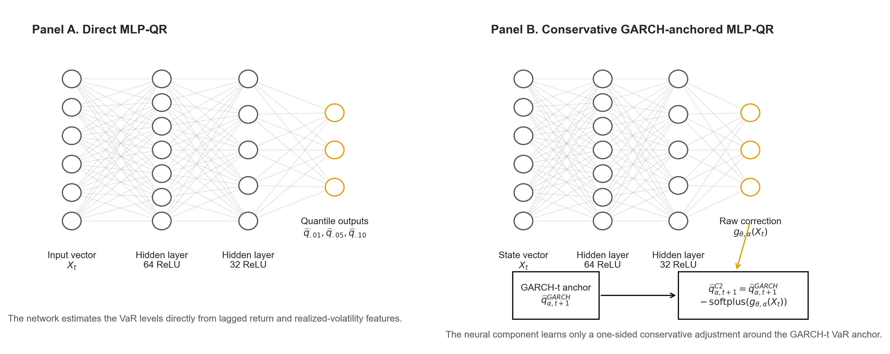

The model is trained with pinball loss. For a quantile level $\alpha$, the loss is

$$
\rho_{\alpha}(y-\hat{q})
=
\max\{\alpha(y-\hat{q}),(\alpha-1)(y-\hat{q})\}.
\tag{10}
$$

This loss is used because VaR is a quantile, not a mean. Mean-squared error would train the network toward an average return, which is not the risk-management object.

### 5.4 Rolling Training Design

The rolling design follows the same no-look-ahead principle as the earlier sections. The estimation window contains W = 1000 usable observations. Within each rolling window, the first 80% is used for training and the last 20% is used for validation. The StandardScaler is fitted only on the training part of the current window. It is never fitted on the full sample.

The network is trained with Adam, learning rate 0.001, batch size 64, maximum 200 epochs, and early stopping patience 10. The model is retrained every 20 trading days. Between refits, the most recent fitted network is used to generate one-day-ahead forecasts. After feature construction, the out-of-sample evaluation contains 3,617 forecasts for each neural specification.

This design is intentionally comparable to the W = 1000 setting in Sections 3 and 4, but the forecast count is slightly smaller because neural features require lagged and rolling observations before the first supervised sample is available.

### 5.5 Backtesting Methodology

The violation indicator is the same as before:

$$
I_{t+1}
=
\mathbf{1}
\left(
r_{t+1}<\widehat{\mathrm{VaR}}_{\alpha,t+1}
\right).
\tag{11}
$$

For each model and alpha level, I report the number of violations, expected violations, failure rate, average VaR, Kupiec unconditional coverage p-value, Christoffersen independence p-value, Duration test p-value, Lopez regulatory loss, pinball loss, and the pre-correction quantile crossing rate. The Lopez loss is

$$
L_{t+1}=
\begin{cases}
1+(r_{t+1}-\widehat{\mathrm{VaR}}_{\alpha,t+1})^2,
& r_{t+1}<\widehat{\mathrm{VaR}}_{\alpha,t+1},\\
0,
& r_{t+1}\ge\widehat{\mathrm{VaR}}_{\alpha,t+1}.
\end{cases}
\tag{12}
$$

The coverage tests evaluate whether the VaR level is correctly calibrated. The independence and duration tests evaluate whether violations arrive randomly or remain clustered. The pinball loss gives the quantile-specific scoring comparison.

### 5.6 Empirical Results: Direct Neural VaR Is Too Shallow

Table 5.1 reports the neural-network backtesting results. The main finding is that the direct MLP-QR models produce VaR forecasts that are too shallow. At the 1% VaR level, Model A records 260 violations, compared with only 36.17 expected violations. Model B, which adds rv5 and bv, reduces the count to 243, but this is still far above the nominal target. In failure-rate terms, the two 1% neural VaR forecasts behave like 7.19% and 6.72% quantiles, not 1% quantiles.

Table 5.1. Backtesting results for baseline neural quantile regression, W = 1000.

| Model | Alpha | Viol./Exp. | Fail. rate | Avg VaR | Kupiec p | Christoffersen p | Duration p | Lopez loss | Pinball loss | Crossing rate |
|---|---:|---:|---:|---:|---:|---:|---:|---:|---:|---:|
| Model A: MLP-QR | 1% | 260 / 36.17 | 0.0719 | -0.0184 | 0.0000 | 0.0000 | 0.0000 | 0.071979 | 0.001712 | 0.0683 |
| Model A: MLP-QR | 5% | 420 / 180.85 | 0.1161 | -0.0120 | 0.0000 | 0.0000 | 0.0000 | 0.116234 | 0.002577 | 0.0683 |
| Model A: MLP-QR | 10% | 549 / 361.70 | 0.1518 | -0.0091 | 0.0000 | 0.0000 | 0.0000 | 0.152007 | 0.003700 | 0.0683 |
| Model B: MLP-QR + RV | 1% | 243 / 36.17 | 0.0672 | -0.0187 | 0.0000 | 0.0000 | 0.0000 | 0.067527 | 0.002368 | 0.1181 |
| Model B: MLP-QR + RV | 5% | 438 / 180.85 | 0.1211 | -0.0107 | 0.0000 | 0.0000 | 0.0000 | 0.121648 | 0.003561 | 0.1181 |
| Model B: MLP-QR + RV | 10% | 584 / 361.70 | 0.1615 | -0.0067 | 0.0000 | 0.0000 | 0.0043 | 0.162917 | 0.005472 | 0.1181 |

Note: Model A uses lagged returns and rolling return features. Model B adds rv5, bv, and their 5-day rolling averages. The crossing rate is measured before the post-prediction sorting correction.

Adding realized-volatility variables does not fix the problem. Model B has fewer 1% violations than Model A, but it has a larger pinball loss at every reported quantile. The average pinball loss across the three levels is 0.002663 for Model A and 0.003800 for Model B. Model B also has a larger quantile crossing rate before sorting, 11.81% compared with 6.83% for Model A. A plausible mechanism is finite-sample instability rather than the absence of volatility information. The rv5 and bv variables are highly correlated volatility proxies, so adding both increases feature redundancy and parameter-estimation noise inside each rolling window. A shallow direct MLP can therefore overfit volatility-state proxies without learning a stable lower-tail quantile map. This is also consistent with the higher crossing rate in Model B.

Figure 5.1 shows why the coverage failure occurs. The 1% VaR forecasts are often not sufficiently conservative during stress periods. Figure 5.2 shows that violations are frequent rather than rare isolated events. Figure 5.3 confirms that Model A has lower pinball loss than Model B at 1%, 5%, and 10%.

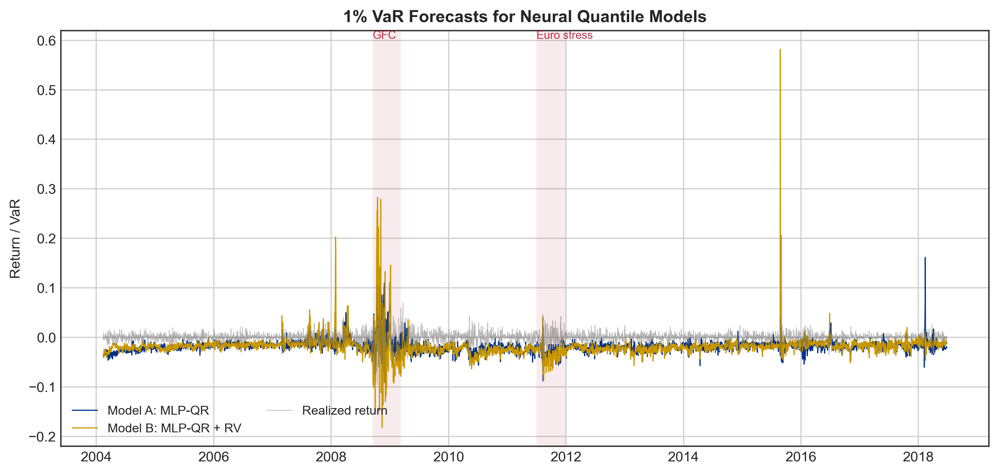

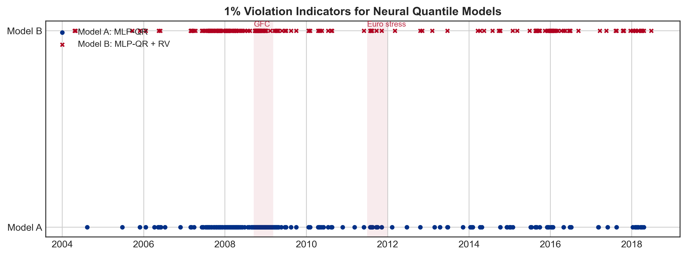

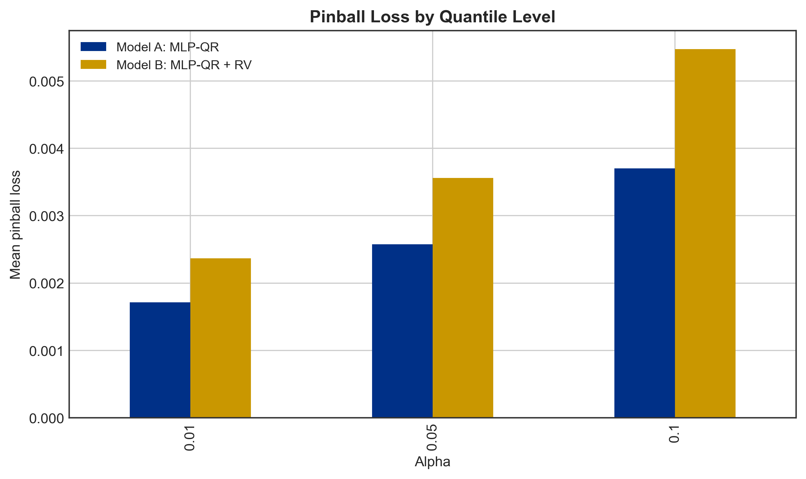

### 5.7 Interpretation of the Baseline Failure

The poor baseline result is consistent with the difficulty of the learning problem. The direct MLP-QR model is required to estimate the full conditional quantile function:

$$
\widehat{\mathrm{VaR}}_{\alpha,t+1}
=
f_{\theta}(X_t).
\tag{13}
$$

This is a difficult task for four reasons. First, the rolling sample is limited. Second, the 1% tail contains very few observations in each 1000-day window. Third, the neural network has no built-in conditional-volatility structure. Fourth, the model must learn both volatility timing and VaR-level calibration simultaneously. The result is a shallow VaR forecast: the model targets the 1% quantile, but the realized failure rate is closer to 7%.

This gives the section its main interpretation. The baseline MLP-QR model is useful not because it dominates the classical methods, but because it identifies the weakness of an unconstrained direct neural VaR specification under limited rolling-window samples. The model-design implication is that the neural network should be given a financial anchor rather than being asked to estimate the entire VaR level independently.

### 5.8 GARCH-Anchored Neural Quantile Correction

The natural anchor is the GARCH-t VaR from Section 4. GARCH already contains a risk-management structure: conditional volatility rises after large shocks and decays gradually afterward. Section 4 shows that this improves violation timing, even though the GARCH-t VaR level is still not perfectly calibrated. This is precisely the setting in which an anchored neural correction is appropriate.

Instead of asking the network to forecast VaR directly, define a GARCH-anchored neural VaR as

$$
\widehat{\mathrm{VaR}}^{NN}_{\alpha,t+1}
=
\widehat{\mathrm{VaR}}^{GARCH}_{\alpha,t+1}
+
g_{\theta}(X_t).
\tag{14}
$$

The GARCH forecast provides the baseline VaR level, and the neural network learns a correction around that baseline. If recent rv5 is high, recent returns are volatile, or the GARCH forecast appears too shallow, the correction term can move the VaR lower. If GARCH is already too conservative, the correction can move it upward. This reduces the burden on the neural network: it no longer has to learn the full VaR level independently; it learns the adjustment conditional on the current market state.

The input set for this anchored design can include the original neural features plus GARCH state variables. In the implementation, this includes lagged returns, rolling return summaries, rv5 and bv features, the three GARCH VaR forecasts, and the GARCH one-step-ahead volatility forecast.

This design matches the empirical logic of the project. Section 4 finds that GARCH improves violation timing but still has coverage errors. Section 5 finds that a direct MLP-QR model is too unstable and too shallow. A GARCH-anchored MLP-QRNN combines the two lessons: retain GARCH's conditional-volatility timing, but allow the neural network to learn nonlinear VaR-level corrections using lagged returns, rv5, bv, and the GARCH baseline.

### 5.9 A Conservative Anchored Variant

Because the baseline neural results underestimate risk, a more conservative anchored design is also possible. Instead of allowing the neural correction to move the VaR line in either direction, force the correction to make the VaR at least as conservative as the GARCH baseline:

$$
\widehat{\mathrm{VaR}}^{NN}_{\alpha,t+1}
=
\widehat{\mathrm{VaR}}^{GARCH}_{\alpha,t+1}
-
\mathrm{softplus}\{g_{\theta}(X_t)\}.
\tag{15}
$$

The softplus function is

$$
\mathrm{softplus}(x)=\log(1+\exp(x)).
\tag{16}
$$

It is always positive. Therefore, subtracting softplus from the GARCH VaR always moves the VaR forecast downward, making it more conservative. For example, if GARCH forecasts a 5% VaR of -1.5% and the neural correction is 0.4%, the final anchored VaR becomes -1.9%. This is a deliberately imposed risk-control constraint, not a claim that the network discovers one-sided conservatism from the data. The statistical rationale is narrower: Sections 4 and 5 show systematic underestimation of left-tail risk, so the correction is restricted to address that known direction of error. The cost is that the model could become trivially conservative if the correction is too large. This possibility is tested explicitly below using average VaR and correction-size diagnostics.

The anchored models use the same W = 1000 rolling window as the baseline neural models, but the internal split is adjusted to 90% training and 10% validation. This change is deliberate. For lower-tail quantile estimation, especially at the 1% level, the effective number of tail observations is small. A 90/10 split retains more observations for training while still preserving a chronologically later validation segment for early stopping. The scaler is still fitted only on the training part of the current rolling window, so the no-look-ahead constraint is unchanged.

The network architecture is intentionally small: two hidden layers with 64 and 32 units and dropout 0.10. This is not presented as a globally optimal architecture. It is a capacity-control choice for rolling-window quantile estimation, where each refit has only 1000 observations and very few 1% tail events. The 64/32 architecture, dropout 0.10, learning rate 0.001, and 20-day refit frequency follow a compact MLP design rather than an exhaustive architecture search. The conservative correction scale and Adam weight decay are then tuned, and the smallest regularization level that improves coverage without collapsing into excessive conservatism is retained.

Table 5.1b. Weight-decay tuning for conservative Model C2.

| Weight decay | 1% fail. | 5% fail. | 10% fail. | 1% pinball | 5% pinball | 10% pinball |
|---:|---:|---:|---:|---:|---:|---:|
| 0 | 0.0136 | 0.0617 | 0.1072 | 0.000357 | 0.001284 | 0.002081 |
| 1e-5 | 0.0095 | 0.0481 | 0.0902 | 0.000348 | 0.001259 | 0.002058 |
| 1e-4 | 0.0034 | 0.0364 | 0.0761 | 0.000365 | 0.001298 | 0.002102 |
| 5e-4 | 0.0004 | 0.0193 | 0.0420 | 0.000543 | 0.001453 | 0.002309 |

The selected value is 1e-5. Larger weight decay values reduce failure rates by making the model too conservative and increase pinball loss, so they are rejected. I do not tune the retraining frequency in this version; the 20-day refit interval is kept fixed to match the computational design of the rolling experiment. This is a limitation and should be treated as a robustness item rather than as an optimized choice.

This tuning result must be interpreted cautiously. The weight-decay comparison in Table 5.1b was selected after inspecting the final out-of-sample backtesting profile, especially the failure rates. Therefore, the reported C2 p-values are conditional on an ex post hyperparameter choice and should not be read as pure untouched test-sample p-values. A stricter design would choose weight decay on a separate validation period or through a pre-registered rolling validation rule, then reserve the final 2640 observations for a single evaluation. In the present project, Table 5.1b is best treated as a sensitivity check that motivates the chosen regularization level, not as a fully independent model-selection experiment.

### 5.10 Empirical Results for Model C

Table 5.2 reports the GARCH-anchored neural correction results. Model C is evaluated on 2640 aligned out-of-sample forecasts rather than the 3640 W = 1000 forecasts used in Sections 3 and 4. The reduction occurs because the anchored network requires the neural feature history, the cached GARCH-t anchor forecasts, and the initial rolling correction-training period to be simultaneously available. The additive version, Model C1, improves on the direct MLP-QR models but still remains too shallow. Its 1% failure rate is 3.94%, which is lower than Model A's 7.19% and Model B's 6.72%, but still far above the nominal 1% target.

The conservative version, Model C2, performs much better. Its failure rates are 0.95%, 4.96%, and 8.90% at the 1%, 5%, and 10% VaR levels. The Kupiec p-values are 0.7823, 0.9288, and 0.0557, respectively. Therefore, the final Model C2 is much closer to correct unconditional coverage than the direct MLP models and the Section 4 GARCH-family models. The independence diagnostics are mixed: the 5% and 10% Christoffersen p-values are comfortably above conventional rejection thresholds, while the 1% Christoffersen p-value is 0.0217, indicating that extreme violations still show some clustering. This is a limitation, but it is materially weaker than the coverage failure of the direct neural models.

For consistency with the multiple-testing discussion in Section 3, the 1% Christoffersen result should also be read under a Bonferroni lens. With nine backtesting checks across three alpha levels and three diagnostic families, a 5% family-wise threshold is approximately 0.0056. The C2 1% independence p-value of 0.0217 is below the unadjusted 5% threshold but above this Bonferroni threshold. The right interpretation is therefore borderline rather than cleanly satisfactory: the evidence of clustering is visible under the conventional single-test rule, but it is weaker under a conservative multiple-testing adjustment.

Table 5.2. Backtesting results for GARCH-anchored neural quantile correction, W = 1000.

| Model | Alpha | Viol./Exp. | Fail. rate | Avg VaR | Kupiec p | Christoffersen p | Duration p | Lopez loss | Pinball loss | Crossing rate |
|---|---:|---:|---:|---:|---:|---:|---:|---:|---:|---:|
| Model C1 | 1% | 104 / 26.40 | 0.0394 | -0.0226 | 0.0000 | 0.1721 | 0.0006 | 0.039412 | 0.000603 | 0.0379 |
| Model C1 | 5% | 287 / 132.00 | 0.1087 | -0.0144 | 0.0000 | 0.2463 | 0.6106 | 0.108744 | 0.001621 | 0.0379 |
| Model C1 | 10% | 394 / 264.00 | 0.1492 | -0.0116 | 0.0000 | 0.8393 | 0.0446 | 0.149290 | 0.002418 | 0.0379 |
| Model C2 | 1% | 25 / 26.40 | 0.0095 | -0.0296 | 0.7823 | 0.0217 | 0.7590 | 0.009470 | 0.000350 | 0.0053 |
| Model C2 | 5% | 131 / 132.00 | 0.0496 | -0.0187 | 0.9288 | 0.5196 | 0.7362 | 0.049625 | 0.001266 | 0.0053 |
| Model C2 | 10% | 235 / 264.00 | 0.0890 | -0.0141 | 0.0557 | 0.4737 | 0.3231 | 0.089024 | 0.002069 | 0.0053 |

Note: Model C uses GARCH(1,1)-t VaR as the baseline. Model C1 learns an unrestricted additive correction. Model C2 uses the conservative softplus correction. The Model C evaluation sample contains 2640 aligned forecast days beginning on 2008-01-03, not the 3640 W = 1000 forecast days used for the Section 3 and Section 4 benchmarks. Hence the expected violation counts in this table are 26.40, 132.00, and 264.00.

The improvement from Model C2 supports the anchored-neural storyline. The baseline MLP-QR models were too shallow because they had to infer the entire conditional quantile from a limited rolling sample. The conservative anchored version starts from a GARCH risk baseline and learns only a one-sided correction. This substantially reduces the severe 1% underestimation while keeping the model connected to the conditional-volatility structure of Section 4. The improvement is not a claim that the neural model dominates every metric. GARCH and GJR-GARCH still have competitive pinball losses at some quantiles. The stronger result is that Model C2 gives the best overall coverage profile in this section while preserving a financially interpretable volatility anchor.

Table 5.3 addresses the trivial-conservatism concern. If Model C2 were merely an extreme conservative rule, its average VaR would be far below the GARCH baseline and a large share of forecasts would fall below -10%. That is not what the diagnostics show. The average correction is about -0.23% to -0.26% in log-return units, and the share of C2 forecasts below -10% is only 1.63% at the 1% VaR level, 0.34% at the 5% level, and 0.08% at the 10% level. Thus Model C2 is more conservative than GARCH, but it is not equivalent to a mechanically extreme fixed VaR rule.

Table 5.3. Model C2 conservatism diagnostic relative to the GARCH baseline.

| Alpha | GARCH avg VaR | C2 avg VaR | Avg correction | Median correction | Share VaR <= -10% |
|---:|---:|---:|---:|---:|---:|
| 1% | -0.0270 | -0.0296 | -0.0026 | -0.0018 | 0.0163 |
| 5% | -0.0164 | -0.0187 | -0.0023 | -0.0015 | 0.0034 |
| 10% | -0.0119 | -0.0141 | -0.0023 | -0.0012 | 0.0008 |

Table 5.4 reports a crisis-versus-calm check for Model C2. The crisis period begins on 2008-01-03 for this table because Model C2 has no aligned forecasts before that date. The comparison is therefore a partial crisis-period check rather than the full crisis window used in Sections 3 and 4. Even with this limitation, the pattern is informative: Model C2 does not collapse in the crisis subsample, but the 5% and 10% failure rates remain above nominal during the stress period. In the post-crisis calm period, the model is close to nominal at 1% and mildly conservative at 5% and 10%.

Table 5.4. Model C2 crisis-versus-calm backtesting check.

| Period | Alpha | N | Viol./Exp. | Failure rate | Avg VaR |
|---|---:|---:|---:|---:|---:|
| Crisis (partial) | 1% | 376 | 3 / 3.76 | 0.0080 | -0.0562 |
| Crisis (partial) | 5% | 376 | 26 / 18.80 | 0.0691 | -0.0369 |
| Crisis (partial) | 10% | 376 | 45 / 37.60 | 0.1197 | -0.0288 |
| Post-crisis calm | 1% | 1258 | 11 / 12.58 | 0.0087 | -0.0223 |
| Post-crisis calm | 5% | 1258 | 57 / 62.90 | 0.0453 | -0.0139 |
| Post-crisis calm | 10% | 1258 | 112 / 125.80 | 0.0890 | -0.0103 |

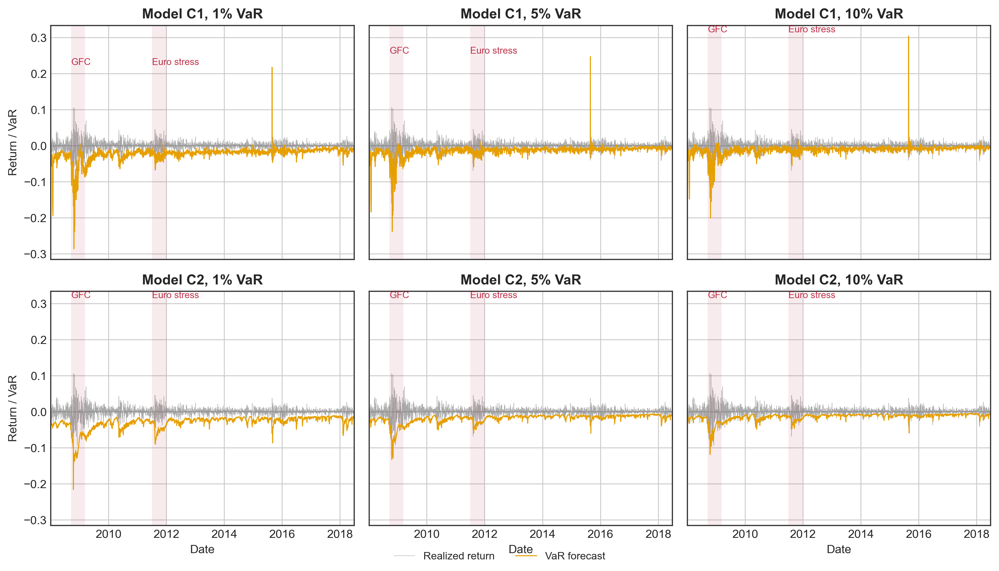

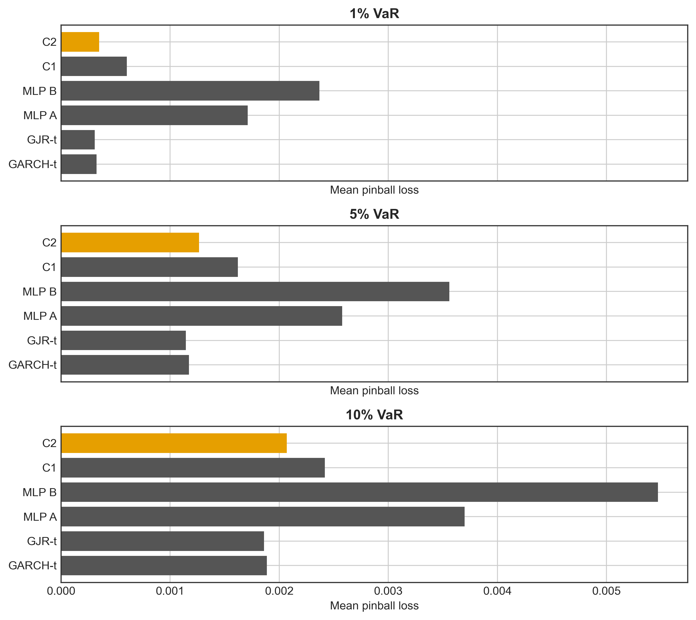

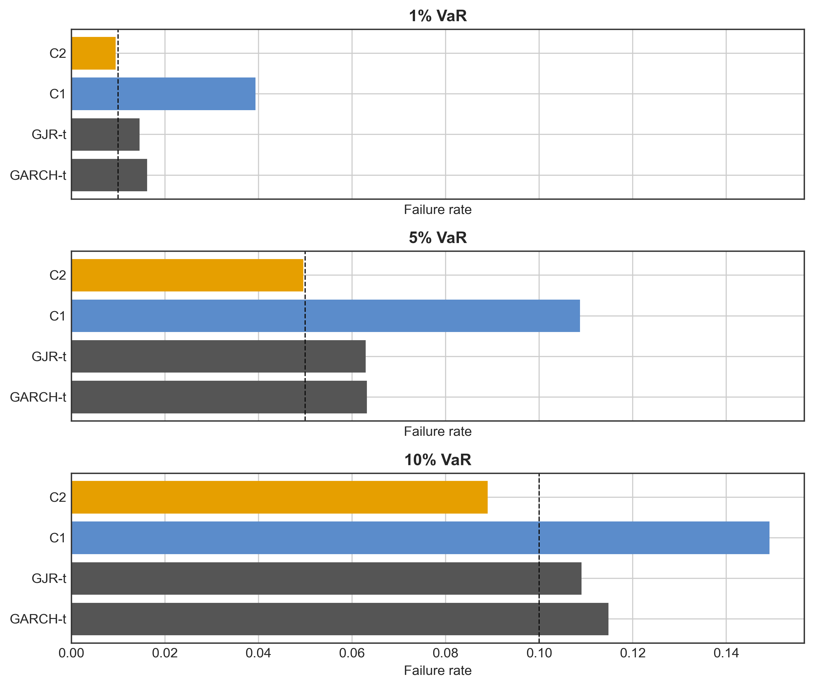

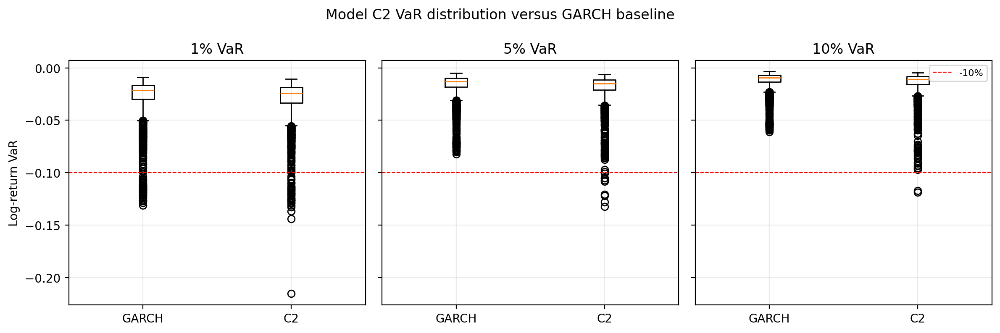

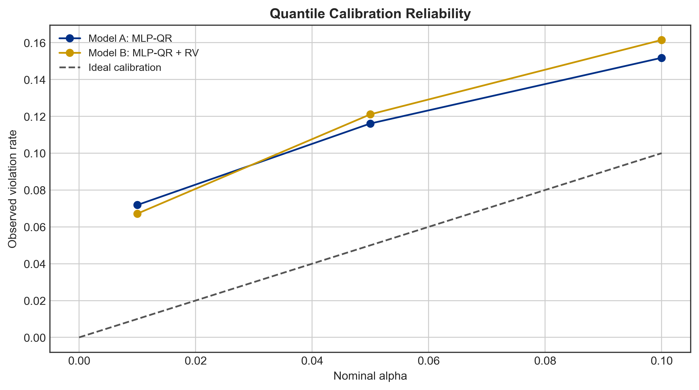

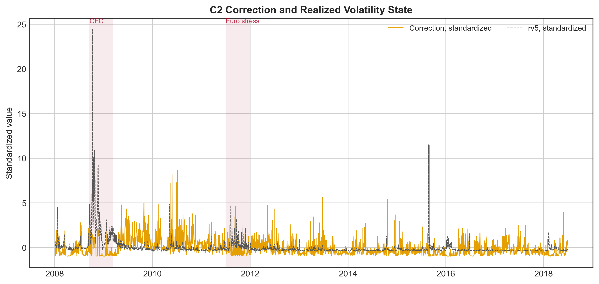

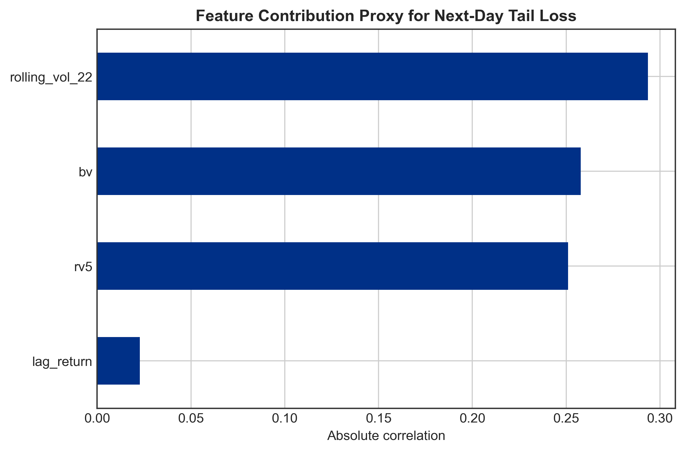

Figure 5.10 gives an additional diagnostic for the one-sided correction. The plotted series standardize the 1% C2 softplus correction and rv5 to a common scale. The correction rises during the 2008 stress period together with realized volatility, which supports the interpretation that the network is responding to market-state information rather than merely adding a constant downward shift. A full training-loss curve is not shown because the original rolling scripts did not persist epoch-level training and validation histories. That missing log is a reproducibility limitation of the current implementation and should be fixed before presenting the model as a finalized production workflow.

### 5.11 Comparison with Sections 3 and 4

The interpretation of Section 5 is therefore constructive. Historical Simulation shows that the empirical tail matters. Time-weighted Historical Simulation shows that recent market states matter. GARCH shows that conditional volatility improves violation timing. The direct MLP-QR experiment shows that neural flexibility alone is not enough when the network is asked to learn lower-tail VaR from a small rolling sample.

The GARCH-anchored neural correction is the natural next step. It does not discard the classical models; it uses them as structure. This is also a more defensible design for a small empirical project: the neural network is not presented as a standalone replacement, but as a correction layer around an interpretable financial risk model.

The empirical results in Table 5.1 should therefore be read as a diagnostic result. The direct MLP-QR models do not dominate the classical methods. In fact, they perform poorly in coverage. Table 5.2 then shows that anchoring the neural correction to GARCH, especially through the conservative correction, materially improves calibration.

Compared with Section 3, Model C2 is more balanced in the regulatory coverage sense. The W = 1000 Time-weighted HS model has a strong 10% failure rate of 10.19%, but its 1% and 5% rates are 1.68% and 5.30%. The KDE Time-weighted HS model has a good 1% rate of 1.29%, but its 10% rate is 8.98%. Model C2 delivers 0.95%, 4.96%, and 8.90%. This is very close at 1% and 5%, although still somewhat conservative at 10%.

Compared with Section 4, the improvement is clearer in unconditional coverage. At W = 1000, GARCH-t has failure rates of 1.62%, 6.32%, and 11.48%. GJR-GARCH-t has failure rates of 1.46%, 6.29%, and 10.91%. Model C2 moves these to 0.95%, 4.96%, and 8.90%. Thus the anchored neural correction fixes the main coverage bias of the GARCH-family forecasts. The caveat is that the 1% Christoffersen test remains weak for Model C2, so the final conclusion should be calibration improvement rather than complete backtesting dominance.

### 5.12 Summary

This section implements baseline neural quantile regression models and uses their performance to motivate a more structured neural VaR design. Model A maps lagged returns and rolling return features directly into VaR forecasts. Model B adds realized-volatility variables rv5 and bv. Both direct models are trained with pinball loss under a W = 1000 rolling-window design.

The empirical result is negative but useful. Both baseline neural models generate far too many VaR violations. Their 1% failure rates are 7.19% and 6.72%, much higher than the nominal 1% target. Adding rv5 and bv does not solve the problem, and Model B has higher pinball losses than Model A at all three quantiles. The conclusion is not that neural quantile regression should be abandoned. The conclusion is that a direct MLP-QRNN should not be asked to learn the entire VaR level without a financial anchor.

The stronger specification is GARCH-anchored neural correction. GARCH supplies the baseline VaR level and the conditional-volatility structure; the neural network learns a nonlinear adjustment using lagged returns, realized-volatility proxies, and GARCH state variables. With the 90/10 internal training-validation split and a small weight-decay penalty, the conservative anchored model reduces the 1% failure rate to 0.95%, the 5% failure rate to 4.96%, and the 10% failure rate to 8.90%. This is substantially better than the direct MLP baselines and improves the main coverage weakness of the Section 4 GARCH-family models. The remaining limitations are that 1% independence is borderline, the weight-decay choice was made after inspecting the final backtesting table, and epoch-level training histories were not saved. The model should therefore be presented as the strongest coverage specification in this project rather than as a universally dominant VaR model.

### References

Christoffersen, P. F. (1998). Evaluating interval forecasts. International Economic Review, 39(4), 841-862.

Christoffersen, P. F., and Pelletier, D. (2004). Backtesting value-at-risk: A duration-based approach. Journal of Financial Econometrics, 2(1), 84-108.

Engle, R. F., and Manganelli, S. (2004). CAViaR: Conditional autoregressive value at risk by regression quantiles. Journal of Business & Economic Statistics, 22(4), 367-381.

Koenker, R., and Bassett, G. (1978). Regression quantiles. Econometrica, 46(1), 33-50.

Lopez, J. A. (1999). Regulatory evaluation of value-at-risk models. Journal of Risk, 1(2), 37-64.
