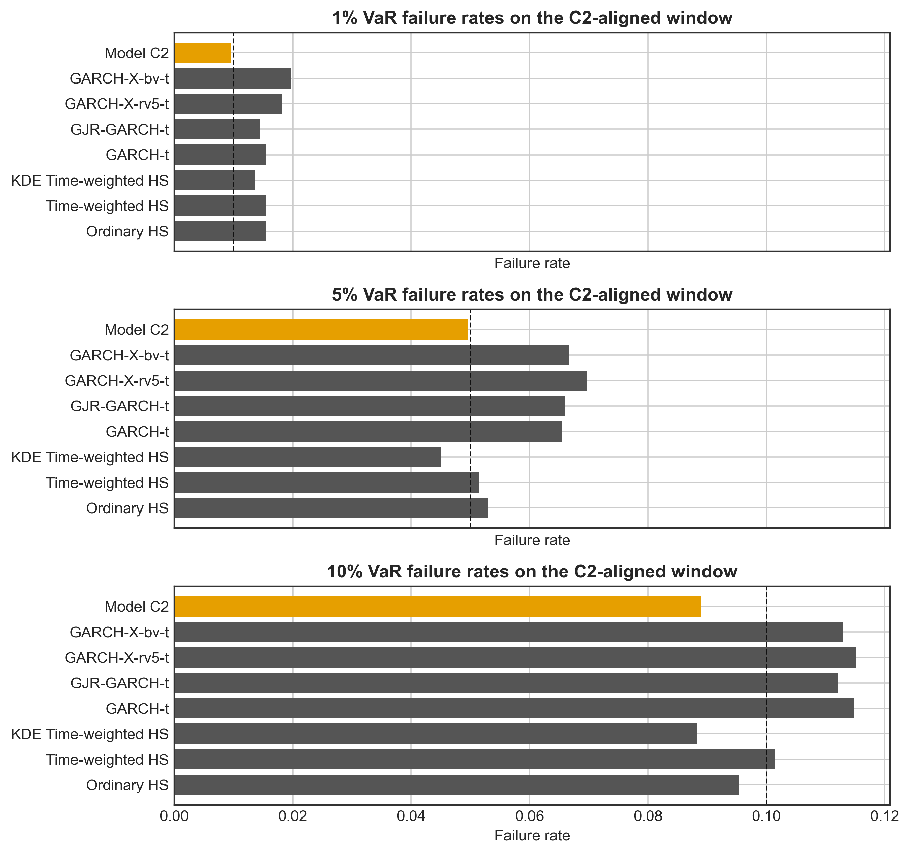
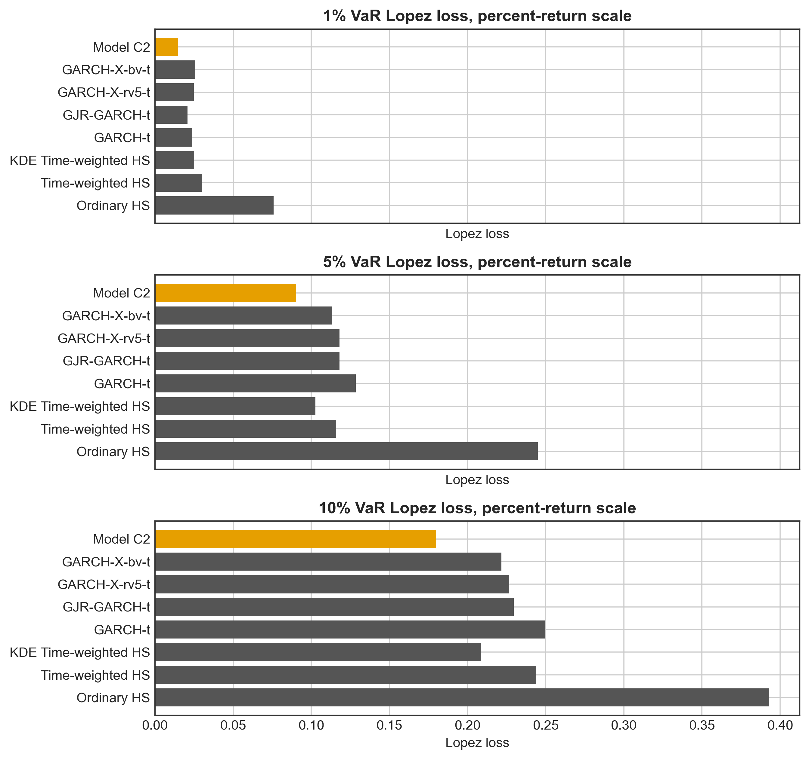

## Value-at-Risk Forecasting for SPY Daily Returns

Final single-PDF report.

This report studies one-day-ahead Value-at-Risk forecasting for SPY daily log returns. It compares Historical Simulation, GARCH-family conditional volatility models, direct neural quantile regression, and a conservative GARCH-anchored neural quantile correction under a common rolling-window backtesting framework.

## Section 1: Introduction

Value-at-Risk (VaR) remains one of the most widely used tools in market-risk measurement because it converts the lower tail of a portfolio return distribution into a single capital-relevant loss threshold. For a regulator, a portfolio manager, or an internal risk-control desk, the practical object is not the unconditional variance of returns, but the probability that the next trading day will produce a loss beyond a specified quantile. The quality of a VaR model therefore matters directly for capital allocation, risk limits, and the interpretation of stress periods. This forecasting problem is difficult for daily equity returns because the empirical distribution is not close to Gaussian and the conditional scale of returns changes sharply over time. In the SPY data used in this paper, daily log returns display heavy tails, volatility clustering, and clear transitions between calm and crisis regimes. These features imply that a simple normal VaR benchmark can be statistically convenient but economically misleading: it can understate the probability of extreme losses precisely when tail-risk measurement is most important.

The empirical challenge is not only to estimate a low quantile, but to estimate a conditional low quantile. A model may have approximately correct average coverage over the whole sample while still producing clustered violations during high-volatility periods. Conversely, a model may react well to volatility regimes while still producing too many violations in total. This distinction is central to statistical VaR backtesting. Unconditional coverage tests, such as the Kupiec test, ask whether the number of violations is consistent with the nominal tail probability. Independence and conditional-coverage tests, following the logic of Christoffersen's framework, ask whether violations arrive in a dynamically acceptable way. A credible empirical VaR model must therefore address both the marginal level of the lower tail and the time-series dependence in that tail.

The existing literature provides three major modelling routes, each with a different strength and a different limitation. The first route is non-parametric Historical Simulation. Its appeal is transparency: VaR is estimated directly from past returns and does not require a parametric distributional assumption. Hybrid or age-weighted variants, such as Boudoukh, Richardson and Whitelaw (1998), improve ordinary Historical Simulation by giving greater influence to recent observations. This is useful when volatility regimes change. At the same time, Historical Simulation remains backward-looking and can be slow to adapt when the rolling window contains observations from a different market state. Pritsker (2006) emphasizes that historical windows may also give a false sense of tail precision when extreme events are sparse. Thus, Historical Simulation preserves empirical tail information, but it does not by itself provide a structural model for conditional volatility dynamics.

The second route is the conditional heteroskedasticity literature. Engle's (1982) ARCH model and Bollerslev's (1986) GARCH model directly target the volatility clustering that is characteristic of financial returns. Student-t innovations add a heavy-tailed standardized shock distribution, and asymmetric extensions such as GJR-GARCH allow negative shocks to have a different volatility effect from positive shocks. These models are statistically natural for daily equity returns because they separate a time-varying volatility scale from an innovation distribution. They can improve the timing of VaR violations by raising predicted risk after large shocks. However, the same parametric structure can also be too rigid. A GARCH-t specification may reduce violation clustering while still failing unconditional coverage if the estimated tail level is too shallow. Realized-measure extensions, using variables such as realized variance and bipower variation, can add information about latent volatility, but a linear variance-side recursion is still not guaranteed to correct VaR calibration.

The third route is direct conditional quantile modelling. Quantile regression, introduced by Koenker and Bassett (1978), gives a natural statistical language for VaR because VaR is itself a conditional quantile. Neural-network quantile regression extends this idea by allowing nonlinear interactions among lagged returns, volatility proxies, and other state variables. This flexibility is attractive because the lower tail of equity returns may depend on market conditions in ways that are not well captured by a small parametric variance equation. The weakness is finite-sample learning. In a 1000-day rolling window, the 1% tail contains only about 10 observations. A neural network trained directly on such windows is asked to learn both the conditional volatility state and the absolute lower-tail level from very few extreme events. Without additional structure, flexibility can therefore increase estimation variance and produce unstable VaR forecasts.

This paper studies one-day-ahead VaR forecasting for SPY daily log returns under a unified rolling-window backtesting framework. The empirical comparison covers three model families. Section 3 evaluates ordinary Historical Simulation, time-weighted Historical Simulation, and KDE-smoothed time-weighted Historical Simulation. These models test how far empirical-tail information and recency weighting can go without an explicit conditional variance equation. Section 4 estimates GARCH-type conditional volatility models with Student-t innovations, including GARCH(1,1)-t, GJR-GARCH-t, and realized-measure GARCH-X robustness specifications using rv5 and bv. These models test the value of parametric volatility dynamics, leverage effects, and realized volatility information. Section 5 evaluates neural quantile regression models, including direct MLP quantile regression and a GARCH-anchored neural correction. All models are assessed using the same rolling forecast timing and the same backtesting criteria, so the comparison is not driven by inconsistent evaluation rules.

The central argument of the paper is that accurate VaR forecasting in this setting requires three components at the same time: heavy-tail information, conditional volatility dynamics, and controlled nonlinear flexibility. Historical Simulation contributes the first component but is weak in dynamic adaptation. GARCH-type models contribute the second component but can remain biased in unconditional coverage. Direct neural quantile regression contributes the third component in principle, but it is too unconstrained for rare-event estimation in small rolling windows. The paper therefore uses the failures and strengths of the individual model classes to motivate a hybrid specification rather than treating the neural network as a standalone replacement for classical risk models.

The main methodological contribution is the conservative GARCH-anchored neural quantile correction, referred to as Model C2. The model begins with a GARCH-t VaR forecast as a structured baseline. A neural network then learns a nonlinear correction using lagged return features, realized volatility proxies, GARCH VaR forecasts, and the GARCH volatility forecast. The key design choice is the direction of the correction. The GARCH-t backtests show that the baseline improves violation timing but leaves the VaR level too shallow on average. Model C2 converts this empirical diagnostic into an architectural restriction by using a softplus correction that can only move the baseline VaR in a more conservative direction. This is not an arbitrary penalty. It is a statistical bias-variance tradeoff: once the direction of the GARCH calibration bias is known, the network does not need to learn both the direction and the magnitude of the adjustment from a small number of tail observations.

This design also gives the neural model a clearer interpretation. The neural network is not responsible for discovering the entire conditional risk structure from scratch. The GARCH component supplies a volatility and heavy-tail anchor, while the neural component adjusts the VaR level conditional on additional state information. In this sense, the hybrid model is closer to a structured statistical correction than to an unrestricted machine-learning forecast. The ARCH-LM residual evidence and the GARCH-family backtests provide the motivation for retaining volatility structure, while the realized-measure variables provide information that may enter the tail risk function nonlinearly. The softplus restriction then prevents the correction from adding avoidable instability in the extreme tail.

The empirical findings support this integrated interpretation. Historical Simulation methods confirm that empirical tail information is useful, especially when recent observations receive greater weight and the empirical quantile is smoothed. However, they remain vulnerable to regime changes and violation clustering. GARCH-type models substantially improve the independence of VaR violations, but the symmetric GARCH-t benchmark still produces too many violations in total. Direct neural quantile regression performs poorly in the extreme tail, which is consistent with the difficulty of learning rare 1% events from rolling windows. The conservative GARCH-anchored model gives the most balanced result. Model C2 records failure rates of approximately 0.95%, 4.96%, and 8.90% at the 1%, 5%, and 10% VaR levels, with Kupiec p-values of 0.7823, 0.9288, and 0.0557. These results are much closer to nominal unconditional coverage than the direct neural models and the GARCH-family baselines.

The conclusion is deliberately qualified. Model C2 is the most defensible final specification in this project, but it does not completely solve dynamic extreme-tail forecasting. Its 5% and 10% independence diagnostics are acceptable, while the 1% Christoffersen p-value remains weak. This means that the most extreme violations still contain residual clustering. The evidence should therefore not be read as a general claim that neural networks dominate classical VaR methods. The stronger and more statistically defensible claim is that neural flexibility becomes useful when it is anchored to a meaningful conditional-risk structure and constrained in a direction supported by prior diagnostics.

The remainder of the paper proceeds as follows. Section 2 presents the data and common backtesting framework; Sections 3-5 evaluate Historical Simulation, GARCH-family models, and neural quantile methods; Section 6 integrates the evidence and concludes.

## Section 2. Data Characteristics and the VaR Backtesting Framework

### 2.1 Data and variables

This section documents the empirical data, motivates the model choices used in the following chapters, and defines a common out-of-sample VaR backtesting design. The dataset contains 4,640 daily observations for SPY from 2000-01-04 to 2018-06-27. The target variable is the daily log return, denoted by `log_ret`. The dataset also contains two high-frequency volatility measures, `rv5` and `bv`, which are used to describe market conditions and to provide volatility-related inputs for the neural quantile model in Section 5.

The role of this section is not merely descriptive. The distributional and time-series properties of the data determine whether the later modelling choices are justified. Heavy tails motivate non-Gaussian and nonparametric VaR methods. Volatility clustering motivates conditional-variance models. The availability of realized-volatility proxies motivates the inclusion of nonlinear machine-learning models with volatility features.

### 2.2 Distributional properties of returns

The sample mean of `log_ret` is 0.000133, while the sample standard deviation is 0.012013. The return distribution is not close to Gaussian: the sample skewness is -0.208, and the excess kurtosis is 8.219. The Jarque-Bera normality test has a p-value of 0, rejecting normality at conventional levels. This evidence is directly relevant for VaR because a Gaussian benchmark may understate the probability of extreme losses.

Figure 2.1(a) shows that large negative returns are clustered in stress periods rather than being evenly distributed through time. Figure 2.1(b) reports the corresponding rolling volatility, which rises sharply in the same stress episodes.

Figure 2.2 provides the distributional evidence more directly. The empirical lower-tail quantiles at the 1%, 5%, and 10% levels are -0.034545, -0.018807, and -0.012885, respectively. These empirical quantiles provide the basic nonparametric benchmark for Historical Simulation in Section 3, but they also show why tail estimation is difficult, especially at the 1% level.

### 2.3 Volatility clustering and volatility proxies

The rolling-volatility evidence in Figure 2.1(b) shows that volatility is clearly state-dependent: calm periods alternate with stress periods, and elevated volatility tends to persist. This pattern motivates the GARCH family in Section 4, because a static unconditional quantile cannot fully account for changing conditional risk.

Figure 2.4 examines `rv5` and `bv`. The correlation between the two volatility proxies is 0.964, indicating that they contain closely related information about market volatility. However, the two measures are not identical, especially during extreme trading days. This provides a reason to retain both variables as inputs for the neural quantile model rather than relying only on lagged returns.

### 2.4 Autocorrelation evidence and modelling implications

Figure 2.3 compares the autocorrelation functions of returns, squared returns, and absolute returns. Raw returns show weak serial dependence, suggesting limited predictability in the conditional mean. In contrast, squared and absolute returns display stronger persistence, which is consistent with volatility clustering. This distinction is important: the empirical task is not to forecast the direction of SPY returns, but to forecast the conditional lower tail of the return distribution.

The volatility-regime summary reinforces this point. The 5% return quantile is -0.006206 in the low-volatility regime, compared with -0.029230 in the high-volatility regime. Therefore, the same nominal VaR level corresponds to very different return thresholds across market states.

### 2.5 Out-of-sample VaR forecasting design

The forecast target is the one-day-ahead lower-tail VaR of `log_ret` at the 1%, 5%, and 10% levels. For a tail probability alpha, VaR is interpreted as the conditional quantile satisfying Pr(r_{t+1} < VaR_{alpha,t+1} | F_t) = alpha.

To match Sections 3 and 4, the empirical analysis compares three rolling-window lengths: W = 250, 500, and 1000 trading days. These windows correspond approximately to one, two, and four trading years. For a forecast made at time t, the model uses only the information set F_t(W) = {r_{t-W+1}, ..., r_t} and the corresponding volatility variables observed inside the same window. The window then rolls forward one day at a time.

The resulting out-of-sample forecast counts are 4,390 for W = 250, 4,140 for W = 500, and 3,640 for W = 1000. Sections 3 and 4 retain all three windows in the empirical comparison, while placing emphasis on W = 1000 because it provides more tail observations for crisis-versus-calm analysis.

### 2.6 Backtesting criteria

The backtesting procedure is common across all models. A VaR violation occurs when the realized return is below the forecasted VaR. The failure rate compares the observed violation frequency with the nominal tail probability. The Kupiec unconditional coverage test evaluates whether the violation rate is statistically consistent with the target probability. The Christoffersen independence and conditional coverage tests examine whether violations are serially clustered. The duration test evaluates the spacing between violations, and the Lopez loss provides a loss-based comparison of VaR forecasts.

This common framework makes the following chapters directly comparable. Section 3 evaluates nonparametric Historical Simulation methods, Section 4 evaluates GARCH-type conditional-volatility models, and Section 5 evaluates neural quantile regression.

### 2.7 Empirical thesis for the modelling comparison

The evidence in this section leads to the central empirical thesis of the report. Accurate daily VaR forecasting for SPY requires more than one modelling ingredient: empirical tail information is needed because returns are heavy-tailed, conditional volatility dynamics are needed because risk changes across regimes, and controlled nonlinear flexibility is needed because realized volatility and lagged returns may interact in ways that a purely linear variance equation cannot capture. The following sections therefore evaluate whether each model family supplies one or more of these ingredients under the same rolling-window backtesting design. The final comparison in Section 6 asks which specification comes closest to combining all three without overfitting the limited number of tail observations.

## Section 3: Historical Simulation Methods

### 3.1 Motivation

Historical Simulation (HS) is used in this project as the non-parametric benchmark for one-day-ahead Value-at-Risk (VaR) forecasting of SPY daily log returns. The data provide a quantitative reason for starting from a non-parametric method. The full-sample excess kurtosis of SPY log returns is 8.22, far above the Gaussian benchmark of zero. The crisis-period standard deviation from 2007-09-01 to 2009-06-30 is 0.0224, whereas the post-crisis calm-period standard deviation from 2012-01-01 to 2016-12-31 is 0.0081. The ratio is 2.78. These two facts are central to the modelling strategy: heavy tails make normal-distribution VaR unattractive, and the volatility-regime gap makes fixed-window estimation fragile. At the same time, the simplicity of HS is also the source of its main weakness: the method uses past returns as if they were drawn from a locally stable distribution.

The purpose of this section is not to treat HS as a single mechanical benchmark. Instead, the analysis starts with ordinary HS and then introduces two targeted improvements: time-weighted HS and KDE-smoothed time-weighted HS. This design follows the logic of Boudoukh, Richardson and Whitelaw (1998), who show that hybrid historical methods can retain the transparency of HS while improving the treatment of time-varying volatility. It also responds to the critique in Pritsker (2006), who shows that standard HS can systematically underestimate tail risk when the return period of extreme events is long relative to the estimation window. In this data set, the maximum daily log-return loss is -9.69%, an event too rare to be represented reliably in short rolling windows.

The empirical question is therefore twofold. First, does equal-weighted HS provide acceptable unconditional coverage at the 1%, 5%, and 10% VaR levels? Second, if it fails, is the failure due to the number of violations, the temporal clustering of violations, or both? The answer matters because a model with the correct average failure rate can still be weak for risk management if violations arrive in clusters during crises.

### 3.2 Rolling Window Design

For each forecast date, the estimation window contains only past observations. If the forecast is made at time t, the information set used by the HS-family models is

$$
\mathcal{F}_t(W)=\{r_{t-W+1},r_{t-W+2},\ldots,r_t\},
\tag{1}
$$

where $r_t$ denotes the SPY daily log return and $W$ is the rolling window length. The VaR forecast constructed from this window is evaluated against $r_{t+1}$. This timing convention avoids look-ahead bias because the realized return being forecast is never included in the estimation sample.

The assignment does not specify a unique rolling window length. I therefore compare W = 250, 500, and 1000 trading days. These windows correspond approximately to one, two, and four trading years. The comparison is statistically important because HS quantiles are sensitive to the number of observations available in the left tail. With W = 250, the 1% empirical tail contains only about two or three observations. With W = 1000, it contains about ten observations, which is still small but materially more stable. This tension is closely related to the horizon and regime-switching problem discussed by Danielsson, Ergun, de Haan and de Vries (2016): a longer window improves tail precision but may mix different volatility regimes, while a shorter window adapts faster but has weak tail information.

The full sample contains 4,640 daily observations from 2000-01-04 to 2018-06-27. The out-of-sample period depends on W. For W = 250, forecasts run from 2001-01-02 to 2018-06-27 with 4,390 forecast days. For W = 500, forecasts run from 2002-01-09 to 2018-06-27 with 4,140 forecast days. For W = 1000, forecasts run from 2004-01-08 to 2018-06-27 with 3,640 forecast days. The W = 1000 window is emphasized in the final interpretation because it contains more tail observations and allows a cleaner crisis-versus-calm subsample comparison. All backtests are interpreted at the 5% significance level unless otherwise stated.

### 3.3 Ordinary Historical Simulation

Ordinary HS estimates VaR as the empirical lower-tail quantile of the rolling return sample:

$$
\widehat{\mathrm{VaR}}^{HS}_{\alpha,t+1}
=Q_{\alpha}(r_{t-W+1},\ldots,r_t).
\tag{2}
$$

Here $Q_{\alpha}(\cdot)$ is the empirical $\alpha$-quantile, with $\alpha$ equal to 1%, 5%, or 10%. Each return in the rolling window receives weight $1/W$. This estimator is transparent and easy to audit, which explains why HS remains widely used in applied risk management. However, ordinary HS treats an observation from a calm regime and an observation from a recent stress regime as equally informative. This assumption is difficult to justify for financial returns, where volatility is persistent and crisis periods produce clustered losses.

The ordinary HS results in this project are consistent with the warning in Pritsker (2006): the method can look acceptable at moderate quantiles while still failing in the extreme tail or in independence diagnostics. In the W = 1000 case, ordinary HS has a reasonable 5% failure rate, but the Christoffersen independence p-value is 0.0004, indicating that violations are not randomly scattered over time. This means that the model captures the unconditional frequency of 5% losses but not the conditional dynamics of risk.

### 3.4 Time-weighted Historical Simulation

Time-weighted HS modifies ordinary HS by assigning exponentially larger weights to more recent observations. The unnormalized weight of observation i is

$$
\tilde{w}_i=\lambda^{\mathrm{age}_i}, \qquad 0<\lambda<1,
\tag{3}
$$

where $\mathrm{age}_i$ equals zero for the most recent observation and increases for older observations. The normalized weight is

$$
w_i=\frac{\lambda^{\mathrm{age}_i}}{\sum_{j=0}^{W-1}\lambda^j}.
\tag{4}
$$

The time-weighted VaR is the smallest value $q$ for which the cumulative weight of returns below $q$ reaches $\alpha$:

$$
\widehat{\mathrm{VaR}}^{TWHS}_{\alpha,t+1}
=\inf\left\{q:\sum_i w_i\mathbf{1}(r_i\le q)\ge \alpha\right\}.
\tag{5}
$$

I use $\lambda = 0.98$. This choice follows the spirit of Boudoukh, Richardson and Whitelaw (1998), who show that historical simulation can be improved by allowing recent observations to receive greater weight. A smaller value such as 0.94 makes the estimator more reactive, but it also lowers the effective sample size and makes tail estimates more unstable. In this data set, $\lambda = 0.98$ provides a practical compromise between responsiveness and tail stability.

The results corroborate Boudoukh, Richardson and Whitelaw (1998) in that time weighting improves the dynamics of violations without abandoning the non-parametric structure of HS. The improvement is strongest at the 5% and 10% levels. This is exactly where time weighting should help most: these quantiles have enough observations for reweighting to matter, while still being sensitive to volatility persistence. At the 1% level, however, the effective number of tail observations remains too small. For W = 1000, time-weighted HS passes both the Kupiec and Christoffersen independence tests at the 5% and 10% levels, but it still fails at the 1% level. This failure is economically meaningful rather than only statistical: the 1% expected number of violations is 36.4, whereas time-weighted HS produces 61 violations.

### 3.5 KDE-smoothed Time-weighted Historical Simulation

The second extension addresses the discreteness of empirical quantiles. Time weighting changes the relevance of observations, but the quantile is still selected from a finite set of historical returns. This is problematic in the 1% tail, where the effective number of observations is small even when W = 1000. I therefore estimate a Gaussian-kernel-smoothed density on the weighted return sample:

$$
\hat{f}_t(x)=\frac{1}{h}\sum_i w_iK\left(\frac{x-r_i}{h}\right),
\qquad
K(u)=\frac{1}{\sqrt{2\pi}}\exp\left(-\frac{u^2}{2}\right).
\tag{6}
$$

The KDE VaR is obtained by inverting the estimated cumulative distribution:

$$
\widehat{\mathrm{VaR}}^{KDE}_{\alpha,t+1}
=\inf\left\{x:\int_{-\infty}^{x}\hat{f}_t(u)\,du\ge \alpha\right\}.
\tag{7}
$$

The implementation uses `scipy.stats.gaussian_kde` with observation weights and Scott bandwidth selection. Conceptually, the weighted Scott bandwidth is proportional to $\sigma_w n_{\mathrm{eff}}^{-1/5}$, where $\sigma_w$ is the weighted dispersion of returns and $n_{\mathrm{eff}} = 1 / \sum_i w_i^2$ when weights sum to one. This detail matters because exponential weighting reduces the effective sample size, which increases smoothing.

KDE smoothing is useful, but it is not a free improvement. Quantile estimation based on kernel smoothing is affected by bandwidth bias. At a boundary or tail point, the relevant non-parametric convergence rate is closer to n^{-2/5} under standard bandwidth choices rather than the parametric n^{-1/2} rate. This slower rate helps explain why the 1% tail remains unstable: smoothing reduces discreteness, but it cannot create genuine tail information that is absent from the sample. The W = 1000 result illustrates this tradeoff. KDE time-weighted HS improves the 1% Kupiec p-value to 0.0911, but it creates a weaker 10% coverage result and a strong 5% Duration rejection. This finding is consistent with Silverman (1986) and Bowman and Azzalini (1997), who emphasize that bandwidth rules designed for smooth density estimation can perform poorly under non-Gaussian, heavy-tailed data. In the present application, Scott bandwidth smoothing helps the far-left 1% tail but distorts the intermediate 5% tail.

### 3.6 Backtesting Methodology

For each VaR forecast, define the violation indicator as

$$
I_{t+1}=\mathbf{1}\left(r_{t+1}<\widehat{\mathrm{VaR}}_{\alpha,t+1}\right).
\tag{8}
$$

The sample failure rate is

$$
\widehat{p}=\frac{1}{T}\sum_{t=1}^{T}I_t.
\tag{9}
$$

Kupiec (1995) tests unconditional coverage. The null hypothesis is $H_0:p=\alpha$, where $p$ is the true violation probability. If $V$ denotes the number of violations in $T$ out-of-sample forecasts, the likelihood-ratio statistic is

$$
LR_{uc}
=-2\log\left[
\frac{(1-\alpha)^{T-V}\alpha^V}
{(1-\hat{p})^{T-V}\hat{p}^{V}}
\right]\sim\chi^2(1).
\tag{10}
$$

The finite-sample power of this test is limited at the 1% level. For $T = 3640$ and $\alpha = 1\%$, the 5% two-sided Kupiec rejection region based on the binomial likelihood ratio is $V \le 25$ or $V \ge 49$, with an acceptance region from 26 to 48 violations. The upper rejection boundary corresponds to a failure rate of $49/3640 = 1.35\%$. A binomial power calculation shows that, on the upper side, the true failure probability must be approximately 1.50% before the test reaches 80% power. Thus, a model can materially underestimate 1% tail risk and still be difficult to reject in finite samples. This calculation is important for interpreting the KDE result: passing the 1% Kupiec test does not prove that the extreme tail is fully solved.

Christoffersen (1998) adds an independence requirement. Let T_{ij} be the number of transitions from state i to state j in the violation sequence, where 0 denotes no violation and 1 denotes violation. The estimated transition probabilities are

$$
\hat{\pi}_{01}=\frac{T_{01}}{T_{00}+T_{01}},
\qquad
\hat{\pi}_{11}=\frac{T_{11}}{T_{10}+T_{11}}.
\tag{11}
$$

The independence null is $H_0:\pi_{01}=\pi_{11}$. The likelihood-ratio statistic is

$$
LR_{ind}
=-2\log\left[
\frac{(1-\hat{p})^{T_{00}+T_{10}}\hat{p}^{T_{01}+T_{11}}}
{(1-\hat{\pi}_{01})^{T_{00}}\hat{\pi}_{01}^{T_{01}}
(1-\hat{\pi}_{11})^{T_{10}}\hat{\pi}_{11}^{T_{11}}}
\right]\sim\chi^2(1).
\tag{12}
$$

The conditional coverage statistic is

$$
LR_{cc}=LR_{uc}+LR_{ind}\sim\chi^2(2).
\tag{13}
$$

This decomposition is useful because a rejection of conditional coverage can arise from a biased violation frequency, clustered violations, or both.

The Duration test of Christoffersen and Pelletier (2004) examines the waiting times between violations. If tau_i is the date of the i-th violation, then

$$
D_i=\tau_i-\tau_{i-1}.
\tag{14}
$$

Under correct coverage and independence, durations are memoryless. In discrete time, the corresponding distribution is geometric:

$$
P(D=d)=(1-\alpha)^{d-1}\alpha,\qquad d=1,2,3,\ldots .
\tag{15}
$$

Christoffersen and Pelletier (2004) use a Weibull alternative,

$$
f(d;a,b)=ab(ad)^{b-1}\exp[-(ad)^b],
\tag{16}
$$

where b = 1 corresponds to the exponential distribution and hence to the memoryless benchmark. The likelihood-ratio statistic is

$$
LR_{dur}=-2\{\ell(\hat{a},1)-\ell(\hat{a},\hat{b})\}\sim\chi^2(1).
\tag{17}
$$

Duration testing is particularly useful at $\alpha = 1\%$, where the transition count $T_{11}$ can be small and the Markov-chain independence test can have weak finite-sample behavior.

As a complementary scoring metric, I also report the Lopez regulatory loss:

$$
L_t =
\begin{cases}
1 + (r_t-\widehat{\mathrm{VaR}}_t)^2, & r_t < \widehat{\mathrm{VaR}}_t,\\
0, & r_t \ge \widehat{\mathrm{VaR}}_t.
\end{cases}
\tag{18}
$$

Unlike Kupiec and Christoffersen tests, Lopez loss is not a hypothesis test. It is a loss score that penalizes both the occurrence of a VaR violation and the depth of the exceedance. In this data set, returns are measured in decimal log-return units, so the squared exceedance component is numerically small and Lopez loss is close to the failure rate. Its value is still useful because it provides a consistent ranking criterion when models have similar coverage but different violation magnitudes.

### 3.7 Empirical Results

Table 3.1 reports the W = 250 results. The one-year window adapts quickly, but it has very few observations in the 1% tail. Ordinary HS has acceptable 5% and 10% unconditional coverage, but the Christoffersen p-values indicate violation clustering. Time-weighted HS improves the 5% and 10% independence diagnostics, while KDE improves 1% coverage at the cost of conservativeness at 10%. This finding is consistent with Pritsker (2006), who emphasizes that short-window HS can be unreliable for tail risk because the empirical tail is too thin.

Table 3.1. Backtesting results for HS-family models, W = 250.

| Model | Alpha | Viol./Exp. | Fail. rate | Avg VaR | Kupiec p | Christoffersen p | Lopez loss |
|---|---:|---:|---:|---:|---:|---:|---:|
| Ordinary HS | 1% | 72 / 43.9 | 0.0164 | -0.0284 | 0.0001 | 0.0370 | 0.016404 |
| Ordinary HS | 5% | 237 / 219.5 | 0.0540 | -0.0180 | 0.2313 | 0.0000 | 0.053995 |
| Ordinary HS | 10% | 450 / 439.0 | 0.1025 | -0.0129 | 0.5814 | 0.0001 | 0.102522 |
| Time-weighted HS | 1% | 72 / 43.9 | 0.0164 | -0.0275 | 0.0001 | 0.0370 | 0.016402 |
| Time-weighted HS | 5% | 232 / 219.5 | 0.0528 | -0.0177 | 0.3909 | 0.0998 | 0.052853 |
| Time-weighted HS | 10% | 438 / 439.0 | 0.0998 | -0.0129 | 0.9599 | 0.1240 | 0.099783 |
| KDE Time-weighted HS | 1% | 54 / 43.9 | 0.0123 | -0.0289 | 0.1392 | 0.0323 | 0.012302 |
| KDE Time-weighted HS | 5% | 194 / 219.5 | 0.0442 | -0.0188 | 0.0719 | 0.0069 | 0.044196 |
| KDE Time-weighted HS | 10% | 383 / 439.0 | 0.0872 | -0.0139 | 0.0041 | 0.0517 | 0.087253 |

Note: The Christoffersen column reports the independence test p-value. Time-weighted models use $\lambda = 0.98$. The 5% significance level is used for rejection decisions.

Table 3.2 reports the W = 500 results. The main pattern is unchanged, but the advantage of time weighting becomes clearer. Ordinary HS again has reasonable unconditional coverage at the 5% and 10% levels, yet its independence p-values are effectively zero. Time-weighted HS keeps the failure rates close to the nominal levels and improves independence. KDE continues to help the 1% failure rate but makes the 10% quantile too conservative.

Table 3.2. Backtesting results for HS-family models, W = 500.

| Model | Alpha | Viol./Exp. | Fail. rate | Avg VaR | Kupiec p | Christoffersen p | Lopez loss |
|---|---:|---:|---:|---:|---:|---:|---:|
| Ordinary HS | 1% | 67 / 41.4 | 0.0162 | -0.0303 | 0.0002 | 0.0049 | 0.016187 |
| Ordinary HS | 5% | 214 / 207.0 | 0.0517 | -0.0182 | 0.6195 | 0.0000 | 0.051702 |
| Ordinary HS | 10% | 396 / 414.0 | 0.0957 | -0.0129 | 0.3479 | 0.0000 | 0.095671 |
| Time-weighted HS | 1% | 67 / 41.4 | 0.0162 | -0.0270 | 0.0002 | 0.0273 | 0.016185 |
| Time-weighted HS | 5% | 218 / 207.0 | 0.0527 | -0.0174 | 0.4366 | 0.1060 | 0.052662 |
| Time-weighted HS | 10% | 412 / 414.0 | 0.0995 | -0.0126 | 0.9174 | 0.2354 | 0.099528 |
| KDE Time-weighted HS | 1% | 51 / 41.4 | 0.0123 | -0.0283 | 0.1479 | 0.0274 | 0.012320 |
| KDE Time-weighted HS | 5% | 186 / 207.0 | 0.0449 | -0.0185 | 0.1279 | 0.0129 | 0.044932 |
| KDE Time-weighted HS | 10% | 362 / 414.0 | 0.0874 | -0.0136 | 0.0060 | 0.0530 | 0.087449 |

Note: The Christoffersen column reports the independence test p-value. Time-weighted models use $\lambda = 0.98$. The 5% significance level is used for rejection decisions.

Table 3.3 reports the W = 1000 results. This window provides the strongest overall evidence. Ordinary HS passes the 5% Kupiec test but fails independence, which indicates that the average number of violations is not enough to establish model adequacy. Time-weighted HS performs best at the 5% and 10% levels, with both coverage and independence p-values above 5%. KDE time-weighted HS is the only HS-family specification that passes the 1% Kupiec test, but the Christoffersen p-value remains below 5%, and the 10% Kupiec p-value indicates excessive conservativeness.

Table 3.3. Backtesting results for HS-family models, W = 1000.

| Model | Alpha | Viol./Exp. | Fail. rate | Avg VaR | Kupiec p | Christoffersen p | Lopez loss |
|---|---:|---:|---:|---:|---:|---:|---:|
| Ordinary HS | 1% | 56 / 36.4 | 0.0154 | -0.0334 | 0.0025 | 0.0002 | 0.015389 |
| Ordinary HS | 5% | 177 / 182.0 | 0.0486 | -0.0187 | 0.7025 | 0.0004 | 0.048641 |
| Ordinary HS | 10% | 303 / 364.0 | 0.0832 | -0.0129 | 0.0005 | 0.0000 | 0.083265 |
| Time-weighted HS | 1% | 61 / 36.4 | 0.0168 | -0.0264 | 0.0002 | 0.0218 | 0.016759 |
| Time-weighted HS | 5% | 193 / 182.0 | 0.0530 | -0.0169 | 0.4072 | 0.2366 | 0.053027 |
| Time-weighted HS | 10% | 371 / 364.0 | 0.1019 | -0.0120 | 0.6998 | 0.3569 | 0.101935 |
| KDE Time-weighted HS | 1% | 47 / 36.4 | 0.0129 | -0.0276 | 0.0911 | 0.0246 | 0.012913 |
| KDE Time-weighted HS | 5% | 167 / 182.0 | 0.0459 | -0.0178 | 0.2476 | 0.0638 | 0.045884 |
| KDE Time-weighted HS | 10% | 327 / 364.0 | 0.0898 | -0.0129 | 0.0379 | 0.1349 | 0.089845 |

Note: The Christoffersen column reports the independence test p-value. Time-weighted models use $\lambda = 0.98$. The 5% significance level is used for rejection decisions.

The Avg VaR column is economically informative. At $W = 1000$ and $\alpha = 1\%$, ordinary HS has an average VaR of -0.0334, while time-weighted HS has an average VaR of -0.0264. The latter is less conservative on average because older crisis observations receive less weight. This explains why time-weighted HS can improve 5% and 10% dynamics while worsening 1% underestimation. KDE time-weighted HS moves the average 1% VaR to -0.0276, which is slightly more conservative than time-weighted HS but still less conservative than ordinary HS. The result is a better balance for 1% unconditional coverage, although not a full solution to violation clustering.

The repeated 1% violation counts for ordinary HS and time-weighted HS at W = 250 and W = 500 are not evidence of duplicated calculations. The average VaR values differ, and diagnostic checks show that the violation dates also differ. There are 40 different 1% violation dates for W = 250 and 60 different 1% violation dates for W = 500. The aggregate counts are equal because some dates are added as violations and others are removed.

Table 3.4 reports the Duration test p-values available for the preferred W = 1000 comparisons. The results clarify why the KDE improvement should be interpreted carefully. KDE time-weighted HS improves 1% duration behavior relative to time-weighted HS, with the p-value increasing from 0.0121 to 0.1258. However, at the 5% level, KDE produces a Duration p-value of 0.0003. This is not merely a statistical artefact. It is consistent with bandwidth mismatch: a global Gaussian bandwidth that stabilizes the far-left tail can distort the intermediate tail, producing periods with too few violations followed by clustered corrections when volatility changes.

Table 3.4. Duration-test diagnostics for W = 1000.

| Model | 1% Duration p | 5% Duration p | 10% Duration p |
|---|---:|---:|---:|
| Time-weighted HS | 0.0121 | 0.0121 | 0.9885 |
| KDE Time-weighted HS | 0.1258 | 0.0003 | 0.8685 |

Note: Duration p-values are based on the Christoffersen and Pelletier (2004) duration-based independence test. The 5% significance level is used for rejection decisions.

The 1% underestimation is not evenly distributed over time. Table 3.5 separates the W = 1000 forecasts into the crisis period from 2007-09-01 to 2009-06-30 and the post-crisis calm period from 2012-01-01 to 2016-12-31. The contrast is sharp. Ordinary HS has a 1% crisis-period failure rate of 7.17%, compared with an expected rate of 1%. In the calm period, the corresponding failure rate is only 0.64%. This shows that the overall failure of ordinary HS is driven by volatility-regime switching rather than by a constant bias over the full sample. During a regime switch, ordinary HS reacts slowly because the estimation window still contains many calm-period observations. Time-weighted HS reacts faster and reduces the crisis-period 1% failure rate to 2.39%. KDE time-weighted HS reduces it further to 1.74%, but the value remains above the nominal level.

Table 3.5. W = 1000 subsample failure rates.

| Model | Period | Alpha | Obs. | Viol./Exp. | Fail. rate | Avg VaR |
|---|---|---:|---:|---:|---:|---:|
| Ordinary HS | Crisis | 1% | 460 | 33 / 4.6 | 0.0717 | -0.0335 |
| Ordinary HS | Crisis | 5% | 460 | 86 / 23.0 | 0.1870 | -0.0167 |
| Ordinary HS | Crisis | 10% | 460 | 117 / 46.0 | 0.2543 | -0.0112 |
| Time-weighted HS | Crisis | 1% | 460 | 11 / 4.6 | 0.0239 | -0.0502 |
| Time-weighted HS | Crisis | 5% | 460 | 23 / 23.0 | 0.0500 | -0.0355 |
| Time-weighted HS | Crisis | 10% | 460 | 50 / 46.0 | 0.1087 | -0.0266 |
| KDE Time-weighted HS | Crisis | 1% | 460 | 8 / 4.6 | 0.0174 | -0.0527 |
| KDE Time-weighted HS | Crisis | 5% | 460 | 23 / 23.0 | 0.0500 | -0.0373 |
| KDE Time-weighted HS | Crisis | 10% | 460 | 48 / 46.0 | 0.1043 | -0.0282 |
| Ordinary HS | Calm | 1% | 1258 | 8 / 12.6 | 0.0064 | -0.0318 |
| Time-weighted HS | Calm | 1% | 1258 | 16 / 12.6 | 0.0127 | -0.0231 |
| KDE Time-weighted HS | Calm | 1% | 1258 | 15 / 12.6 | 0.0119 | -0.0240 |

Note: The crisis period is 2007-09-01 to 2009-06-30. The calm period is 2012-01-01 to 2016-12-31. The table reports all crisis-period VaR levels and the 1% calm-period comparison to keep the subsample evidence compact.

The subsample evidence explains the overall results more precisely. In the crisis period, time-weighted HS and KDE time-weighted HS bring the 5% failure rate exactly to 5.00% and the 10% failure rate close to 10%. This is strong evidence that time weighting is effective for intermediate tails during regime changes. In the calm period, ordinary HS becomes conservative at 1%, while the two weighted methods are close to the nominal level. This pattern is consistent with Danielsson et al. (2016), who emphasize that fixed rolling windows can mix incompatible market states.

The analysis also involves multiple testing. For each model, there are three tail levels and three backtesting dimensions, which implies nine simultaneous hypotheses. A Bonferroni correction would use a per-test threshold of 0.05/9 = 0.0056. Under this stricter threshold, some marginal rejections would no longer be classified as significant. For example, the 1% Christoffersen p-value of 0.0218 for time-weighted HS and the 10% Kupiec p-value of 0.0379 for KDE time-weighted HS would not survive the correction. However, the main conclusions do not change: ordinary HS still fails several diagnostics strongly, time-weighted HS remains the best overall choice at 5% and 10%, and KDE remains a targeted improvement for 1% coverage rather than a universal replacement.

Figure 3.1 compares the 1% VaR forecasts for the three HS-family models at W = 1000. Figure 3.2 plots the corresponding 1% violation indicators. The figures support the table-based interpretation by showing whether violations occur as isolated events or in clusters.

### 3.8 Model Choice

The evidence supports a tail-level-specific model choice. For 1% VaR, KDE time-weighted HS with W = 1000 is preferred within the HS family because it is the only specification that passes the Kupiec unconditional coverage test at the 5% level. This conclusion must be qualified because the Christoffersen independence p-value remains below 5%, and the finite-sample power calculation shows that 1% VaR backtests have limited ability to detect moderate misspecification.

For 5% and 10% VaR, time-weighted HS with $W = 1000$ and $\lambda = 0.98$ is preferred. It maintains failure rates close to the nominal levels and substantially improves independence relative to ordinary HS. This finding is consistent with Boudoukh, Richardson and Whitelaw (1998), who argue that weighting schemes can improve HS when volatility is persistent.

If a single HS-family model must be selected for operational use, the most defensible choice is time-weighted HS with $W = 1000$ and $\lambda = 0.98$. It is transparent, easy to implement, and robust at the 5% and 10% levels. The remaining weakness at 1% should be reported rather than hidden. A practical system could therefore use time-weighted HS as the main non-parametric benchmark and report KDE-smoothed 1% VaR as a sensitivity analysis.

The limitations also point to more advanced alternatives. Barone-Adesi, Giannopoulos and Vosper (1999) propose filtered historical simulation, which combines volatility filtering with empirical innovations and is a natural next step when ordinary HS fails in volatile regimes. Engle and Manganelli (2004) propose CAViaR models that directly model conditional quantiles and avoid estimating the full return distribution. McNeil and Frey (2000) combine GARCH volatility dynamics with extreme value theory, which is especially relevant for the 1% tail. These alternatives are beyond the scope of the present HS section, but they identify the correct direction for improving extreme-tail risk measurement.

### 3.9 Summary

This section shows that historical simulation should not be evaluated only by average failure rates. Ordinary HS is transparent but suffers from violation clustering and sparse-tail instability. Time-weighted HS improves the dynamic behavior of violations by giving more relevance to recent observations. KDE-smoothed time-weighted HS improves 1% unconditional coverage by replacing the discrete empirical distribution with a continuous density estimate, but it can distort intermediate quantiles when the bandwidth is not locally appropriate.

The preferred non-parametric specification depends on the VaR level. For 1% VaR, KDE time-weighted HS with $W = 1000$ is the best HS-family candidate, although independence remains imperfect. For 5% and 10% VaR, time-weighted HS with $W = 1000$ and $\lambda = 0.98$ is the most balanced model. This conclusion reflects a statistical tradeoff among tail sample size, responsiveness to volatility regimes, unconditional coverage, and violation independence. It also establishes a clear benchmark for the later parametric and machine-learning models in the project.

## Section 4: GARCH(1,1) with Student-t Innovations

### 4.1 Motivation

Section 3 shows that Historical Simulation (HS) family methods are transparent but mechanically backward-looking. Ordinary HS gives each return in the rolling window equal weight, while time-weighted HS and KDE-smoothed time-weighted HS improve this design by giving more recent observations greater influence and by smoothing the empirical tail. These changes help, but they do not fully solve the conditional-risk problem. At W = 1000, ordinary HS has a 1% crisis-period failure rate of 7.17%, time-weighted HS reduces it to 2.39%, and KDE time-weighted HS reduces it to 1.74%. The improvement is meaningful, but the 1% Christoffersen p-value for KDE time-weighted HS remains only 0.0246, so violation clustering is still present.

The next step is therefore to model the conditional distribution of returns directly. This section estimates a GARCH(1,1) model with Student-t innovations, hereafter GARCH-t. The GARCH component targets volatility clustering, while the Student-t innovation distribution targets excess kurtosis in standardized shocks. This structure is parametric, unlike the HS methods in Section 3, but it is designed to respond faster when market volatility changes.

The choice is motivated by two empirical features of SPY daily log returns. First, the autocorrelation function of squared returns is positive and persistent, which is the standard signature of ARCH effects. Second, the full-sample excess kurtosis of log returns is 8.22, far above the Gaussian benchmark. A Gaussian GARCH model can adjust conditional volatility, but it still imposes Gaussian standardized residuals. The Student-t distribution adds a degrees-of-freedom parameter that allows the left tail to be thicker than the normal distribution.

The research questions are therefore direct. First, does GARCH-t reduce the violation-clustering problem observed in Section 3? Second, does the Student-t tail deliver acceptable unconditional coverage at the 1%, 5%, and 10% VaR levels? Third, does the crisis-versus-calm comparison confirm that a conditional-variance model adapts more quickly than HS-based methods?

### 4.2 Model Specification

Let r_t denote the SPY daily log return. The GARCH-t model is

$$
r_t = \mu + \epsilon_t, \qquad
\epsilon_t = \sigma_t z_t, \qquad
z_t \overset{i.i.d.}{\sim} t_\nu(0,1),
\tag{1}
$$

where mu is a constant conditional mean, sigma_t is the conditional standard deviation, and z_t follows a standardized Student-t distribution with degrees of freedom nu > 2. The conditional variance follows

$$
\sigma_t^2
= \omega + \alpha_1 \epsilon_{t-1}^2 + \beta_1 \sigma_{t-1}^2.
\tag{2}
$$

The restrictions omega > 0, alpha_1 >= 0, beta_1 >= 0, and alpha_1 + beta_1 < 1 ensure a positive and covariance-stationary conditional variance process. The sum alpha_1 + beta_1 measures volatility persistence. Values close to one imply that volatility shocks decay slowly, which is typical for daily equity returns.

For a rolling estimation window, the model parameters are estimated by maximum likelihood. The one-step-ahead VaR forecast is

$$
\widehat{\mathrm{VaR}}_{\alpha,t+1}
= \hat{\mu} + \hat{\sigma}_{t+1|t} q_\alpha(t_{\hat{\nu}}),
\tag{3}
$$

where q_alpha(t_nu) is the alpha-quantile of the standardized Student-t distribution. This formula has two risk channels. The conditional volatility sigma changes over time and scales all quantiles. The estimated degrees of freedom nu controls the tail multiplier, especially at the 1% level.

In implementation, returns are multiplied by 100 before estimation for numerical stability, and forecasts are converted back to decimal log-return units. The VaR calculation uses the standardized Student-t quantile used by the `arch` package, namely the raw Student-t quantile multiplied by sqrt((nu - 2) / nu). This is important because the `arch` Student-t distribution is scaled to unit variance.

### 4.3 Rolling Window Design

The rolling design is the same as Section 3. For each forecast date, the estimation window contains only past observations:

$$
\mathcal{F}_t(W)=\{r_{t-W+1},r_{t-W+2},\ldots,r_t\}.
\tag{4}
$$

The model is fitted on this information set and evaluated against r_{t+1}. This timing convention avoids look-ahead bias. I compare W = 250, 500, and 1000 trading days, matching the HS-family analysis. The resulting out-of-sample forecast counts are 4,390, 4,140, and 3,640 respectively.

The backtesting methodology is also held fixed. For each alpha level, I report the number of VaR violations relative to the expected number, the failure rate, average VaR, Kupiec unconditional coverage p-value, Christoffersen independence p-value, Duration p-value, and Lopez regulatory loss. The Duration test evaluates whether the waiting times between VaR violations are consistent with the memoryless benchmark implied by correctly timed exceedances. Keeping the same diagnostics makes the comparison with Tables 3.1-3.5 direct.

### 4.4 Parameter Estimates

Table 4.1 reports the rolling parameter summary for the preferred W = 1000 specification. The median degrees of freedom is 6.39, with an interquartile range from 5.61 to 8.94. This confirms that the fitted standardized shocks are substantially heavier-tailed than Gaussian. The median persistence alpha_1 + beta_1 is 0.9896, indicating very slow volatility decay.

Table 4.1. Median rolling GARCH(1,1)-t parameter estimates, W = 1000.

| Parameter | Median | IQR | Interpretation |
|---|---:|---:|---|
| $\hat{\mu}$ | 0.000735 | 0.000533 to 0.000943 | Daily mean return |
| $\hat{\omega}$ | 0.019137 | 0.007068 to 0.033304 | Baseline variance |
| $\hat{\alpha}_1$ | 0.099004 | 0.064526 to 0.145009 | ARCH effect (shock sensitivity) |
| $\hat{\beta}_1$ | 0.896013 | 0.811530 to 0.924210 | Volatility persistence |
| $\hat{\alpha}_1+\hat{\beta}_1$ | 0.989610 | 0.969190 to 1.000000 | Total persistence |
| $\hat{\nu}$ | 6.388838 | 5.609068 to 8.942289 | Tail degrees of freedom |

The high persistence is economically intuitive but also diagnostically important. After a large shock, the conditional variance remains elevated for many days, which should reduce the clustering of subsequent VaR violations. At the same time, the median persistence of 0.9896 is close to the IGARCH boundary. This means that shocks decay very slowly and the model may behave as if volatility is nearly integrated in some rolling windows. For VaR forecasting, this creates a trade-off: the model adapts to stress regimes, but its risk level can remain highly dependent on recent large shocks and may still be miscalibrated if the innovation distribution is too restrictive.

I therefore add a residual diagnostic rather than relying only on parameter estimates. Table 4.1b reports an ARCH-LM test on one-step standardized residuals for the W = 1000 baseline GARCH and GJR-GARCH models. The null hypothesis is no remaining ARCH structure in the squared standardized residuals. The baseline GARCH model is rejected at the 5% level, while the GJR model is not rejected. This supports the leverage-effect robustness check: asymmetry removes part of the remaining conditional heteroskedasticity that symmetric GARCH leaves behind.

Table 4.1b. ARCH-LM residual diagnostic for standardized residuals, W = 1000.

| Model | Lags | Obs. | LM stat | p-value |
|---|---:|---:|---:|---:|
| GARCH(1,1)-t | 10 | 3630 | 22.9925 | 0.0108 |
| GJR-GARCH(1,1)-t | 10 | 3630 | 13.1270 | 0.2167 |

### 4.5 Empirical Results

Tables 4.2-4.4 report the full backtesting results for the three rolling windows.

Table 4.2. Backtesting results for GARCH(1,1)-t, W = 250.

| Alpha | Viol./Exp. | Fail. rate | Avg VaR | Kupiec p | Christoffersen p | Duration p | Lopez loss |
|---|---:|---:|---:|---:|---:|---:|---:|
| 1% | 89 / 43.9 | 0.0203 | -0.0253 | 0.0000 | 0.1484 | 0.0000 | 0.020274 |
| 5% | 280 / 219.5 | 0.0638 | -0.0160 | 0.0001 | 0.5839 | 0.0001 | 0.063787 |
| 10% | 527 / 439.0 | 0.1200 | -0.0119 | 0.0000 | 0.9956 | 0.0000 | 0.120057 |

Table 4.3. Backtesting results for GARCH(1,1)-t, W = 500.

| Alpha | Viol./Exp. | Fail. rate | Avg VaR | Kupiec p | Christoffersen p | Duration p | Lopez loss |
|---|---:|---:|---:|---:|---:|---:|---:|
| 1% | 64 / 41.4 | 0.0155 | -0.0253 | 0.0011 | 0.0964 | 0.0011 | 0.015460 |
| 5% | 261 / 207.0 | 0.0630 | -0.0158 | 0.0002 | 0.6974 | 0.0002 | 0.063049 |
| 10% | 481 / 414.0 | 0.1162 | -0.0117 | 0.0007 | 0.2298 | 0.0000 | 0.116194 |

Table 4.4. Backtesting results for GARCH(1,1)-t, W = 1000.

| Alpha | Viol./Exp. | Fail. rate | Avg VaR | Kupiec p | Christoffersen p | Duration p | Lopez loss |
|---|---:|---:|---:|---:|---:|---:|---:|
| 1% | 59 / 36.4 | 0.0162 | -0.0244 | 0.0006 | 0.3424 | 0.0000 | 0.016210 |
| 5% | 230 / 182.0 | 0.0632 | -0.0151 | 0.0004 | 0.8973 | 0.0007 | 0.063192 |
| 10% | 418 / 364.0 | 0.1148 | -0.0111 | 0.0035 | 0.1363 | 0.0001 | 0.114846 |

The main finding is mixed. GARCH-t substantially improves the Christoffersen independence diagnostic, but it does not provide correct unconditional coverage. For W = 1000, the Christoffersen p-values are 0.3424, 0.8973, and 0.1363 at the 1%, 5%, and 10% levels respectively. This is a major improvement over ordinary HS, whose W = 1000 Christoffersen p-values were 0.0002, 0.0004, and 0.0000. Conditional volatility modeling therefore reduces violation clustering.

At the same time, the failure rates are too high. For W = 1000, the 1% failure rate is 1.62%, the 5% failure rate is 6.32%, and the 10% failure rate is 11.48%. All three Kupiec p-values are below 1%. The model is therefore not rejected because violations cluster; it is rejected because the VaR forecasts are too shallow on average. This distinction matters. GARCH-t improves the timing of risk but still underestimates the required VaR level.

The Duration test confirms that the time pattern is not fully satisfactory. Even when the Christoffersen test does not reject independence, the Duration p-values remain very small. This suggests that the waiting-time distribution between violations still differs from the memoryless benchmark. In practical terms, GARCH-t spreads violations more evenly than ordinary HS, but not enough to pass all dynamic diagnostics.

Figure 4.1 compares the realized log returns with the W = 1000 1% GARCH-t VaR forecast. Figure 4.2 plots the corresponding 1% violation dates. Figure 4.3 shows the annualized conditional volatility and the rolling estimated degrees of freedom. Figure 4.4 gives the standardized-residual QQ diagnostic.

### 4.6 Crisis-Period and Calm-Period Analysis

Table 4.5 applies the same subsample decomposition as Table 3.5. The crisis period runs from 2007-09-01 to 2009-06-30, and the post-crisis calm period runs from 2012-01-01 to 2016-12-31.

Table 4.5. Subsample failure rates for GARCH(1,1)-t, W = 1000.

| Period | Alpha | Obs. | Viol./Exp. | Fail. rate | Avg VaR |
|---|---:|---:|---:|---:|---:|
| Crisis | 1% | 460 | 11 / 4.6 | 0.0239 | -0.0486 |
| Crisis | 5% | 460 | 38 / 23.0 | 0.0826 | -0.0304 |
| Crisis | 10% | 460 | 65 / 46.0 | 0.1413 | -0.0225 |
| Post-crisis calm | 1% | 1258 | 15 / 12.6 | 0.0119 | -0.0202 |
| Post-crisis calm | 5% | 1258 | 78 / 62.9 | 0.0620 | -0.0121 |
| Post-crisis calm | 10% | 1258 | 145 / 125.8 | 0.1153 | -0.0088 |

The crisis-period comparison is important. GARCH-t reduces ordinary HS's 1% crisis failure rate from 7.17% to 2.39%, matching the time-weighted HS result and coming close to KDE time-weighted HS at 1.74%. The average crisis-period 1% VaR is -0.0486, much more conservative than ordinary HS at -0.0335, which shows that the conditional variance channel is active during stress.

However, GARCH-t does not dominate the HS extensions. At the 5% and 10% crisis levels, its failure rates are 8.26% and 14.13%, higher than the nominal rates and higher than the time-weighted HS crisis rates of 5.00% and 10.87%. In the calm period, the same pattern persists: GARCH-t is close at 1% but produces too many 5% and 10% violations. The model adapts to volatility regimes, but its conditional distribution is still not calibrated enough across the full tail.

### 4.7 Comparison with Section 3

The cleanest comparison is at W = 1000. Ordinary HS had acceptable 5% unconditional coverage but failed independence badly. Time-weighted HS fixed much of the 5% and 10% independence problem but still failed at 1%. KDE time-weighted HS improved the 1% Kupiec test but did not fully solve independence.

GARCH-t changes the error profile. Its independence p-values are stronger than the HS-family results, especially at 5%, where the p-value rises to 0.8973. But its Kupiec p-values are all below 0.005, meaning the model generates too many violations. In other words, GARCH-t solves part of the dynamic clustering problem but introduces a calibration problem.

This result is consistent with the limits of a symmetric GARCH(1,1) specification. Equity returns often display leverage effects, where negative shocks increase future volatility more than positive shocks of the same magnitude. A symmetric GARCH model treats both signs identically. This can leave the model under-reactive after adverse shocks and over-simplified during regime transitions. The GJR-GARCH specification of Glosten, Jagannathan and Runkle (1993) is therefore a natural robustness check.

### 4.8 Robustness: Leverage Effects and Realized Measures

The dataset contains two high-frequency volatility measures that are not used by the baseline GARCH-t model: rv5 and bv. The realized-volatility literature shows that intraday realized measures contain useful information about latent daily volatility. Andersen, Bollerslev, Diebold and Labys (2003) formalize realized volatility as an observable proxy for latent volatility, while Barndorff-Nielsen and Shephard (2004) introduce bipower variation as a jump-robust variation measure. Hansen, Huang and Shek (2012) build this idea directly into Realized GARCH, a joint model for returns and realized measures of volatility.

Motivated by this literature, I estimate three W = 1000 robustness models. First, GJR-GARCH(1,1)-t adds an asymmetric leverage term:

$$
\sigma_t^2
= \omega + \alpha_1 \epsilon_{t-1}^2
+ \gamma_1 \mathbf{1}(\epsilon_{t-1}<0)\epsilon_{t-1}^2
+ \beta_1 \sigma_{t-1}^2.
\tag{5}
$$

Second, I estimate variance-side GARCH-X models using rv5 and bv as lagged exogenous variance predictors:

$$
\sigma_t^2
= \omega + \alpha_1 \epsilon_{t-1}^2
+ \beta_1 \sigma_{t-1}^2
+ \gamma_x X_{t-1},
\tag{6}
$$

where X_{t-1} is either rv5 or bv, scaled to percent-squared units. This is not the same as placing x in the mean equation. The realized measure enters the conditional variance recursion directly, so the forecast uses information available at the end of day t to predict day t+1 VaR.

Table 4.6 reports the robustness comparison. The table keeps only W = 1000 because this is the preferred window in the main analysis and the cleanest bridge to Section 5.

Table 4.6. Robustness models with leverage and realized measures, W = 1000.

| Model | Alpha | Viol./Exp. | Fail. rate | Avg VaR | Kupiec p | Christoffersen p | Duration p |
|---|---:|---:|---:|---:|---:|---:|---:|
| GARCH(1,1)-t | 1% | 59 / 36.4 | 0.0162 | -0.0244 | 0.0006 | 0.3424 | 0.0000 |
| GARCH(1,1)-t | 5% | 230 / 182.0 | 0.0632 | -0.0151 | 0.0004 | 0.8973 | 0.0007 |
| GARCH(1,1)-t | 10% | 418 / 364.0 | 0.1148 | -0.0111 | 0.0035 | 0.1363 | 0.0001 |
| GJR-GARCH(1,1)-t | 1% | 53 / 36.4 | 0.0146 | -0.0243 | 0.0096 | 0.8009 | 0.0005 |
| GJR-GARCH(1,1)-t | 5% | 229 / 182.0 | 0.0629 | -0.0154 | 0.0006 | 0.6873 | 0.0002 |
| GJR-GARCH(1,1)-t | 10% | 397 / 364.0 | 0.1091 | -0.0115 | 0.0719 | 0.1017 | 0.0000 |
| GARCH-X-rv5-t | 1% | 61 / 36.4 | 0.0168 | -0.0235 | 0.0002 | 0.3831 | 0.0000 |
| GARCH-X-rv5-t | 5% | 241 / 182.0 | 0.0662 | -0.0151 | 0.0000 | 0.9916 | 0.0000 |
| GARCH-X-rv5-t | 10% | 403 / 364.0 | 0.1107 | -0.0113 | 0.0338 | 0.5368 | 0.0004 |
| GARCH-X-bv-t | 1% | 65 / 36.4 | 0.0179 | -0.0232 | 0.0000 | 0.8762 | 0.0000 |
| GARCH-X-bv-t | 5% | 233 / 182.0 | 0.0640 | -0.0150 | 0.0002 | 0.7976 | 0.0000 |
| GARCH-X-bv-t | 10% | 394 / 364.0 | 0.1082 | -0.0112 | 0.1014 | 0.8186 | 0.0014 |

The GJR extension gives the clearest calibration improvement. The 1% failure rate falls from 1.62% to 1.46%, and the 10% failure rate falls from 11.48% to 10.91%. The 10% Kupiec p-value rises from 0.0035 to 0.0719, so the asymmetric leverage term materially improves moderate-tail coverage. In the GJR recursion used here, the leverage term is gamma_1 I(epsilon_{t-1}<0) epsilon_{t-1}^2. A positive gamma_1 therefore means that negative shocks add extra variance relative to positive shocks of the same magnitude. The rolling estimates support this interpretation: the median gamma_1 is 0.1598, the interquartile range is 0.1214 to 0.2987, and the coefficient is positive in essentially all rolling windows.

The realized-measure extensions are more subtle. They do not automatically improve the 1% failure rate: GARCH-X-rv5-t has a 1.68% failure rate and GARCH-X-bv-t has a 1.79% failure rate. However, they sharply reduce the estimated GARCH persistence. The median alpha_1 + beta_1 falls from 0.9896 in baseline GARCH-t to 0.6963 for GARCH-X-rv5-t and 0.6450 for GARCH-X-bv-t. This is exactly what the realized-volatility literature predicts: once an observed realized measure enters the variance equation, less persistence has to be carried by the latent GARCH recursion.

The best interpretation is therefore not that realized measures mechanically dominate baseline GARCH-t in this sample. Rather, rv5 and bv contain genuine state information, but a linear GARCH-X variance equation is still too restrictive for VaR calibration. This finding is useful for Section 5. It supports using lagged rv5, bv, and GARCH-based volatility forecasts as neural-network inputs, while allowing the network to learn nonlinear interactions that the linear GARCH-X model cannot capture.

### 4.9 Model Limitations and the Case for Neural Network Methods

The GARCH-t model improves the conditional timing of VaR violations, but the empirical results show that it is not the final model. Its main limitation is parametric rigidity. The conditional variance is forced into the GARCH(1,1) recursion, the standardized innovation distribution is forced into a single Student-t shape, and the mean equation is constant.

The robustness results confirm that the high-frequency volatility variables are informative but not sufficient under a linear variance recursion. The data contain rv5 and bv, which summarize intraday realized volatility and bipower variation. These variables contain information about current volatility that daily returns alone cannot fully capture. A model that uses rv5, bv, GARCH forecasts, and lagged returns jointly may forecast conditional quantiles more accurately than a univariate GARCH recursion.

Finally, GARCH-t estimates a full conditional distribution and then extracts the desired quantile. Direct quantile models instead target VaR itself. This is the motivation for Section 5: neural network quantile regression can use realized-volatility covariates, allow nonlinear interactions, and estimate the 1%, 5%, and 10% conditional quantiles directly without imposing a single parametric innovation distribution.

### 4.10 Summary

GARCH(1,1)-t is a useful bridge between the non-parametric HS family and more flexible machine-learning VaR models. Relative to ordinary HS, it clearly improves violation independence. For W = 1000, the Christoffersen p-values at 1%, 5%, and 10% are 0.3424, 0.8973, and 0.1363, whereas ordinary HS rejected independence at all three levels.

The model nevertheless fails unconditional coverage. It produces too many violations at every alpha level and every rolling window. The preferred W = 1000 failure rates are 1.62%, 6.32%, and 11.48%, all above the nominal 1%, 5%, and 10% targets. The conclusion is therefore not that GARCH-t fully solves VaR forecasting. The correct conclusion is narrower and more informative: conditional variance modeling reduces clustering, but symmetric GARCH-t is still miscalibrated for SPY daily tail risk.

The robustness checks refine this conclusion. GJR-GARCH-t improves calibration by adding leverage effects, while GARCH-X-rv5-t and GARCH-X-bv-t show that realized measures absorb a large part of volatility persistence. The realized-measure models do not fully fix VaR coverage by themselves, but they provide the right transition to Section 5. The neural network models should keep these realized measures as inputs and allow nonlinear conditional-quantile effects.

---

## Section 5: Neural Quantile Regression and GARCH-Anchored Extensions

### 5.1 Motivation

The previous sections establish a sequence of increasingly structured VaR models. Section 2 documents heavy tails and volatility clustering in SPY daily log returns. Section 3 shows that Historical Simulation is transparent and distribution-free, but its equal-weighted form reacts slowly when the market moves from a calm regime into a stress regime. Time-weighted Historical Simulation improves this limitation by assigning greater relevance to recent observations. Section 4 then introduces an explicit conditional-volatility structure through GARCH-type models, which improves the timing of VaR violations even when unconditional coverage remains imperfect.

This section evaluates whether a neural quantile regression model can improve the VaR forecast. The baseline neural specification is an MLP-QR model that maps the current information set directly into next-day conditional quantiles:

$$
\widehat{\mathrm{VaR}}_{\alpha,t+1}
=
f_{\theta}(X_t).
\tag{1}
$$

Here $X_t$ denotes information available up to day t, and $f_{\theta}$ is the neural network. The target remains the next-day realized return, $r_{t+1}$. This direct specification is flexible, but it asks the network to learn the full VaR level from a limited rolling-window sample. The problem is particularly severe at the 1% level, where each 1000-day estimation window contains only a small number of extreme left-tail observations.

The empirical results below show that the direct MLP-QR forecasts are too shallow: realized returns violate the estimated VaR far more often than the nominal level implies. This negative result is useful because it motivates a more structured neural design. The appropriate role of the neural network is not necessarily to replace GARCH, but to correct it:

GARCH supplies a conditional-volatility anchor, while the neural network learns nonlinear calibration adjustments around that anchor.

This is the motivation for a GARCH-anchored neural quantile correction. The baseline MLP-QR results should therefore be interpreted as a diagnostic step that identifies why an anchored specification is more defensible than a purely direct neural VaR model.

### 5.2 Forecasting Target

For each tail probability $\alpha$, the object of interest is tomorrow's conditional lower-tail quantile:

$$
\mathrm{VaR}_{\alpha,t+1}.
\tag{2}
$$

For example, if

$$
\widehat{\mathrm{VaR}}_{0.05,t+1}=-0.02,
\tag{3}
$$

the model implies that the 5% lower-tail threshold for the next trading day is -2%. If the realized return is

$$
r_{t+1}=-0.03,
\tag{4}
$$

then the return has fallen below the VaR forecast, because $-0.03<-0.02$. This is a VaR violation. A correctly calibrated 5% VaR forecast should be violated approximately 5% of the time, and a correctly calibrated 1% VaR forecast should be violated approximately 1% of the time.

The forecasting problem is therefore a quantile-calibration problem: the estimated VaR must be low enough to represent the intended lower-tail probability, but not so low that it becomes unnecessarily conservative.

### 5.3 Baseline MLP-QR Specification

The baseline neural model in this section is an MLP quantile regression model. It directly maps today's information into tomorrow's VaR forecasts:

$$
\left(
\widehat{\mathrm{VaR}}_{0.01,t+1},
\widehat{\mathrm{VaR}}_{0.05,t+1},
\widehat{\mathrm{VaR}}_{0.10,t+1}
\right)
=
f_{\theta}(X_t).
\tag{5}
$$

Two input designs are considered. Model A uses only lagged returns and rolling return summaries:

$$
X^{A}_t =
\{r_t,r_{t-1},r_{t-2},r_{t-3},r_{t-4},
\overline{r}_{t,5},s_{t,5},s_{t,22},\min_{22}(r),\max_{22}(r)\}.
\tag{6}
$$

Model B adds realized-volatility information:

$$
X^{B}_t =
\{X^{A}_t,\mathrm{rv5}_t,\mathrm{bv}_t,
\overline{\mathrm{rv5}}_{t,5},\overline{\mathrm{bv}}_{t,5}\}.
\tag{7}
$$

All features are constructed using information available through day t. The target is

$$
y_t=r_{t+1}.
\tag{8}
$$

This timing convention avoids look-ahead bias. The model can observe past returns, rolling volatility, rv5, and bv, but it cannot use tomorrow's return when constructing tomorrow's VaR forecast.

The MLP has two hidden layers with 64 and 32 units, ReLU activations, and dropout 0.10. The output layer has three units for the 1%, 5%, and 10% quantiles. Because independently predicted quantiles can cross, the three outputs are sorted after inference so that

$$
\widehat{\mathrm{VaR}}_{0.01,t+1}
\le
\widehat{\mathrm{VaR}}_{0.05,t+1}
\le
\widehat{\mathrm{VaR}}_{0.10,t+1}.
\tag{9}
$$

Figure 5.4 summarizes the two neural designs used in this section. The direct MLP-QR model maps the feature vector directly into three quantile outputs. Model C2 instead uses the same compact MLP as a correction layer around the GARCH-t VaR anchor, with the softplus restriction forcing the correction in the conservative direction.

The model is trained with pinball loss. For a quantile level $\alpha$, the loss is

$$
\rho_{\alpha}(y-\hat{q})
=
\max\{\alpha(y-\hat{q}),(\alpha-1)(y-\hat{q})\}.
\tag{10}
$$

This loss is used because VaR is a quantile, not a mean. Mean-squared error would train the network toward an average return, which is not the risk-management object.

### 5.4 Rolling Training Design

The rolling design follows the same no-look-ahead principle as the earlier sections. The estimation window contains W = 1000 usable observations. Within each rolling window, the first 80% is used for training and the last 20% is used for validation. The StandardScaler is fitted only on the training part of the current window. It is never fitted on the full sample.

The network is trained with Adam, learning rate 0.001, batch size 64, maximum 200 epochs, and early stopping patience 10. The model is retrained every 20 trading days. Between refits, the most recent fitted network is used to generate one-day-ahead forecasts. After feature construction, the out-of-sample evaluation contains 3,617 forecasts for each neural specification.

This design is intentionally comparable to the W = 1000 setting in Sections 3 and 4, but the forecast count is slightly smaller because neural features require lagged and rolling observations before the first supervised sample is available.

### 5.5 Backtesting Methodology

The violation indicator is the same as before:

$$
I_{t+1}
=
\mathbf{1}
\left(
r_{t+1}<\widehat{\mathrm{VaR}}_{\alpha,t+1}
\right).
\tag{11}
$$

For each model and alpha level, I report the number of violations, expected violations, failure rate, average VaR, Kupiec unconditional coverage p-value, Christoffersen independence p-value, Duration test p-value, Lopez regulatory loss, pinball loss, and the pre-correction quantile crossing rate. The Lopez loss is

$$
L_{t+1}=
\begin{cases}
1+(r_{t+1}-\widehat{\mathrm{VaR}}_{\alpha,t+1})^2,
& r_{t+1}<\widehat{\mathrm{VaR}}_{\alpha,t+1},\\
0,
& r_{t+1}\ge\widehat{\mathrm{VaR}}_{\alpha,t+1}.
\end{cases}
\tag{12}
$$

The coverage tests evaluate whether the VaR level is correctly calibrated. The independence and duration tests evaluate whether violations arrive randomly or remain clustered. The pinball loss gives the quantile-specific scoring comparison.

### 5.6 Empirical Results: Direct Neural VaR Is Too Shallow

Table 5.1 reports the neural-network backtesting results. The main finding is that the direct MLP-QR models produce VaR forecasts that are too shallow. At the 1% VaR level, Model A records 260 violations, compared with only 36.17 expected violations. Model B, which adds rv5 and bv, reduces the count to 243, but this is still far above the nominal target. In failure-rate terms, the two 1% neural VaR forecasts behave like 7.19% and 6.72% quantiles, not 1% quantiles.

Table 5.1. Backtesting results for baseline neural quantile regression, W = 1000.

| Model | Alpha | Viol./Exp. | Fail. rate | Avg VaR | Kupiec p | Christoffersen p | Duration p | Lopez loss | Pinball loss | Crossing rate |
|---|---:|---:|---:|---:|---:|---:|---:|---:|---:|---:|
| Model A: MLP-QR | 1% | 260 / 36.17 | 0.0719 | -0.0184 | 0.0000 | 0.0000 | 0.0000 | 0.071979 | 0.001712 | 0.0683 |
| Model A: MLP-QR | 5% | 420 / 180.85 | 0.1161 | -0.0120 | 0.0000 | 0.0000 | 0.0000 | 0.116234 | 0.002577 | 0.0683 |
| Model A: MLP-QR | 10% | 549 / 361.70 | 0.1518 | -0.0091 | 0.0000 | 0.0000 | 0.0000 | 0.152007 | 0.003700 | 0.0683 |
| Model B: MLP-QR + RV | 1% | 243 / 36.17 | 0.0672 | -0.0187 | 0.0000 | 0.0000 | 0.0000 | 0.067527 | 0.002368 | 0.1181 |
| Model B: MLP-QR + RV | 5% | 438 / 180.85 | 0.1211 | -0.0107 | 0.0000 | 0.0000 | 0.0000 | 0.121648 | 0.003561 | 0.1181 |
| Model B: MLP-QR + RV | 10% | 584 / 361.70 | 0.1615 | -0.0067 | 0.0000 | 0.0000 | 0.0043 | 0.162917 | 0.005472 | 0.1181 |

Note: Model A uses lagged returns and rolling return features. Model B adds rv5, bv, and their 5-day rolling averages. The crossing rate is measured before the post-prediction sorting correction.

Adding realized-volatility variables does not fix the problem. Model B has fewer 1% violations than Model A, but it has a larger pinball loss at every reported quantile. The average pinball loss across the three levels is 0.002663 for Model A and 0.003800 for Model B. Model B also has a larger quantile crossing rate before sorting, 11.81% compared with 6.83% for Model A. A plausible mechanism is finite-sample instability rather than the absence of volatility information. The rv5 and bv variables are highly correlated volatility proxies, so adding both increases feature redundancy and parameter-estimation noise inside each rolling window. A shallow direct MLP can therefore overfit volatility-state proxies without learning a stable lower-tail quantile map. This is also consistent with the higher crossing rate in Model B.

Figure 5.1 shows why the coverage failure occurs. The 1% VaR forecasts are often not sufficiently conservative during stress periods. Figure 5.2 shows that violations are frequent rather than rare isolated events. Figure 5.3 confirms that Model A has lower pinball loss than Model B at 1%, 5%, and 10%.

### 5.7 Interpretation of the Baseline Failure

The poor baseline result is consistent with the difficulty of the learning problem. The direct MLP-QR model is required to estimate the full conditional quantile function:

$$
\widehat{\mathrm{VaR}}_{\alpha,t+1}
=
f_{\theta}(X_t).
\tag{13}
$$

This is a difficult task for four reasons. First, the rolling sample is limited. Second, the 1% tail contains very few observations in each 1000-day window. Third, the neural network has no built-in conditional-volatility structure. Fourth, the model must learn both volatility timing and VaR-level calibration simultaneously. The result is a shallow VaR forecast: the model targets the 1% quantile, but the realized failure rate is closer to 7%.

This gives the section its main interpretation. The baseline MLP-QR model is useful not because it dominates the classical methods, but because it identifies the weakness of an unconstrained direct neural VaR specification under limited rolling-window samples. The model-design implication is that the neural network should be given a financial anchor rather than being asked to estimate the entire VaR level independently.

### 5.8 GARCH-Anchored Neural Quantile Correction

The natural anchor is the GARCH-t VaR from Section 4. GARCH already contains a risk-management structure: conditional volatility rises after large shocks and decays gradually afterward. Section 4 shows that this improves violation timing, even though the GARCH-t VaR level is still not perfectly calibrated. This is precisely the setting in which an anchored neural correction is appropriate.

Instead of asking the network to forecast VaR directly, define a GARCH-anchored neural VaR as

$$
\widehat{\mathrm{VaR}}^{NN}_{\alpha,t+1}
=
\widehat{\mathrm{VaR}}^{GARCH}_{\alpha,t+1}
+
g_{\theta}(X_t).
\tag{14}
$$

The GARCH forecast provides the baseline VaR level, and the neural network learns a correction around that baseline. If recent rv5 is high, recent returns are volatile, or the GARCH forecast appears too shallow, the correction term can move the VaR lower. If GARCH is already too conservative, the correction can move it upward. This reduces the burden on the neural network: it no longer has to learn the full VaR level independently; it learns the adjustment conditional on the current market state.

The input set for this anchored design can include the original neural features plus GARCH state variables. In the implementation, this includes lagged returns, rolling return summaries, rv5 and bv features, the three GARCH VaR forecasts, and the GARCH one-step-ahead volatility forecast.

This design matches the empirical logic of the project. Section 4 finds that GARCH improves violation timing but still has coverage errors. Section 5 finds that a direct MLP-QR model is too unstable and too shallow. A GARCH-anchored MLP-QRNN combines the two lessons: retain GARCH's conditional-volatility timing, but allow the neural network to learn nonlinear VaR-level corrections using lagged returns, rv5, bv, and the GARCH baseline.

### 5.9 A Conservative Anchored Variant

Because the baseline neural results underestimate risk, a more conservative anchored design is also possible. Instead of allowing the neural correction to move the VaR line in either direction, force the correction to make the VaR at least as conservative as the GARCH baseline:

$$
\widehat{\mathrm{VaR}}^{NN}_{\alpha,t+1}
=
\widehat{\mathrm{VaR}}^{GARCH}_{\alpha,t+1}
-
\mathrm{softplus}\{g_{\theta}(X_t)\}.
\tag{15}
$$

The softplus function is

$$
\mathrm{softplus}(x)=\log(1+\exp(x)).
\tag{16}
$$

It is always positive. Therefore, subtracting softplus from the GARCH VaR always moves the VaR forecast downward, making it more conservative. For example, if GARCH forecasts a 5% VaR of -1.5% and the neural correction is 0.4%, the final anchored VaR becomes -1.9%. This is a deliberately imposed risk-control constraint, not a claim that the network discovers one-sided conservatism from the data. The statistical rationale is narrower: Sections 4 and 5 show systematic underestimation of left-tail risk, so the correction is restricted to address that known direction of error. The cost is that the model could become trivially conservative if the correction is too large. This possibility is tested explicitly below using average VaR and correction-size diagnostics.

The anchored models use the same W = 1000 rolling window as the baseline neural models, but the internal split is adjusted to 90% training and 10% validation. This change is deliberate. For lower-tail quantile estimation, especially at the 1% level, the effective number of tail observations is small. A 90/10 split retains more observations for training while still preserving a chronologically later validation segment for early stopping. The scaler is still fitted only on the training part of the current rolling window, so the no-look-ahead constraint is unchanged.

The network architecture is intentionally small: two hidden layers with 64 and 32 units and dropout 0.10. This is not presented as a globally optimal architecture. It is a capacity-control choice for rolling-window quantile estimation, where each refit has only 1000 observations and very few 1% tail events. The 64/32 architecture, dropout 0.10, learning rate 0.001, and 20-day refit frequency follow a compact MLP design rather than an exhaustive architecture search. The conservative correction scale and Adam weight decay are then tuned, and the smallest regularization level that improves coverage without collapsing into excessive conservatism is retained.

Table 5.1b. Weight-decay tuning for conservative Model C2.

| Weight decay | 1% fail. | 5% fail. | 10% fail. | 1% pinball | 5% pinball | 10% pinball |
|---:|---:|---:|---:|---:|---:|---:|
| 0 | 0.0136 | 0.0617 | 0.1072 | 0.000357 | 0.001284 | 0.002081 |
| 1e-5 | 0.0095 | 0.0481 | 0.0902 | 0.000348 | 0.001259 | 0.002058 |
| 1e-4 | 0.0034 | 0.0364 | 0.0761 | 0.000365 | 0.001298 | 0.002102 |
| 5e-4 | 0.0004 | 0.0193 | 0.0420 | 0.000543 | 0.001453 | 0.002309 |

The selected value is 1e-5. Larger weight decay values reduce failure rates by making the model too conservative and increase pinball loss, so they are rejected. I do not tune the retraining frequency in this version; the 20-day refit interval is kept fixed to match the computational design of the rolling experiment. This is a limitation and should be treated as a robustness item rather than as an optimized choice.

This tuning result must be interpreted cautiously. The weight-decay comparison in Table 5.1b was selected after inspecting the final out-of-sample backtesting profile, especially the failure rates. Therefore, the reported C2 p-values are conditional on an ex post hyperparameter choice and should not be read as pure untouched test-sample p-values. A stricter design would choose weight decay on a separate validation period or through a pre-registered rolling validation rule, then reserve the final 2640 observations for a single evaluation. In the present project, Table 5.1b is best treated as a sensitivity check that motivates the chosen regularization level, not as a fully independent model-selection experiment.

### 5.10 Empirical Results for Model C

Table 5.2 reports the GARCH-anchored neural correction results. Model C is evaluated on 2640 aligned out-of-sample forecasts rather than the 3640 W = 1000 forecasts used in Sections 3 and 4. The reduction occurs because the anchored network requires the neural feature history, the cached GARCH-t anchor forecasts, and the initial rolling correction-training period to be simultaneously available. The additive version, Model C1, improves on the direct MLP-QR models but still remains too shallow. Its 1% failure rate is 3.94%, which is lower than Model A's 7.19% and Model B's 6.72%, but still far above the nominal 1% target.

The conservative version, Model C2, performs much better. Its failure rates are 0.95%, 4.96%, and 8.90% at the 1%, 5%, and 10% VaR levels. The Kupiec p-values are 0.7823, 0.9288, and 0.0557, respectively. Therefore, the final Model C2 is much closer to correct unconditional coverage than the direct MLP models and the Section 4 GARCH-family models. The independence diagnostics are mixed: the 5% and 10% Christoffersen p-values are comfortably above conventional rejection thresholds, while the 1% Christoffersen p-value is 0.0217, indicating that extreme violations still show some clustering. This is a limitation, but it is materially weaker than the coverage failure of the direct neural models.

For consistency with the multiple-testing discussion in Section 3, the 1% Christoffersen result should also be read under a Bonferroni lens. With nine backtesting checks across three alpha levels and three diagnostic families, a 5% family-wise threshold is approximately 0.0056. The C2 1% independence p-value of 0.0217 is below the unadjusted 5% threshold but above this Bonferroni threshold. The right interpretation is therefore borderline rather than cleanly satisfactory: the evidence of clustering is visible under the conventional single-test rule, but it is weaker under a conservative multiple-testing adjustment.

Table 5.2. Backtesting results for GARCH-anchored neural quantile correction, W = 1000.

| Model | Alpha | Viol./Exp. | Fail. rate | Avg VaR | Kupiec p | Christoffersen p | Duration p | Lopez loss | Pinball loss | Crossing rate |
|---|---:|---:|---:|---:|---:|---:|---:|---:|---:|---:|
| Model C1 | 1% | 104 / 26.40 | 0.0394 | -0.0226 | 0.0000 | 0.1721 | 0.0006 | 0.039412 | 0.000603 | 0.0379 |
| Model C1 | 5% | 287 / 132.00 | 0.1087 | -0.0144 | 0.0000 | 0.2463 | 0.6106 | 0.108744 | 0.001621 | 0.0379 |
| Model C1 | 10% | 394 / 264.00 | 0.1492 | -0.0116 | 0.0000 | 0.8393 | 0.0446 | 0.149290 | 0.002418 | 0.0379 |
| Model C2 | 1% | 25 / 26.40 | 0.0095 | -0.0296 | 0.7823 | 0.0217 | 0.7590 | 0.009470 | 0.000350 | 0.0053 |
| Model C2 | 5% | 131 / 132.00 | 0.0496 | -0.0187 | 0.9288 | 0.5196 | 0.7362 | 0.049625 | 0.001266 | 0.0053 |
| Model C2 | 10% | 235 / 264.00 | 0.0890 | -0.0141 | 0.0557 | 0.4737 | 0.3231 | 0.089024 | 0.002069 | 0.0053 |

Note: Model C uses GARCH(1,1)-t VaR as the baseline. Model C1 learns an unrestricted additive correction. Model C2 uses the conservative softplus correction. The Model C evaluation sample contains 2640 aligned forecast days beginning on 2008-01-03, not the 3640 W = 1000 forecast days used for the Section 3 and Section 4 benchmarks. Hence the expected violation counts in this table are 26.40, 132.00, and 264.00.

The improvement from Model C2 supports the anchored-neural storyline. The baseline MLP-QR models were too shallow because they had to infer the entire conditional quantile from a limited rolling sample. The conservative anchored version starts from a GARCH risk baseline and learns only a one-sided correction. This substantially reduces the severe 1% underestimation while keeping the model connected to the conditional-volatility structure of Section 4. The improvement is not a claim that the neural model dominates every metric. GARCH and GJR-GARCH still have competitive pinball losses at some quantiles. The stronger result is that Model C2 gives the best overall coverage profile in this section while preserving a financially interpretable volatility anchor.

Table 5.3 addresses the trivial-conservatism concern. If Model C2 were merely an extreme conservative rule, its average VaR would be far below the GARCH baseline and a large share of forecasts would fall below -10%. That is not what the diagnostics show. The average correction is about -0.23% to -0.26% in log-return units, and the share of C2 forecasts below -10% is only 1.63% at the 1% VaR level, 0.34% at the 5% level, and 0.08% at the 10% level. Thus Model C2 is more conservative than GARCH, but it is not equivalent to a mechanically extreme fixed VaR rule.

Table 5.3. Model C2 conservatism diagnostic relative to the GARCH baseline.

| Alpha | GARCH avg VaR | C2 avg VaR | Avg correction | Median correction | Share VaR <= -10% |
|---:|---:|---:|---:|---:|---:|
| 1% | -0.0270 | -0.0296 | -0.0026 | -0.0018 | 0.0163 |
| 5% | -0.0164 | -0.0187 | -0.0023 | -0.0015 | 0.0034 |
| 10% | -0.0119 | -0.0141 | -0.0023 | -0.0012 | 0.0008 |

Table 5.4 reports a crisis-versus-calm check for Model C2. The crisis period begins on 2008-01-03 for this table because Model C2 has no aligned forecasts before that date. The comparison is therefore a partial crisis-period check rather than the full crisis window used in Sections 3 and 4. Even with this limitation, the pattern is informative: Model C2 does not collapse in the crisis subsample, but the 5% and 10% failure rates remain above nominal during the stress period. In the post-crisis calm period, the model is close to nominal at 1% and mildly conservative at 5% and 10%.

Table 5.4. Model C2 crisis-versus-calm backtesting check.

| Period | Alpha | N | Viol./Exp. | Failure rate | Avg VaR |
|---|---:|---:|---:|---:|---:|
| Crisis (partial) | 1% | 376 | 3 / 3.76 | 0.0080 | -0.0562 |
| Crisis (partial) | 5% | 376 | 26 / 18.80 | 0.0691 | -0.0369 |
| Crisis (partial) | 10% | 376 | 45 / 37.60 | 0.1197 | -0.0288 |
| Post-crisis calm | 1% | 1258 | 11 / 12.58 | 0.0087 | -0.0223 |
| Post-crisis calm | 5% | 1258 | 57 / 62.90 | 0.0453 | -0.0139 |
| Post-crisis calm | 10% | 1258 | 112 / 125.80 | 0.0890 | -0.0103 |

Figure 5.10 gives an additional diagnostic for the one-sided correction. The plotted series standardize the 1% C2 softplus correction and rv5 to a common scale. The correction rises during the 2008 stress period together with realized volatility, which supports the interpretation that the network is responding to market-state information rather than merely adding a constant downward shift. A full training-loss curve is not shown because the original rolling scripts did not persist epoch-level training and validation histories. That missing log is a reproducibility limitation of the current implementation and should be fixed before presenting the model as a finalized production workflow.

### 5.11 Comparison with Sections 3 and 4

The interpretation of Section 5 is therefore constructive. Historical Simulation shows that the empirical tail matters. Time-weighted Historical Simulation shows that recent market states matter. GARCH shows that conditional volatility improves violation timing. The direct MLP-QR experiment shows that neural flexibility alone is not enough when the network is asked to learn lower-tail VaR from a small rolling sample.

The GARCH-anchored neural correction is the natural next step. It does not discard the classical models; it uses them as structure. This is also a more defensible design for a small empirical project: the neural network is not presented as a standalone replacement, but as a correction layer around an interpretable financial risk model.

The empirical results in Table 5.1 should therefore be read as a diagnostic result. The direct MLP-QR models do not dominate the classical methods. In fact, they perform poorly in coverage. Table 5.2 then shows that anchoring the neural correction to GARCH, especially through the conservative correction, materially improves calibration.

Compared with Section 3, Model C2 is more balanced in the regulatory coverage sense. The W = 1000 Time-weighted HS model has a strong 10% failure rate of 10.19%, but its 1% and 5% rates are 1.68% and 5.30%. The KDE Time-weighted HS model has a good 1% rate of 1.29%, but its 10% rate is 8.98%. Model C2 delivers 0.95%, 4.96%, and 8.90%. This is very close at 1% and 5%, although still somewhat conservative at 10%.

Compared with Section 4, the improvement is clearer in unconditional coverage. At W = 1000, GARCH-t has failure rates of 1.62%, 6.32%, and 11.48%. GJR-GARCH-t has failure rates of 1.46%, 6.29%, and 10.91%. Model C2 moves these to 0.95%, 4.96%, and 8.90%. Thus the anchored neural correction fixes the main coverage bias of the GARCH-family forecasts. The caveat is that the 1% Christoffersen test remains weak for Model C2, so the final conclusion should be calibration improvement rather than complete backtesting dominance.

### 5.12 Summary

This section implements baseline neural quantile regression models and uses their performance to motivate a more structured neural VaR design. Model A maps lagged returns and rolling return features directly into VaR forecasts. Model B adds realized-volatility variables rv5 and bv. Both direct models are trained with pinball loss under a W = 1000 rolling-window design.

The empirical result is negative but useful. Both baseline neural models generate far too many VaR violations. Their 1% failure rates are 7.19% and 6.72%, much higher than the nominal 1% target. Adding rv5 and bv does not solve the problem, and Model B has higher pinball losses than Model A at all three quantiles. The conclusion is not that neural quantile regression should be abandoned. The conclusion is that a direct MLP-QRNN should not be asked to learn the entire VaR level without a financial anchor.

The stronger specification is GARCH-anchored neural correction. GARCH supplies the baseline VaR level and the conditional-volatility structure; the neural network learns a nonlinear adjustment using lagged returns, realized-volatility proxies, and GARCH state variables. With the 90/10 internal training-validation split and a small weight-decay penalty, the conservative anchored model reduces the 1% failure rate to 0.95%, the 5% failure rate to 4.96%, and the 10% failure rate to 8.90%. This is substantially better than the direct MLP baselines and improves the main coverage weakness of the Section 4 GARCH-family models. The remaining limitations are that 1% independence is borderline, the weight-decay choice was made after inspecting the final backtesting table, and epoch-level training histories were not saved. The model should therefore be presented as the strongest coverage specification in this project rather than as a universally dominant VaR model.

## Section 6: Integrated Discussion and Final Model Assessment

### 6.1 Purpose of the Integrated Assessment

The preceding sections should be read as a single modelling argument rather than as a sequence of unrelated experiments. The empirical problem is one-day-ahead Value-at-Risk forecasting for SPY daily log returns, and the data show three features that any credible model must address: heavy tails, volatility clustering, and nonlinear state dependence. No single modelling family automatically satisfies all three requirements. Historical Simulation captures the empirical tail without imposing a distribution, but it is weak when market regimes change. GARCH-type models introduce an explicit conditional volatility structure, but the symmetric GARCH-t specification remains biased in unconditional coverage. Direct neural quantile regression is flexible, but without a structural anchor it performs poorly in the extreme tail under rolling-window estimation.

This section therefore evaluates the models through a unified thesis: accurate VaR forecasting requires the joint presence of empirical tail information, conditional volatility structure, and controlled nonlinear flexibility. The purpose is not to claim that a neural network dominates classical risk models in general. The evidence is more specific. Neural flexibility becomes useful only after the model is anchored to a statistically meaningful risk structure. In this project, the best empirical support for that claim comes from Model C2, the conservative GARCH-anchored neural quantile correction.

### 6.2 Evidence from the Data and Backtesting Framework

Section 2 establishes why a Gaussian benchmark is not sufficient for this application. The full-sample excess kurtosis of SPY daily log returns is approximately 8.21, far above the Gaussian benchmark of zero. The empirical lower-tail quantiles are also economically large: the 1%, 5%, and 10% daily log-return quantiles are approximately -3.45%, -1.88%, and -1.29%. These facts justify the use of methods that can handle heavy tails directly. They also explain why Student-t innovations are preferable to Gaussian innovations in the GARCH specification. The Student-t distribution adds a degrees-of-freedom parameter, and the rolling GARCH estimates in Section 4 produce a median degrees of freedom around 6.39, which is substantially heavier-tailed than the normal distribution.

The common backtesting framework is essential for interpreting the results. The Kupiec test evaluates unconditional coverage: whether the total number of violations is consistent with the nominal tail probability. The Christoffersen independence test evaluates whether violations are serially independent. A model can pass one test and fail the other. This distinction becomes central to the project. Historical Simulation can produce reasonable average failure rates at some quantile levels while still generating clustered violations. GARCH-t reduces clustering by adapting to volatility regimes, but it still produces too many violations in total. Model C2 is strongest in the unconditional-coverage dimension because it improves the violation-frequency problem while preserving much of the dynamic structure supplied by the GARCH anchor.

### 6.3 What Each Model Family Contributes

The Historical Simulation family provides the first benchmark because it is transparent and distribution-free. Ordinary Historical Simulation uses the empirical return distribution directly, so it avoids the false precision of a Gaussian parametric model. However, the equal-weighted rolling window reacts slowly when the market shifts from a calm regime into a stress regime. This is visible in the crisis-period evidence: ordinary Historical Simulation has a 1% crisis failure rate of 7.17%, far above the nominal rate. Time-weighted Historical Simulation improves this by assigning more weight to recent returns, and KDE-smoothed time-weighted Historical Simulation further improves the 1% unconditional coverage by smoothing the empirical tail. At W = 1000, KDE time-weighted Historical Simulation reaches a 1% failure rate of 1.29% with a Kupiec p-value of 0.0911, but its 1% Christoffersen p-value remains 0.0246. Thus, the HS family demonstrates that empirical tail information matters, but also that a non-parametric tail alone does not fully solve conditional risk dynamics.

GARCH-t addresses the conditional-risk weakness more directly. By modelling the conditional variance recursively and using Student-t innovations, it responds to volatility clustering and thick-tailed standardized shocks. The W = 1000 GARCH-t results show this clearly: the Christoffersen p-values at the 1%, 5%, and 10% levels are 0.3424, 0.8973, and 0.1363, respectively. These are much stronger than the ordinary HS independence results. However, the same model fails unconditional coverage. Its failure rates are 1.62%, 6.32%, and 11.48%, and all three Kupiec p-values are below conventional significance thresholds. The model therefore improves the timing of violations but leaves the VaR level too shallow on average.

The robustness extensions refine this interpretation. GJR-GARCH-t improves calibration by adding an asymmetric leverage channel: the 10% Kupiec p-value rises to 0.0719, and the 1% failure rate falls from 1.62% to 1.46%. The realized-measure GARCH-X models using rv5 and bv reduce volatility persistence, which confirms that intraday realized measures contain information about the latent volatility state. Nevertheless, these linear variance-side extensions do not fully fix VaR coverage. Their value is therefore mainly diagnostic: they show that realized measures should be retained as information variables, but that a linear GARCH-X recursion is too restrictive to be the final model.

Direct neural quantile regression tests the opposite extreme. Models A and B allow nonlinear conditional quantile functions, with Model B adding realized-volatility features. In principle, this flexibility should help capture interactions among lagged returns, realized volatility, and tail risk. In practice, both direct MLP specifications fail badly. Model A records a 1% failure rate of 7.19%, and Model B records a 1% failure rate of 6.72%. Both are far above the nominal 1% target. The reason is structural. With a 1000-day rolling window, the 1% tail contains only about 10 extreme observations inside each estimation sample. A neural network asked to learn both volatility dynamics and the absolute lower-tail level from this small number of events has too much freedom relative to the information available. The direct neural results therefore do not reject machine learning; they show that unconstrained flexibility is not enough for rare-event VaR forecasting.

### 6.4 Why Model C2 Is the Most Defensible Final Specification

Model C2 combines the useful parts of the previous models. The GARCH-t forecast supplies a structured baseline for conditional volatility and heavy-tailed innovations. The neural network then learns a correction term using lagged returns, realized volatility proxies, GARCH VaR forecasts, and the GARCH volatility forecast. The conservative softplus design restricts the correction so that it can only move the baseline VaR in a more conservative direction:

$$
\widehat{\mathrm{VaR}}^{C2}_{\alpha,t+1}
= \widehat{\mathrm{VaR}}^{GARCH}_{\alpha,t+1}
- \operatorname{softplus}(g_{\theta,\alpha}(X_t)).
$$

This restriction is not an ad hoc repair of a failed neural model. It encodes a prior learned from Section 4. GARCH-t produces too many violations across all alpha levels and rolling windows, which means that the absolute VaR level is systematically too shallow. The softplus correction turns this empirical bias into a modelling constraint: the network only needs to learn the magnitude of the additional conservatism, not its direction. In a limited rolling sample, this is a deliberate bias-variance tradeoff. It reduces estimation variance by narrowing the function class to corrections that are economically and statistically consistent with the GARCH evidence.

The empirical results support this design choice in the coverage dimension. Model C2 records 25 1% violations from 2640 forecasts, compared with 26.4 expected violations, for a failure rate of 0.95%. At the 5% level, it records 131 violations against 132 expected, for a failure rate of 4.96%. At the 10% level, it records 235 violations against 264 expected, for a failure rate of 8.90%. The Kupiec p-values are 0.7823, 0.9288, and 0.0557. These values are substantially stronger than the direct MLP models and, on the C2-aligned window, closer to nominal coverage than the GARCH-family baselines. This is a coverage result rather than a blanket loss-dominance result.

The independence diagnostics are more mixed. Model C2 has Christoffersen p-values of 0.0217, 0.5196, and 0.4737 at the 1%, 5%, and 10% levels. The 5% and 10% results are satisfactory, but the 1% result still indicates residual clustering of extreme violations. This caveat matters. The appropriate conclusion is that Model C2 is the best model in this project for unconditional VaR calibration, not that it completely solves all dynamic backtesting diagnostics. The remaining 1% clustering suggests that extreme-tail dynamics may require a richer quantile process, a stronger regime component, or post-training calibration.

### 6.5 Cross-model Comparison

The comparison must be made on a common evaluation window. The original Section 3 and Section 4 W = 1000 benchmarks begin in 2004 and contain 3640 forecast days, whereas Model C2 begins on 2008-01-03 and contains 2640 aligned forecast days. Directly placing these rows in one table gives C2 a different market sample and excludes the relatively calm 2004-2007 period from the neural comparison. Table 6.1 therefore recomputes the Historical Simulation and GARCH-family benchmarks on exactly the C2 forecast dates. This is the apple-to-apple comparison that should carry the main empirical conclusion.

Table 6.1. C2-aligned cross-model backtesting comparison, 2008-01-03 onward.

| Model | N | FR 1% | Kupiec 1% | Christ. 1% | FR 5% | Kupiec 5% | Christ. 5% | FR 10% | Kupiec 10% | Christ. 10% |
|---|---:|---:|---:|---:|---:|---:|---:|---:|---:|---:|
| Ordinary HS | 2640 | 0.0155 | 0.0082 | 0.0003 | 0.0530 | 0.4791 | 0.0012 | 0.0955 | 0.4331 | 0.0000 |
| Time-weighted HS | 2640 | 0.0155 | 0.0082 | 0.0275 | 0.0515 | 0.7222 | 0.6988 | 0.1015 | 0.7957 | 0.7059 |
| KDE Time-weighted HS | 2640 | 0.0136 | 0.0752 | 0.0127 | 0.0451 | 0.2381 | 0.2640 | 0.0883 | 0.0406 | 0.4171 |
| GARCH-t | 2640 | 0.0155 | 0.0082 | 0.1632 | 0.0655 | 0.0005 | 0.2654 | 0.1148 | 0.0132 | 0.0535 |
| GJR-GARCH-t | 2640 | 0.0144 | 0.0333 | 0.5768 | 0.0659 | 0.0003 | 0.2489 | 0.1121 | 0.0413 | 0.0214 |
| GARCH-X-rv5-t | 2640 | 0.0182 | 0.0002 | 0.2907 | 0.0697 | 0.0000 | 0.5749 | 0.1152 | 0.0111 | 0.1139 |
| GARCH-X-bv-t | 2640 | 0.0197 | 0.0000 | 0.9801 | 0.0667 | 0.0002 | 0.5783 | 0.1129 | 0.0303 | 0.4717 |
| Model C2 | 2640 | 0.0095 | 0.7823 | 0.0217 | 0.0496 | 0.9288 | 0.5196 | 0.0890 | 0.0557 | 0.4737 |

The aligned table gives a narrower and more defensible conclusion than the unaligned comparison. Model C2 is closest to nominal unconditional coverage at all three alpha levels, and it has the strongest Kupiec p-values. However, its 1% Christoffersen p-value remains 0.0217. Under a conventional single-test 5% rule, this still signals residual clustering. Under a Bonferroni threshold of approximately 0.0056, it is not rejected. The conclusion is therefore not that C2 fully solves independence, but that its independence weakness is borderline while its unconditional coverage is clearly stronger.

Coverage is not the same as forecast-loss dominance. Table 6.2 reports Diebold-Mariano tests using paired pinball-loss series on the same C2-aligned dates. The statistic is based on the loss difference C2 minus benchmark, so a negative value favours C2.

Table 6.2. Diebold-Mariano tests for paired pinball loss, C2 versus benchmarks.

| Benchmark | DM p 1% | DM p 5% | DM p 10% | Interpretation |
|---|---:|---:|---:|---|
| Ordinary HS | 0.0000 | 0.0000 | 0.0000 | C2 lower loss |
| Time-weighted HS | 0.0001 | 0.0228 | 0.0918 | C2 lower at 1% and 5%, not 10% |
| KDE Time-weighted HS | 0.0001 | 0.0087 | 0.1076 | C2 lower at 1% and 5%, not 10% |
| GARCH-t | 0.3558 | 0.1949 | 0.9950 | No significant loss difference |
| GJR-GARCH-t | 0.1032 | 0.5023 | 0.2072 | No significant loss difference |
| GARCH-X-rv5-t | 0.2706 | 0.0374 | 0.0226 | C2 not uniformly lower; benchmark has lower 5% and 10% loss |
| GARCH-X-bv-t | 0.0451 | 0.0055 | 0.0020 | C2 not uniformly lower; benchmark has lower loss |

These tests discipline the interpretation. C2 materially improves unconditional coverage, but the improvement is not a formal pinball-loss dominance result over the GARCH-family benchmarks. Relative to GARCH-t and GJR-GARCH-t, the paired loss differences are statistically indistinguishable at all three alpha levels. Relative to GARCH-X, C2 has better coverage but higher pinball loss at several quantiles. The correct claim is therefore: C2 is the best-calibrated coverage model in this project, not the uniformly best scoring model.

Table 6.3 reports Lopez loss on the same common window after converting return differences to percentage points before squaring the exceedance. This avoids the near-equivalence between decimal-scale Lopez loss and failure rate.

Table 6.3. Lopez loss on percent-return scale, C2-aligned window.

| Model | 1% | 5% | 10% |
|---|---:|---:|---:|
| Ordinary HS | 0.0758 | 0.2450 | 0.3928 |
| Time-weighted HS | 0.0301 | 0.1160 | 0.2438 |
| KDE Time-weighted HS | 0.0250 | 0.1027 | 0.2086 |
| GARCH-t | 0.0239 | 0.1285 | 0.2496 |
| GJR-GARCH-t | 0.0209 | 0.1180 | 0.2295 |
| GARCH-X-rv5-t | 0.0248 | 0.1181 | 0.2267 |
| GARCH-X-bv-t | 0.0259 | 0.1135 | 0.2216 |
| Model C2 | 0.0147 | 0.0904 | 0.1798 |

The comparison shows why the final narrative should not be framed as a sequence of failed attempts. Each stage identifies one necessary component of a reliable VaR model. Historical Simulation establishes the importance of the empirical tail. Time weighting and GARCH establish the importance of conditional dynamics. Direct neural quantile regression establishes the risk of using flexible nonlinear models without enough tail observations. Model C2 is the synthesis: it keeps the conditional structure of GARCH, uses realized-measure and lagged-return information in a nonlinear correction, and imposes a conservative direction consistent with the previous coverage bias.

The empirical answer to the thesis is therefore nuanced. Model C2 comes closest to satisfying the coverage requirement, but it does not satisfy every diagnostic perfectly. It inherits thick-tail and conditional-volatility information from the GARCH-t anchor, it uses rv5 and bv as state variables for nonlinear correction, and it controls finite-sample variance through the one-sided softplus restriction. However, the 1% Christoffersen p-value remains below the unadjusted 5% threshold, and the DM tests do not show pinball-loss dominance over the GARCH-family benchmarks. The proper conclusion is not full dominance, but disciplined improvement: Model C2 materially improves unconditional calibration while leaving clear targets for future dynamic-tail modelling and pre-specified model selection.

### 6.6 Limitations

Several limitations should be reported explicitly. First, the extreme-tail sample size is small by construction. Even with a 1000-day rolling window, the 1% quantile is informed by roughly 10 observations in each training window. This makes all 1% VaR comparisons statistically fragile, especially for flexible models. Second, the neural-network hyperparameters are not the result of a fully pre-specified tuning protocol. In particular, weight decay was selected after inspecting the final out-of-sample failure-rate table, so the C2 p-values are conditional on this ex post choice and should not be presented as untouched test-sample evidence. Third, epoch-level training and validation losses were not persisted by the original rolling scripts, which limits reproducibility of the convergence claim even though early stopping was used. Fourth, Model C2 improves unconditional coverage partly by imposing one-sided conservatism. This is defensible because the GARCH evidence points to systematic underestimation, but it may become too conservative in a different market sample or asset class. Fifth, all models are evaluated on SPY daily returns only. The conclusions should therefore be interpreted as evidence for this data set rather than a universal ranking of VaR methods.

### 6.7 Future Work

There are several natural extensions. First, CAViaR models directly specify the dynamics of the VaR process without first estimating a conditional variance equation. This would provide a useful benchmark between GARCH and neural quantile regression. Second, Realized GARCH would integrate rv5 and bv into a joint model for returns and realized measures, rather than using realized measures only in a simplified variance-side GARCH-X recursion or as neural-network inputs. Third, the neural architecture could be extended beyond a feed-forward MLP. Sequence models such as LSTM or temporal convolutional networks may capture persistent state dependence more effectively, although they would also increase the risk of overfitting in the 1% tail. Fourth, post-training calibration methods could be used to adjust neural VaR levels while preserving the shape of the learned conditional quantile function.

### 6.8 Final Conclusion

The central conclusion of the project is that VaR forecasting accuracy depends on combining structure with flexibility. A model that only uses the empirical distribution reacts too slowly to volatility regimes. A model that only uses GARCH structure improves timing but can still be biased in coverage. A model that only uses neural flexibility can collapse in the extreme tail because the rolling training sample contains too few rare events. The best-performing specification in this project is therefore not the most complex model in isolation, but the model with the most coherent allocation of tasks: GARCH-t supplies the conditional risk anchor, realized measures and lagged returns provide state information, and the neural network learns a constrained conservative correction.

Model C2 is the most defensible final specification for unconditional coverage under the C2-aligned backtesting framework. It achieves near-nominal unconditional coverage at the 1% and 5% levels and remains statistically reasonable at the 10% level. Its remaining weaknesses are the borderline 1% independence diagnostic, the ex post regularization choice, and the absence of formal pinball-loss dominance over GARCH-family benchmarks. The final interpretation is consequently balanced: the conservative GARCH-anchored neural correction materially improves VaR calibration, but it should be presented as a structured coverage improvement over classical benchmarks rather than as a complete or uniformly dominant solution to extreme-tail risk forecasting.

## References

Andersen, T. G., Bollerslev, T., Diebold, F. X., and Labys, P. (2003). Modeling and forecasting realized volatility. Econometrica, 71(2), 579-625.

Barndorff-Nielsen, O. E., and Shephard, N. (2004). Power and bipower variation with stochastic volatility and jumps. Journal of Financial Econometrics, 2(1), 1-37.

Bollerslev, T. (1986). Generalized autoregressive conditional heteroskedasticity. Journal of Econometrics, 31(3), 307-327.

Boudoukh, J., Richardson, M., and Whitelaw, R. (1998). The best of both worlds: A hybrid approach to calculating value at risk. Risk, 11(5), 64-67.

Christoffersen, P. F. (1998). Evaluating interval forecasts. International Economic Review, 39(4), 841-862.

Christoffersen, P. F., and Pelletier, D. (2004). Backtesting value-at-risk: A duration-based approach. Journal of Financial Econometrics, 2(1), 84-108.

Danielsson, J., Ergun, L., de Haan, L., and de Vries, C. (2016). Tail index estimation: Quantile driven threshold selection. Working paper.

Engle, R. F. (1982). Autoregressive conditional heteroscedasticity with estimates of the variance of United Kingdom inflation. Econometrica, 50(4), 987-1007.

Engle, R. F., and Manganelli, S. (2004). CAViaR: Conditional autoregressive value at risk by regression quantiles. Journal of Business & Economic Statistics, 22(4), 367-381.

Glosten, L. R., Jagannathan, R., and Runkle, D. E. (1993). On the relation between the expected value and the volatility of the nominal excess return on stocks. Journal of Finance, 48(5), 1779-1801.

Hansen, P. R., Huang, Z., and Shek, H. H. (2012). Realized GARCH: A joint model for returns and realized measures of volatility. Journal of Applied Econometrics, 27(6), 877-906.

Koenker, R., and Bassett, G. (1978). Regression quantiles. Econometrica, 46(1), 33-50.

Kupiec, P. H. (1995). Techniques for verifying the accuracy of risk measurement models. Journal of Derivatives, 3(2), 73-84.

Lopez, J. A. (1999). Regulatory evaluation of value-at-risk models. Journal of Risk, 1(2), 37-64.

Pritsker, M. (2006). The hidden dangers of historical simulation. Journal of Banking and Finance, 30(2), 561-582.

Sheppard, K. (2024). arch: Autoregressive Conditional Heteroskedasticity models in Python.

## Author Contribution Statement

This project was implemented as an integrated empirical risk-modelling pipeline. The author designed the rolling-window backtesting framework, implemented Historical Simulation, GARCH-family, and neural quantile models in Python, generated the reported tables and figures, and interpreted the statistical diagnostics under a common VaR evaluation framework.

The mathematical and statistical contribution is the explicit treatment of VaR as a conditional quantile and the structured comparison of unconditional coverage, independence, duration, Lopez, and pinball-loss diagnostics. The programming contribution is the reproducible pipeline connecting raw SPY data, rolling forecasts, cached model outputs, backtesting tables, figures, and LaTeX-ready PDF generation. The domain contribution is the final GARCH-anchored neural correction, which encodes the observed GARCH calibration bias through a one-sided softplus constraint rather than treating the neural model as an unconstrained black box.
